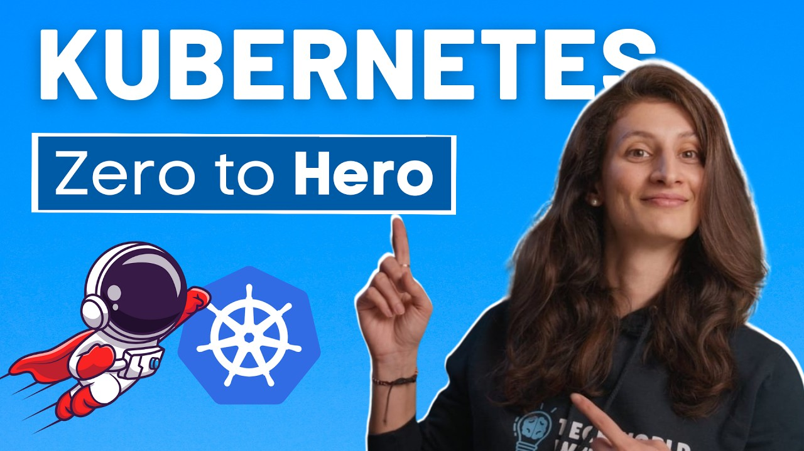

# Kubernetes Türkçe Döküman ☸️☸🐳👨

  

Kubernetes Türkçe DökümanTechWorld Nina kanalına ait olan 4 saatlik "Kubernetes Tutorial for Beginners [FULL COURSE in 4 Hours]" videosunun obsidian formatındaki Türkçeye çevirilmiş hali. Henüz bitmedi hala devam ediyorum. İngilizce konusunda sıkıntı yaşayanlar için faydalı bir *full tutorial* olacağına inanıyorum.

* **Video linki aşağıda yer almaktadır**.

## İçindekiler

- [[1- Kubernetes Nedir?]]
- [[2- Kubernetes Avantajları]]
- [[3- Kubernetes Componentleri]]
- [[4- Kubernetes Mimarisi]]
- [[5- Cluster Yapısı]]
- [[6- Minikube ve Kubectl Kurulumu]]
- [[7- İlk Cluster]]
- [[8- Main Kubectl Komutları]]
- [[9- Kubernetes YAML Konfigürasyonu]]
- [[10- İlk Demo Uygulama]]
- [[11- Kubernetes Namespaces]]

