Bu bölümde iki uygulama deploy edeceğiz: MongoDB ve Express. Bu iki uygulama ile basit bir web app ve database kurulumunun tipik bir örneğini çok iyi görebileceğiz. O zaman yapmaya başlayalım..


* İlk olarak bir MongoDB pod'u oluşturacağız.
* Bu pod ile iletişim kurabilmek için bir servise ihtiyacımız olacak. Internal servis oluşturacağız, yani bu pod'a dışarıdan gelen(external request) istekler engellenecek ve yalnızca aynı cluster içindeki componentler iletişim kurabilecek. Bu bizim istediğimiz şey.
* Daha sonra bir Mongo Express deployment oluşturacağız. İki şeye ihtiyacımız olacak: biri MongoDB'nin veritabanı URL'si, böylece Express bu URL'ye bağlanabilecek; diğeri ise veritabanının kullanıcı adı ve şifresi, böylece kimlik doğrulaması yapabilecek.

* Bu bilgileri Mongo Express deployment'a geçirebilmenin yolu, deployment config dosyasında `environmental variables`(çevresel değişkenler) aracılığıyla olacak, çünkü uygulama bu şekilde yapılandırılmış.
* Veritabanı URL'sini içeren bir `ConfigMap` ve kimlik bilgilerini içeren bir `Secret` oluşturacağız ve bunları deployment dosyasının içine referans olarak ekleyeceğiz.
* Bu kurulum tamamlandığında, Mongo Express'in tarayıcı üzerinden erişilebilir olması gerekecek. Bunu yapmak için, `external request`(dış istek)lerin pod'a iletilmesine izin verecek bir `external service` oluşturacağız.

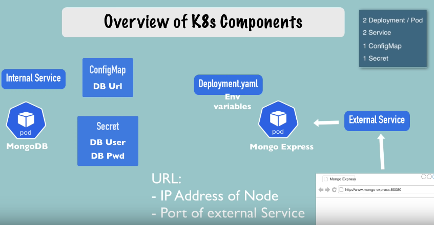

Bu kurulumla birlikte istek akışı aşağıdaki gibi görünecek.

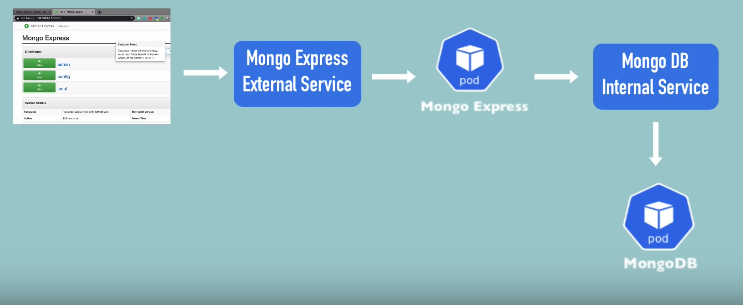

* İstek tarayıcıdan gelecek ve Mongo Express'in external servisine gidecek.
* Bu servis isteği Mongo Express pod'una iletecek.
* Pod, MongoDB'nin internal servisine bağlanacak ve isteği MongoDB pod'una iletecek. Burada kimlik doğrulama yapılacak.
**Şimdi bu kurulumun tamamını Kubernetes yapılandırma dosyalarını kullanarak oluşturalım.**

### 1) MongoDB Pod
İlk olarak, çalışan bir Minikube clusterımız var. `kubectl get all` komutunu kullanarak kümedeki tüm bileşenleri listelediğimde yalnızca default Kubernetes servisini görüyoruz.

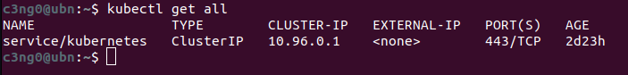

Yani clusterımız boş ve sıfırdan başlıyoruz. İlk yapacağımız şey bir MongoDB deployment oluşturmak.

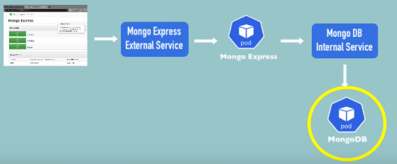

MongoDB için hazır olan deployment dosyası aşağıdaki şekilde.
```yaml
apiVersion: apps/v1
kind: Deployment
metadata:
  name: mongodb-deployment
  labels:
    app: mongodb
spec:
  replicas: 1
  selector:
    matchLabels:
      app: mongodb
  template:
    metadata:
      labels:
        app: mongodb
    spec:
      containers:
      - name: mongodb
        image: mongo
```

Bu dağıtıma `mongodb-deployment` adını verelim. Konteyner `mongodb` olarak adlandırılacak ve kullanacağımız image bu olacak. Hadi Docker-Hub'a gidip MongoDB image yapılandırmasını kontrol edelim.
* https://hub.docker.com/_/mongo

Aradığımız şey, bu konteyneri nasıl kullanacağımız, yani hangi portları açacağı ve hangi harici yapılandırmaları alacağız.

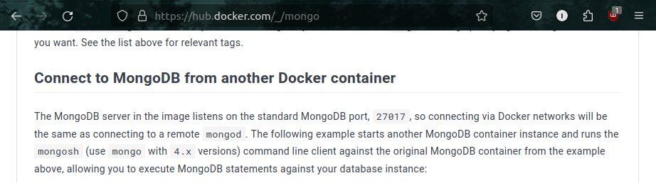

MongoDB konteynerinin varsayılan portu 27017'miş, bu yüzden bunu kullanacağız.

Ayrıca `Environment Variables`(çevresel değişkenler) kullanacağız.

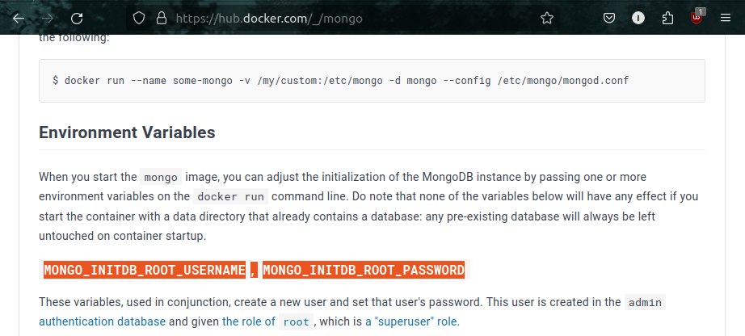

root kullanıcı adı ve root şifresi. Yani konteyner başlatıldığında admin kullanıcı adı ve şifresini tanımlayabiliriz. Şimdi bunu config dosyamızda ayarlayalım.

```yaml
apiVersion: apps/v1
kind: Deployment
metadata:
  name: mongodb-deployment
  labels:
    app: mongodb
spec:
  replicas: 1
  selector:
    matchLabels:
      app: mongodb
  template:
    metadata:
      labels:
        app: mongodb
    spec:
      containers:
      - name: mongodb
        image: mongo
        ports:
        - containerPort: 27017
        env:
        - name: MONGO_INITDB_ROOT_USERNAME
          value:
        - name: MONGO_INITDB_ROOT_PASSWORD
          value:
```
 * `ports` özelliği ve `containerPort` ile hangi portu açmak istediğimizi belirttik. Standart portu kullandık.
 Altında iki environment variables(`env`) belirttik.
 * Birincisi `MONGO_INITDB_ROOT_USERNAME` ve boş bırakacağız.
 * Diğeri ise `MONGO_INITDB_ROOT_PASSWORD` olacak ve bunu da boş bırakacağız.

> [!CAUTION]
> **Şunu unutmamalıyız ki bu, bir repository içine kaydedilecek bir config dosyasıdır. Bu yüzden admin kullanıcı adı ve şifresini yapılandırma dosyasının içine yazmamalıyız.**

### 2) Secret ve Referans

Şimdi yapacağımız şey, değerleri referans alacağımız bir `secret` oluşturmak olacak.

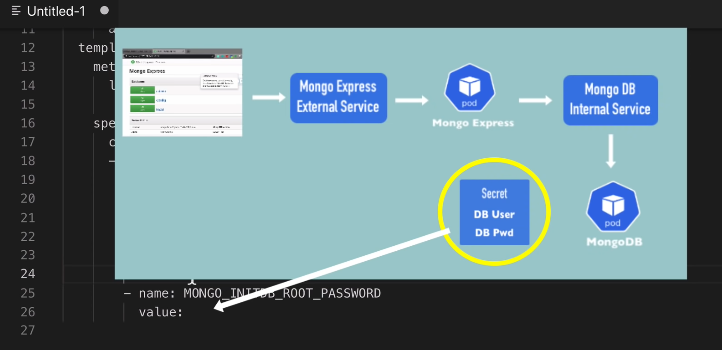

Yani bu gizli dosya Kubernetes'te yer alacak ve kimse git reposunda buna erişemeyecek.
**Secret lives in K8s, not in the repository**

Şimdilik az önce yazdığımız henüz bitmemiş olan deployment config dosyasını kaydedelim. Adını `mongo-depoyment.yml` olarak koyup kaydedelim.

Şimdi bu yapılandırmayı apply etmeden önce, root kullanıcı adı ve şifresinin yer alacağı `Secret` oluşturacağız. Yeni bir dosya oluşturalım ve aşağıdaki *Secret* configi yapıştıralım.

```yaml
apiVersion: v1
kind: Secret
metadata:
  name: mongodb-secret
type: Opaque
data:
  username:
  password:
```

Oldukça basit bir yapısı var.
* `kind: Secret` var.
* `metadata` var, ve bu sadece adını içeriyor. Buna `mongodb-secret` diyeceğiz.
* `type: Opaque` aslında en temel `key-value` secret türüdür. Diğer türler örneğin TLS sertifikalarını içerir. Yani bir gizli dosya oluşturabiliriz ve bunu TLS sertifikası türünde yapabiliriz. Ancak çoğunlukla default türü (Opaque) kullanacağız.
* `data` var ve burada `key-value` çiftleri bulunuyor. Elbette bunlar bizim belirlediğimiz isimler olacak. Mesela data kısmında değişiklik yapalım.
```yaml
data:
  mongo-root-username:
  mongo-root-password:
```
* Kullanıcı adını `root-username` ve şifreyi `root-password` olarak belirleyeceğiz.

> [!IMPORTANT]
>**Buradaki önemli nokta, bu anahtar-değer çiftlerindeki değerlerin düz metin olmamasıdır. Bir gizli dosya oluştururken değerlerin base64 ile kodlanması gerekir.**

Bunu yapmanın en basit yolu terminale gitmektir. Burada, `echo -n` komutunu kullanacağız.
```bash
echo -n "username" | base64
echo -n "password" | base64
```
Buraya istediğim düz metin değerini koyalım. `username` ve `password` kullanalım ve base64 ile kodlayalım. Elde ettiğimiz değerleri secret confige kopyalayalım.

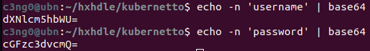

Tamamladıktan sonra dosyayı `mongo-secret.yaml` olarak kaydedelim.
```yaml
apiVersion: v1
kind: Secret
metadata:
  name: mongodb-secret
type: Opaque
data:
  mongo-root-username: dXNlcm5hbWU=
  mongo-root-password: cGFzc3dvcmQ=
```

Şimdiye kadar sadece config dosyaları yazdık, clusterda henüz bir şey oluşturmadık. Deploymenti referans alacağımız secret'tan önce oluşturmalıyız. Eğer secret içermeyen bir deployment oluşturursak, hata alırız ve deployment başlatılamaz.

İlk componentimiz hazır olduğuna göre, şimdi config dosyasından bir secret oluşturabiliriz. Şu an her iki dosyamız da mevcut.

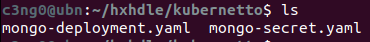

Aşağıdaki komutu çalıştırıyoruz ve `secret` oluşturuluyor.

```bash
kubectl apply -f mongo-secret-yaml
```

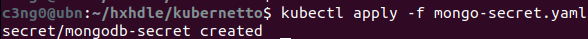

Secretlarımızı listelemek için de aşağıdaki komutu çalıştırdığımızda, Yeni Secret'ımızın oluşturulduğunu görmeliyiz.

```bash
kubectl get secret
```


Artık Secret'ımızı deployment config dosyamızda referans alabiliriz. Config dosyamıza geri dönelim ve Secret'taki belirli `key-value` verilerini referans alalım.

```yaml
          env:
          - name: MONGO_INITDB_ROOT_USERNAME
            valueFrom:
              secretKeyRef:
                name: mongodb-secret
                key: mongo-root-username
          - name: MONGO_INITDB_ROOT_PASSWORD
            valueFrom:
              secretKeyRef:
                name: mongodb-secret
                key: mongo-root-password
```

* `value` yerine `valueFrom` yazıyoruz ve altına `secretKeyRef` yazıyoruz.
* `secretKeyRef`  name'i, `Secret` dosyamızın adı olacak.
* `key` değerini almak için de, Secret dosyamızdan isimleriyle referans alacağız. `mongo-root-username`, `mongo-root-password`.


Bu şekilde referans almayı tamamlıyoruz.

* Unutmayın, YAML dosyası girintilere çok dikkat eder.

Böylece root kullanıcı adı ve şifresi, Secret'tan referans alınacak ve config dosyasının içinde gerçek değerler bulunmayacak. Bu güvenlik açısından oldukça iyidir çünkü kimlik bilgilerimizin kod reposunda bulunmasını asla istemeyiz.

Deployment dosyamız artık hazır, Artık apply edebiliriz.

```bash
kubectl apply -f [YAML_file]
```

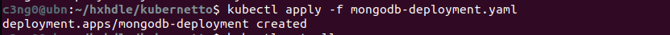
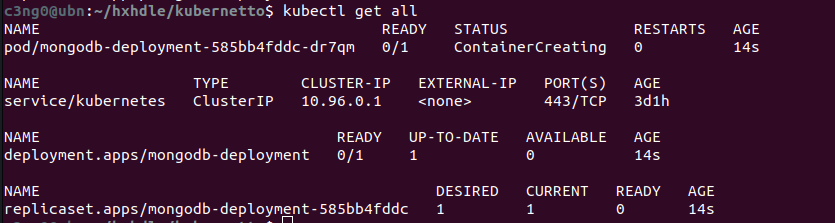

Deployment oluşturuldu, yani `get all` komutunu çalıştırırsam Pod'un başlatıldığını, deploymenti ve ReplicaSet'i görmeliyim.

Şimdi Pod'un statusunu kontrol edelim. Konteyner oluşturuluyor, bu yüzden izlememiz gerekiyor. Eğer uzun sürerse ve bir sorun olup olmadığını görmek isterseniz, `kubectl describe pod` ve Pod adımızı yazıyoruz.

```bash
kubectl describe pod [POD_NAME]
```

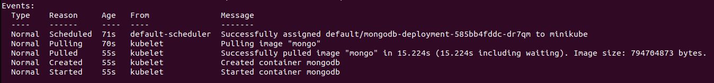

Görüyoruz ki sadece image çekiyor, bu yüzden uzun sürüyor.

Tekrar `kubectl get pod` komutunu çalıştırırsak, Pod'un çalıştığını göreceğiz. Şu anda bir MongoDB deployment ve bir replika Pod çalışıyor.

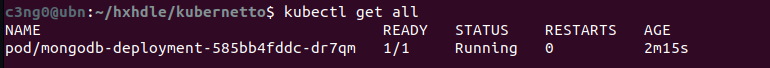

### 3) MongoDB Internal Service

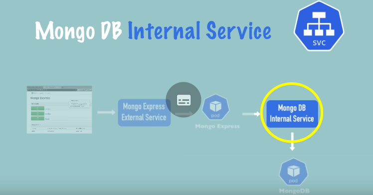

Şimdiki adımda, diğer componentlerin veya diğer Pod'ların bu MongoDB ile konuşabilmesi için bir `internal service` oluşturacağız. Önce servisconfiguration oluşturalım.

YAML dosyamıza geri dönelim.

> [!TIP]
> **YAML'da tek dosyada, birden fazla yaml yazabiliriz. YAML'da 3 tire `---`  belge ayırma sözdizimidir. Yani yeni bir belge başladığını belirtmiş oluyoruz.**

Hatta deployment ve servisi aynı config dosyasına koyabiliriz çünkü genelde bu iki dosya birlikte bulunur.

```yaml
apiVersion: apps/v1
kind: Deployment
metadata:
  name: mongodb-deployment
  labels:
    app: mongodb
spec:
  replicas: 1
  selector:
    matchLabels:
      app: mongodb
  template:
    metadata:
      labels:
        app: mongodb
    spec:
      containers:
      - name: mongodb
        image: mongo
        ports:
        - containerPort: 27017
        env:
        - name: MONGO_INITDB_ROOT_USERNAME
          valueFrom:
            secretKeyRef:
              name: mongodb-secret
              key: mongo-root-username
        - name: MONGO_INITDB_ROOT_PASSWORD
          valueFrom:
            secretKeyRef:
              name: mongodb-secret
              key: mongo-root-password
---
apiVersion: v1
kind: Service
metadata:
  name: mongodb-service
spec:
  selector:
    app: mongodb
  ports:
    - protocol: TCP
      port: 27017
      targetPort: 27017
```

Bu MongoDB için bir servis. Bazı nitelikleri gözden geçirelim.

* `kind: Service` ve `name: mongodb-service` olarak adlandırdık.
* `selector` önemli çünkü biz bu oluşturacağımız servisin Pod'a bağlanmasını istiyoruz ve bunu yapmanın yolu Servisten `selector`, Deployment'tan `label` kullanmaktır. Bu etiketleri kullanarak, deployment ve Pod'un sahip olduğu labelları, servis bulup bağlanabilir.
* `ports:` Burada servisin bağlantı noktasını (port) açıyoruz.
	* `port: 27017` Servis portudur.
	* `targetPort: 27017` Konteyner veya Pod portudur.
	Deployment config içerisindeki `containerPort` ile, Servisteki `targetPort` birbiriyle eşleşmelidir. Tabii ki, bu iki bağlantı noktası *farklı olabilir*, ama biz bu seferlik aynı portu kullanalım.

Hadi şimdi servisi oluşturalım. Bu dosyayı kaydedelim ve aynı dosyayı tekrar uygulayalım. Böylece az önce deployment oluşturulduğu gibi şimdi de servis oluşacak. Bakalım ne olacak?


Hem dağıtım hem de servis yapılandırması olmasına rağmen, Kubernetes deploymenti değiştirmediğimizi anlıyor. Bu nedenle sadece servisi oluşturuyor.

Şimdi servisimizin oluşturulduğunu kontrol edelim.

```bash
kubectl get services
```

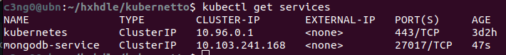

Oluşan servisimiz 27017 portunda dinliyor. Hatırlarsanız, servisin doğru Pod'a bağlı olup olmadığını da kontrol edebiliyorduk. Bunu yapmak için;

```bash
kubectl describe service [SERVICE_NAME]
```

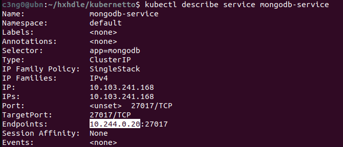

Burada bir IP adresi ve Pod'un içinde dinleyen uygulama portu var. Bu doğru Pod olup olmadığını kontrol edelim.  `-o wide` ile ek çıktıyla çalıştırıyorum.

```bash
kubectl get pod -o wide
```

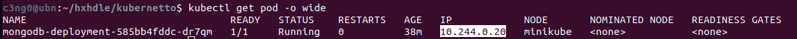

Bu IP adresi, Pod IP adresi ile eşleşiyor ve uygulamanın Pod içinde dinlediği port doğru.

Her şey mükemmel şekilde ayarlandı. MongoDB dağıtımı ve servisi oluşturuldu.

> [!TIP]
> Bir uygulamanın tüm componentlerini görmek istersek, `kubectl get all` ve `grep` komutunu birlikte kullanabiliriz. Böylece hem tüm componentleri listeleyip hem de isme göre  filtreleyebiliriz.

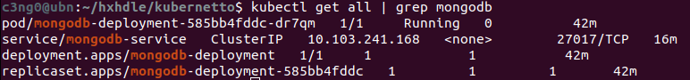

İşte bu şekilde tek komutla servisimizi, deploymentımızı, replicasetimizi ve Podumuzu görüntüleyebiliriz. Tüm component tipleri burada görünüyor.

### 4) Mongo Express Deployment & Service & ConfigMap

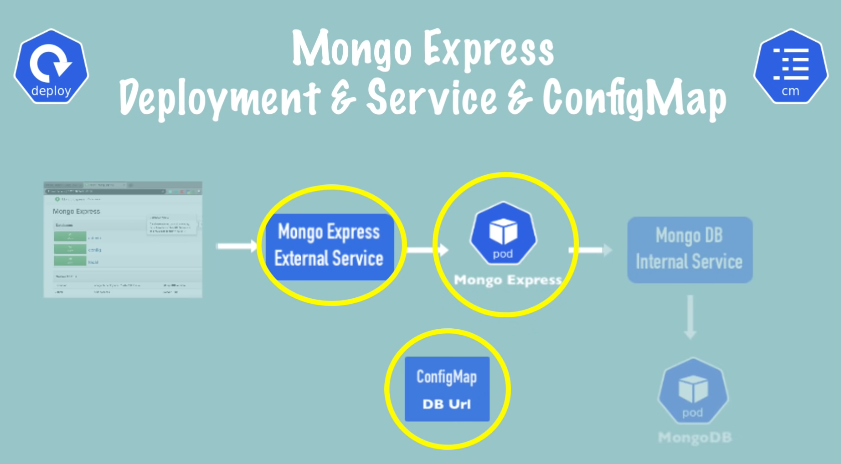

Şimdi sıradaki adımda, `Mongo Express Deployment ve Servisi` oluşturacağız. Ayrıca MongoDB için veritabanı URL'sini içeren `External Configuration` oluşturacağız. Yeni bir dosya oluşturarak başlayalım.

```yaml
apiVersion: apps/v1
kind: Deployment
metadata:
  name: mongo-express
  labels:
    app: mongo-express
spec:
  replicas: 1
  selector:
    matchLabels:
      app: mongo-express
  template:
    metadata:
      labels:
        app: mongo-express
    spec:
      containers:
      - name: mongo-express
        image: mongo-express
```

Bu, MongoExpress deployment taslağı. İsim `express`.
* `template:` Pod tanımımız var. Image adı `express`. Bu imajı da kontrol edelim. image adı `mongo-express`.

*https://hub.docker.com/_/mongo-express*

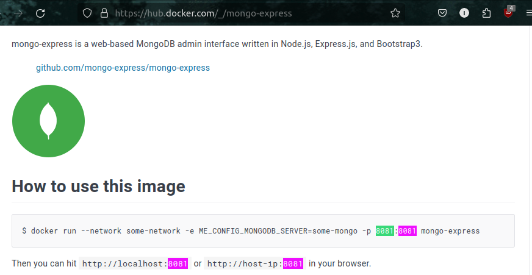

Konteyner içindeki MongoExpress Port 8081'deymiş.
Biraz aşağı inersek de çevresel değişkenleri(environmental variables) görebiliriz.

* MongoExpress için üç şeye ihtiyacımız var: MongoDB adresi(veritabanı adresi) ve kimlik doğrulama bilgileri.
	* MongoDB Adresi                        ->          ...MONGODB_SERVER
	* Kimlik Doğrulama Bİlgileri          ->          ...ADMIN_USERNAME, ...ADMIN_PASSWORD

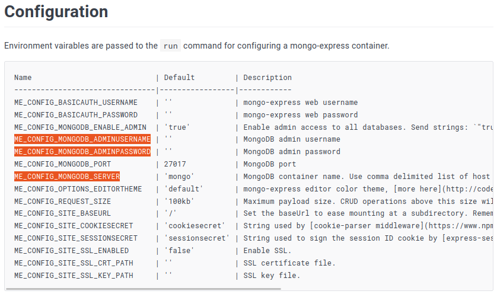

Bu çevresel değişkenleri kullanacağız. O zaman ilk olarak konteyner portlarını açabiliriz.

```yaml
...  
...
  template:
    metadata:
      labels:
        app: mongo-express
    spec:
      containers:
      - name: mongo-express
        image: mongo-express
        ports:
        - containerPort: 8081
```

* İçerideki Pod'da birden fazla port açabileceğimiz için birden fazla port olabileceği anlamına gelen `ports` kullanılır. Bu değerimiz, 8081 olacak.

Şimdi bağlantı için `ENV`(environment variables) ekleyeceğiz.

```yaml
...
...
        ports:
        - containerPort: 8081
        env:
        - name: ME_CONFIG_MONGODB_ADMINUSERNAME
          valueFrom:
            secretKeyRef:
              name: mongodb-secret
              key: mongo-root-username
        - name: ME_CONFIG_MONGODB_ADMINPASSWORD
          valueFrom:
            secretKeyRef:
              name: mongodb-secret
              key: mongo-root-username
```

Tabiiki tanımladığımız aynı kullanıcı adı ve şifre, deploymentta tanımladığımız ile aynı olacak. Bu yüzden yaptığımız şey onları kopyalamak. Aynı `valueFrom` ile zaten orada olan secret içerisinden okumuş olacağız.

Son olarak database server:

```yaml
...
...
        - name: ME_CONFIG_MONGODB_ADMINPASSWORD
          valueFrom:
            secretKeyRef:
              name: mongodb-secret
              key: mongo-root-username
        - name: ME_CONFIG_MONGODB_SERVER
          value:
```

Bu da harici bir yapılandırma olduğu için ya burada `value` kullanabilir ve mongodb sunucu adresini doğrudan buraya yazabiliriz. Ya da diyagramda gösterildiği gibi, merkezi bir yapılandırma olan bir configmap'e koyabiliriz. Bu şekilde merkezi bir yerde saklanır ve diğer componentler de kullanabilir.
* Örneğin, iki uygulamam mongodb veritabanını kullanıyorsa, bu harici yapılandırmayı referans alabiliriz ve bir noktada değişiklik yapmamız gerekirse; sadece bir yerde değişiklik yaparak diğer dosyaları güncellemeden devam edebiliriz.
Bu nedenle, şu an için eksik olan bu deployment configi kenara kaydedip, mongodb sunucu adresini içeren configmap'i oluşturacağız. Yeni bir dosya oluşturalım, bu eksik dağıtımı kaydedelim, adını `mongo-express.yaml` koyalım ve daha sonra geri dönelim!

```yaml
apiVersion: v1
kind: ConfigMap
metadata:
  name: mongodb-configmap
data:
  database_url:
```

Bu da secret key gibi oldukça basit. Beraber göz atalım:
* `kind: ConfigMap` olan aynı Secret gibi bir yapı görüyoruz.

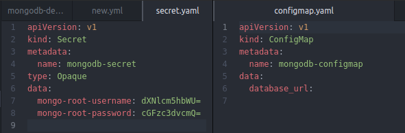
* Tıpkı yukarıda gördüğünüz gibi `data` içerisinde `key-value` çifti var.
* `type:` yok çünkü sadece configmapin sadece bir türü var. Sonuç olarak veritabanı URL'si ve server adı aslında Servisin adı. Bu kadar basit.

Hizmetimize  `mongodb-service` adını vermiştik. Bu yüzden hizmet adını kopyalayalım ve bunu veritabanı sunucusu URL'sine yazalım. Dosyayı mongo-configmap.yaml olarak kaydedelim.

> [!NOTE]
> Gizli anahtar gibi, çalıştırma veya oluşturma sırası önemlidir. ConfigMap'in zaten clusterda olması gerekiyor ki onu referans alabilelim. Bu yüzden işimiz bittiğinde, önce configmap'i oluşturmalı daha sonra deploymenti yapmalıyız.

Yapılandırma haritasını deployment içinde referans almaya geldik. mongo-express.yaml dosyamıza geri dönelim.

> [!TIP]
> Yapılandırma haritasını deployment içinde referans almanın yolu gizli anahtara çok benzer. Tek fark burada `secret` yerine `configMap` yazacağız. Tamamı küçük ve büyük harf karışık olacak ve elbette adı `config map` olacak.
>
> 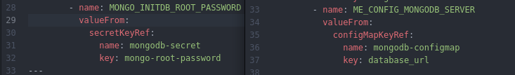

Deploymenti tamamladık. Şimdi önce config map'i ve sonra Express dağıtımını oluşturalım.

```bash
kubectl apply -f mongo-configmap.yaml
kubectl apply -f mongo-express.yaml
```

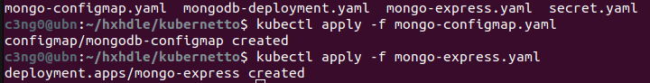

Herhangi bir hata almadık. Pod'un durumuna bakalım.

```bash
kubectl get pod
```

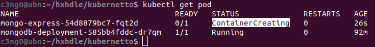

Konteyner oluşturuluyor. Gayet iyi. Biraz bekleyip tekrar kontrol edelim ve bum!

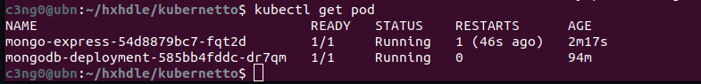

Doğru çalışıp çalışmadığını öğrenmek için Logları görüntülemek önemlidir.

```bash
kubectl logs [POD_NAME]
```

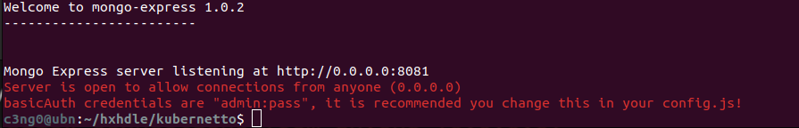

### 5) Mongo Express External Service

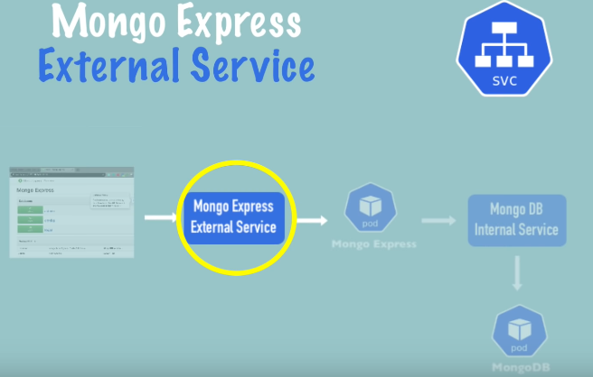

Şimdi son adımımız, Express'e bir tarayıcıdan erişmektir. Bunu yapmak için mongo-express için bir External Service ihtiyacımız olacak. Öyleyse hadi bunu da oluşturalım.

>[!TIP]
>Daha önce yaptığımız gibi yine MongoExpress servisimizi, deploymentı ile aynı dosyada oluşturacağız. Çünkü zaten pratikte hiçbir zaman servis olmadan deploymentı olmaz. Bu yüzden onları aynı yaml dosyasında yazmak mantıklıdır.

```yaml
---
apiVersion: v1
kind: Service
metadata:
  name: mongo-express-service
spec:
  selector:
    app: mongo-express
  ports:
    - protocol: TCP
      port: 8081
      targetPort: 8081
```

Deployment dosyamızın devamına yukarıdaki servis configi yapıştırıyoruz. Bu, Mongo Express'in external servisi ve bu farkettiyseniz tamamen mongodb servisinin yapılandırmasıyla aynı görünüyor.

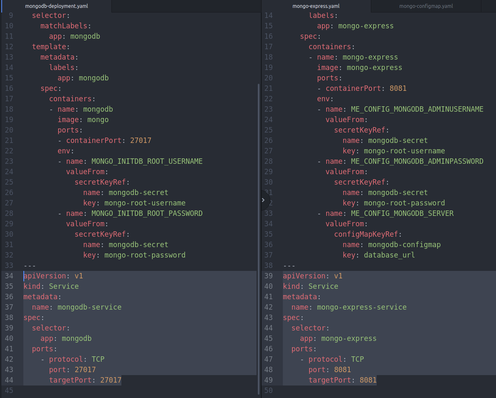


* Servis portunu 8081 olarak açtık ve yine target Port, container Port'un dinlediği yerdir.

**Peki bu servisi external(harici) yapacak olan şey nedir?**
Bu servisi iki şey yaparak external yaparız:

1) `spec` bölümünde, `selector` altına `type: Loadbalancer` yazarız.

>[!NOTE]
>Sanıyoruz ki `external servis` için bu isim "LoadBalancer" olarak düzgün seçilmemiş çünkü `internal servis` de istekleri dengeleyip Load Balance yapabilir. İki mongodb podumuz olsa, internal servis de bu podlara gelen istekleri dengeleyebilirdi. Yani gerçekten de tür adı olarak `Load Balancer` seçilmesi çok iyi değil gibi çünkü kafa karışıklığına neden olabilir. Ancak, bu yük dengeleyici türü basitçe servise `external IP adres`i atar ve `external request`leri kabul eder.

```yaml
apiVersion: v1
kind: Service
metadata:
  name: mongo-express-service
spec:
  selector:
    app: mongo-express
  type: LoadBalancer         ## Tam burası..
  ports:
    - protocol: TCP
      port: 8081
      targetPort: 8081
```

2) `nodePort: 30000`

Yapacağımız ikinci şey ise, bu servisi harici yapmak için üçüncü bir port sağlamak. Bu da node port olacak ve bu, External IP adresinin açık olacağı port olacak. Ayrıca belirtelim ki bu port, Tarayıcıdan erişmek için kullanacağımız port olacak.

Bu port aslında bir aralığa sahiptir ve bu aralık 30000 ile 32767 arasındadır, yani bu aralıkta bir port vermemiz gerekiyor, bu yüzden sadece 30000 ile gidelim, aralıktaki minimumdur.

```yaml
apiVersion: v1
kind: Service
metadata:
  name: mongo-express-service
spec:
  selector:
    app: mongo-express
  type: LoadBalancer
  ports:
    - protocol: TCP
      port: 8081
      targetPort: 8081
      nodePort: 30000
```

Artık hazır olduğumuza göre uygulamaya geçebiliriz. Ardından bu bağlantı noktalarının nasıl farklı olduklarına bakalım.

```bash
kubectl apply -f mongo-express.yaml
```

Hizmet oluşturuldu ve hizmeti `kubectl get service` ile görüntülersek, önceden oluşturduğumuz mongodb servisinin `ClusterIP`' tipinde olduğunu görüyoruz ve yeni oluşturduğumuz mongo express servisinin bir `LoadBalancer` olduğunu görüyoruz.

```bash
c3ng0@ubn:~/hxhdle/kubernetto$ kubectl get service
NAME                    TYPE           CLUSTER-IP       EXTERNAL-IP   PORT(S)          AGE
kubernetes              ClusterIP      10.96.0.1        <none>        443/TCP          6d1h
mongo-express-service   LoadBalancer   10.96.100.133    <pending>     8081:30000/TCP   9s
mongodb-service         ClusterIP      10.111.249.213   <none>        27017/TCP        95m
```

Internal servis oluştururken herhangi bir tür belirtmedik çünkü zaten default olarak internal IP hizmeti türüdür.

>[!NOTE]
>İnternal Servis oluştururken `type` belirtmeye gerek yok çünkü zaten default olarak tanımlanır.
>

Fark ise;
* ClusterIP, servise internal IP adresi verir. Aşağıda görüldüğü gibi:

```bash
mongodb-service         ClusterIP      10.111.249.213   <none>        27017/TCP        95m
```

* LoadBalancer, servise bir internal IP adresi verir, ancak bununla birlikte external isteklerin geleceği external IP adresi de verir. *(pending)*

```bash
mongo-express-service   LoadBalancer   10.96.100.133    <pending>     8081:30000/TCP   9s
```

* Şu an bize `pending` diyor çünkü minicube'deyiz ve bu normal kubernetes kurulumunda biraz daha farklı çalışır.  

Dediğim gibi, "pending" durumu external IP adresini henüz almadığı anlamına gelir. Bu durumu Minikube'da yapmanın yolu `minikube service` komutunu kullanmaktır ve servisin adına ihtiyacımız olacak.

```bash
minikube service mongo-express-service
```

Bu komut temelde external servisimize bir genel IP adresi atayacak.
Komutu çalıştırdığımızda tarayıcı açılacak ve karşımıza şu sayfa çıkacak:

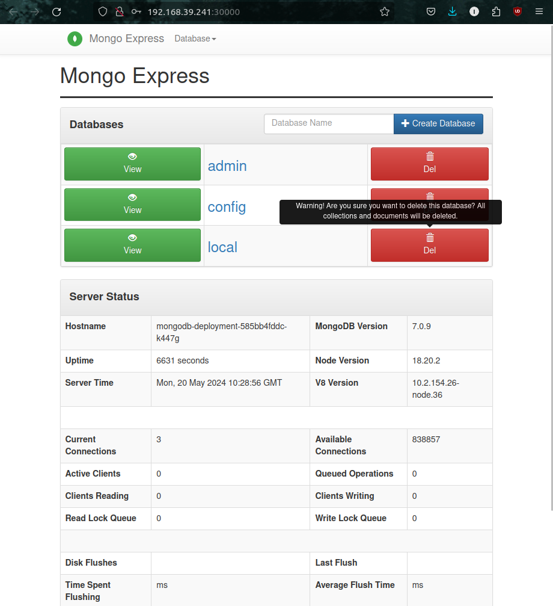

Eğer açılırken kullanıcı adı ve şifre sorarsa `admin:pass` olarak yazabiliriz.

Ve Mongo Express sayfamızı görüyoruz. Komut satırına geri dönersek, buradaki bu komut Express servisini Public IP adresli URL atadığını ve bizim belirttiğimiz 30000 portunu kullandığını görüyoruz.

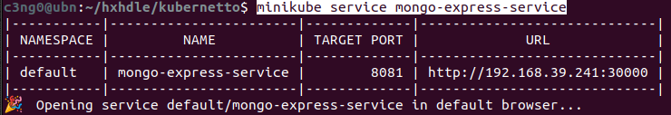

Burada değişiklikler yaparsak, örneğin yeni bir veritabanı oluşturalım, ona testDB adını verelim ve Create Database ile isteği gönderelim.

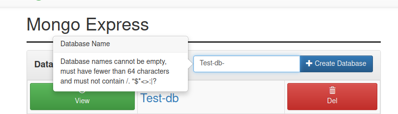

Arka planda olan şeyi şu şekilde açıklayabiliriz.
* Bu isteğin Mongo Express'in external servisine ulaşması
* Ardından Mongo Express poduna yönlendirilmesidir.
* Express podu, Internal servis olan mongodb servisine bağlanır.
* Mongodb servisi, isteğimizi sonunda mongodb Poduna iletir.
* Sonra tüm bu yol geri gelir ve burada değişiklikleri görürüz.

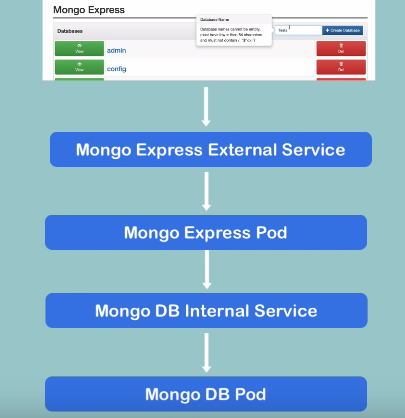

Basit bir uygulama kurulumunu bir Kubernetes kümesinde nasıl dağıtacağınızı böyle anlatmış olduk.

---
