Bu konu başlığında , `Namespaces` kullanımlarından bahsedeceğiz.


### Namespace Nedir
Öncelikle, Kubernetes'te `Namespace` nedir? Kubernetes clusterında, kaynakları namespaces ile organize edebiliriz. Yani, bir clusterda birden fazla namespace olabilir. Bir namespace'i, Kubernetes kümesi içinde sanal bir cluster olarak düşünebiliriz.

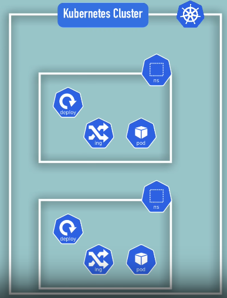

### Default Namespaces
Bir cluster oluşturduğumuzda, Kubernetes bize varsayılan olarak bazı namespace'ler sağlar. Komut satırında `kubectl get namespaces` yazarsak, Kubernetes'in varsayılan olarak sunduğu namespace listesini görürüz.

```bash
c3ng0@ubn:~$ kubectl get namespace
NAME              STATUS   AGE
default           Active   6d3h
kube-node-lease   Active   6d3h
kube-public       Active   6d3h
kube-system       Active   6d3h
```

Şimdi, bunları tek tek inceleyelim.
* 1) `kube-system`
`kube-system` namespace, bizim kullanımımıza yönelik değildir. Yani, bu namespace'te herhangi bir şey oluşturmamalı veya değiştirmemeliyiz. Bu namespace'te yer alan componentler, sistem süreçleri, yönetici süreçler veya `kubectl` gibi bileşenlerdir.

* 2) `kube-public`
Genel olarak erişilebilir veriler bulunur. Bu namespace'te, cluster bilgilerini içeren ve kimlik doğrulama olmadan bile erişilebilen bir ConfigMap bulunur.
`kubectl cluster-info` yazarsak, bu ConfigMap bilgilerinin çıktısını alırız.

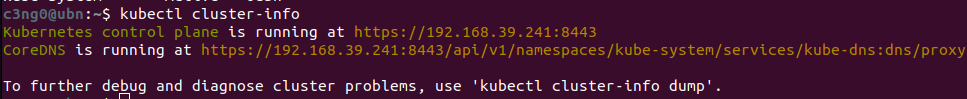

* 3) `kube-node-lease`
Bu namespace'in amacı, nodeların kalp atış bilgilerini tutmaktır. Her node, kendisinin kullanılabilirlik bilgilerini içeren kendi objesini alır.

* 4) `default`
default namespace, başlangıçta yeni bir namespace oluşturmadıysak, kaynakları oluşturmak için kullanacağımız alandır. 

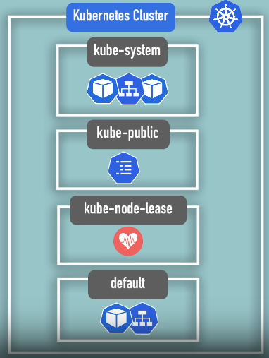

Tabii ki, yeni namespace ekleyip oluşturabiliriz.
Bunu yapmak için, `kubectl create namespace` komutunu, namespace adıyla birlikte kullanabiliriz. Böylece, kendi namespace'imizi oluşturabilir ve `kubectl get namespaces` yazarsak, namespace'imiz listede görünecektir.

```bash
kubectl create namespace my-namespace
```

Namespace oluşturmanın bir diğer yolu, namespace config file kullanmaktır. Bu, namespace oluşturmanın daha kaliteli bir yoludur. Çünkü bu şekilde config file reposunda, clusterda hangi kaynakları oluşturduğumuzun geçmişi de olur.

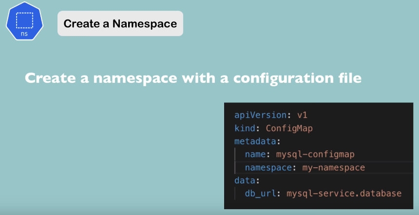

### Ne Zaman & Nasıl Namespace Oluşturmalı

Şimdi, namespaces'in ne olduğunu, yeni namespaces oluşturabileceğimizi ve Kubernetes'in default olarak bazı namespace'ler sunduğunu gördük. Ancak, asıl soru şu: namespace'e neden ihtiyaç var? Ne zaman ve nasıl namespaces oluşturmalıyız?

Bazı use case durumlarından bahsedelim:

1) **Kaynaklar Namespaces'ta Gruplanırsa**:
Varsayalım ki, Kubernetes tarafından sağlanan tek bir default namespace'a sahibiz ve tüm kaynaklarımızı bu default namespaces'da oluşturuyoruz. Eğer karmaşık bir uygulamamız varsa ve bu uygulama birçok deployment içeriyorsa, bu deploymentlar birçok kopya oluşturuyorsa ve servisler, ConfigMap gibi kaynaklarımız varsa, çok kısa sürede varsayılan namespace'imiz farklı componentlerle dolup taşacaktır. Bu durumda, neyin ne olduğunu gözlemlemek de zor olacaktır, özellikle de birden fazla kullanıcı içerik oluşturuyorsa..

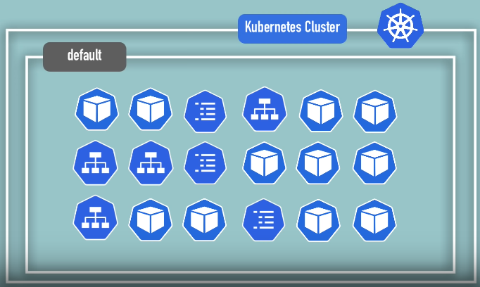

Böyle bir durumda namespaces'i kullanmanın daha iyi bir yolu, kaynakları namespaces'ta gruplandırmaktır. Örneğin, veritabanımızı ve gerekli tüm kaynaklarını dağıtacağımız bir veritabanı namespace oluşturabiliriz. Monitoring araçlarımızı dağıtacağımız bir monitoring namespace oluşturabiliriz. Elasticsearch ve Kibana gibi kaynakları dağıtacağımız bir Elastic Stack namespace oluşturabiliriz. Bu şekilde kaynaklarımızı cluster içinde mantıksal olarak gruplandırabiliriz.

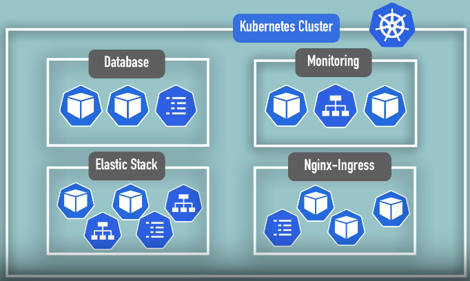

Kubernetes'in resmi dokümantasyonuna göre, eğer küçük projelerimiz ve 10'a kadar kullanıcımız varsa, namespaces kullanmamalıyız. Ancak Nina'nın kişisel görüşüne göre, kaynaklarımızı namespaces'ta gruplandırmak her zaman iyi bir fikirdir. Çünkü küçük bir projeye ve 10 kullanıcıya sahip olsak bile, uygulamamız için monitoring ve logging gibi ek kaynaklara ihtiyaç duyabiliriz.

2) **Conflicts: Birden Fazla Takım, Aynı Proje:**
Namespaces kullanmamız gereken bir diğer use case, birden fazla takımımız olduğunda ortaya çıkar. Bu senaryoda, aynı cluster'ı kullanan iki takımımız olduğunu varsayalım. Bir takım, `my-app-deployment` adlı bir deployment oluşturur ve bu deployment belirli bir konfigürasyona sahiptir. Eğer diğer takım, aynı ada sahip ancak farklı bir konfigürasyona sahip bir deployment oluşturursa ve bunu uygularsa(apply), ilk takımın deployment'ını geçersiz kılabilir. Jenkins veya otomatik bir deployment aracı kullanıyorlarsa, diğer takımın deployment'ını bozduklarının farkına bile varmazlar. 


Bu tür çakışmaları önlemek için namespaces kullanabiliriz. Her takım, kendi namespace'inde çalışarak diğerini rahatsız etmeden rahatça çalışabilir.

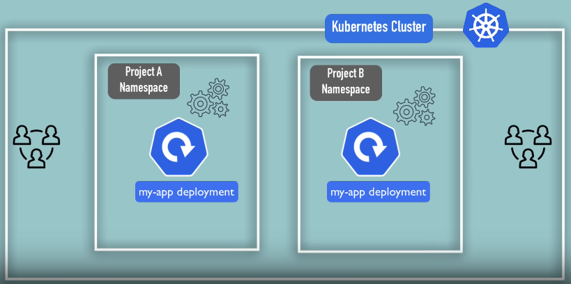

3) **Kaynak Paylaşımı: Staging ve Development:**
Namespaces kullanmanın bir diğer use case'i, aynı clusterda hem staging hem de development ortamlarını barındırmak istediğimizde ortaya çıkar. Bu durumda, örneğin nginx controller veya Elasticsearch gibi kaynakları her iki ortamda da kullanabiliriz. Bu şekilde, bu ortak kaynakları iki farklı clusterda da kurmak zorunda kalmayız. Hem staging hem de development ortamı bu kaynakları kullanabilir.

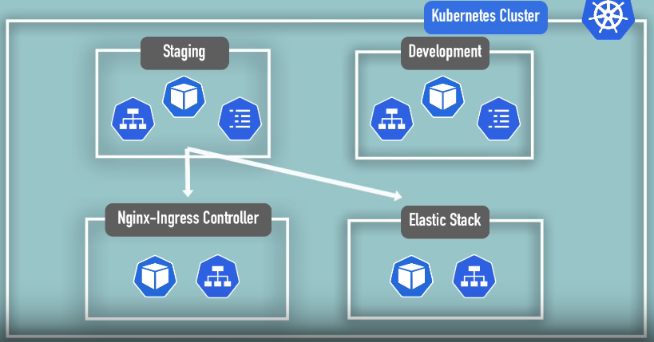

3) **Kaynak Paylaşımı: Blue/Green Deployment:**
Namespacesnı kullanmanın bir diğer durumu, Blue/Green deployment stratejisini kullandığımızda ortaya çıkar. Bu durumda, aynı clusterda iki farklı production sürümüne sahip olmak isteriz . Biri aktif olan ve şu anda production olan sürüm, diğeri ise bir sonraki production sürümü olacaktır. Bu durumda, her iki üretim namespace da ortak kaynakları kullanabilir, örneğin nginx controller veya Elasticsearch gibi.

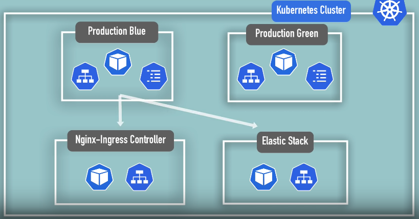

4) **Namespaces'e Erişimi ve Kaynakları Sınırlama:**
namespacesnı kullanmanın bir diğer durumu, kaynakları ve erişimi sınırlamaktır. Birden fazla takımın aynı clusterda çalıştığı senaryoda, her takımın kendi namespace'nde çalışmasını sağlayabilir ve diğer namespaces'te hiçbir şey yapmalarına izin vermeyiz. Bu şekilde, bir takımın diğerinin işine müdahale etme riskini azaltırız. Ayrıca, namespace düzeyinde kaynak kotaları tanımlayarak her takımın ne kadar CPU, RAM ve depolama kullanabileceğini de sınırlayabiliriz. Bu, bir takımın çok fazla kaynak tüketmesini ve diğer takımların kaynaklarının tükenmesini önler.

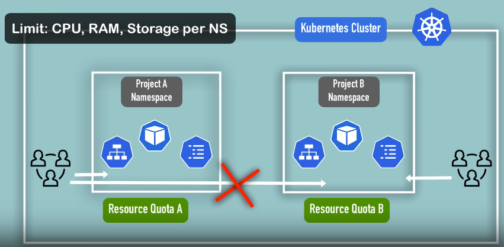

Bu senaryoları inceledikten sonra, projenizde namespacesnı nasıl kullanmamız gerektiğini daha iyi analiz edebileceğimizi umuyoruz. 

### NameSpaces Özellikleri

Namespaces'imizi nasıl gruplandıracağımıza ve kullanacağımıza karar vermeden önce dikkate almamız gereken birkaç özellik var.

* İlk olarak, çoğu kaynağa başka bir namespacendan erişemeyiz. 
Örneğin, bir namespace'teki bir ConfigMap, başka bir namespace'teki bir Servisi referans alıyorsa, bu ConfigMap'i başka bir namespace'de kullanamayız. 
Aynı referans ve aynı ConfigMap olsa bile: **her namespace için, kendi ConfigMap'ini tanımlamamız gerekecektir**. Aşağıdaki resimde bunun örneği vardır. Project A içerisindeki ConfigMap, Database servisine referans edilmiştir. Bu sebeple bu ConfigMap, Project B için kullanılamaz. Aynı ConfigMap projectB içerisinde de oluşturulmalıdır ve referans edilmelidir.

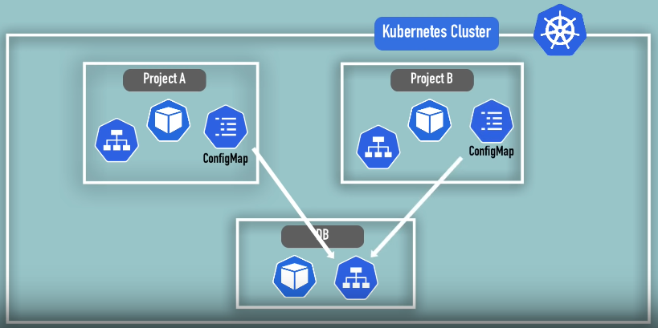

Bu, Secret'lar için de geçerlidir. Örneğin, ortak bir servisin kimlik bilgilerine sahipseniz, bu kimlik bilgilerini her namespace'de oluşturmamız gerekecektir. Ancak, namespace'ler arasında paylaşabileceğimiz bir kaynak türü `Servis`lerdir.

Bir configMap, bir namespace'deki servisi referans aldığında, URL'sinde namespace adı da eklenir. Bu şekilde, diğer namespace'lerdeki servislere erişebiliriz. Bu, Elasticsearch veya nginx gibi paylaşılan kaynakları kullanmanın pratik bir yoludur.

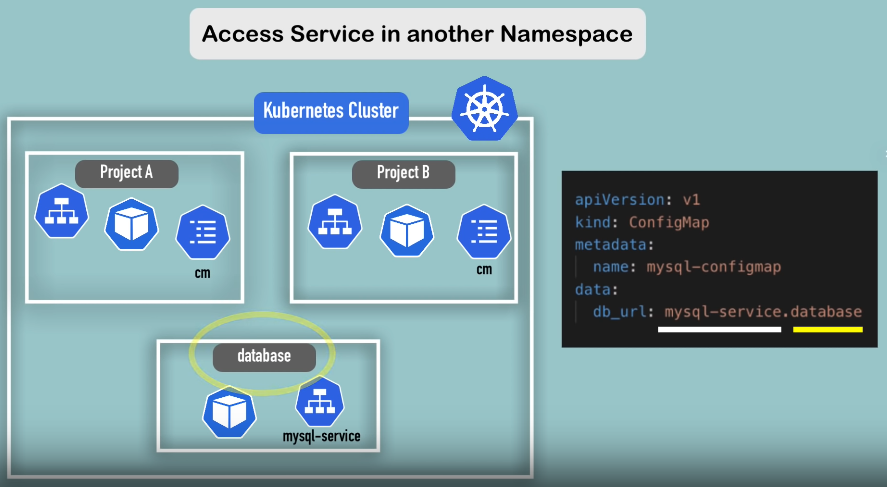

Kubernetes'teki bazı componentler namespace olmadan clusterda global olarak bulunur. Bu componentler, namespace'a ait olmayan componenetler olarak adlandırılır. Örneğin, Volume'ler veya node'lar cluster genelinde erişilebilir. 

Namespace'siz componentleri listelemek için:
```bash
kubectl api-resources --namespaced=false
```

Namespaced componentleri listelemek için:
```bash
kubectl api-resources --namespaced=true
```

Şimdi, namespacesnın ne olduğunu, ne zaman ve nasıl kullanmamız gerektiğini öğrendik. Ayrıca, bazı özellikleri dikkate almamız gerektiğini de öğrendik. 

### Namespaces Component Oluşturma

Şimdi, namespace'te component oluşturmayı görelim. Bir önceki örnekte, config dosyalarını kullanarak componentler oluşturduk ve namespace belirtmedik. Bu durumda, componentler varsayılan olarak default namespace'te oluşturuldu.

```yaml
apiVersion: v1
kind: ConfigMap
metadata:
  name: mysql-configmap
data:
  db_url: mysql-service.database
```

Bu configMap componentini apply edelim: `kubectl apply -f config-map` komutunu uygularsak ve `kubectl get config-map` komutunu çalıştırırsak, config map default namespace'te oluşturulmuş olur. 

>[!IMPORTANT]
>Dikkat edin ki `kubectl get config-map` komutunda bile bir ad alanı kullanmadık çünkü `kubectl get` veya `kubectl` komutları varsayılan ad alanını `default` olarak alır. Yani `kubectl get config-map` komutu aslında `kubectl get config-map -n default` ile aynıdır, bu nedenle bu komutlar aynıdır. 

```bash
c3ng0@ubn:~$ kubectl apply -f mysql-configmap.yaml 
configmap/mysql-configmap created

c3ng0@ubn:~$ kubectl get configmap
NAME                DATA   AGE
kube-root-ca.crt    1      6d4h
mongodb-configmap   1      5h1m
mysql-configmap     1      6s

c3ng0@ubn:~$ kubectl get configmap -n default
NAME                DATA   AGE
kube-root-ca.crt    1      6d4h
mongodb-configmap   1      5h1m
mysql-configmap     1      18s

```

Bu, varsayılan olarak varsayılan ad alanını aldığı için bir kısayoldur.


* Bu config map'i belirli bir namespace ile oluşturmanın bir yolu, `kubectl apply` komutunu kullanmak ve `--namespace` bayrağını eklemek. Ardından namespace adını eklemektir. Bu, config map'i belirli bir namespace ile oluşturacaktır ve bu sadece bir yoludur. 

```bash
kubectl apply -f mysql-configmap.yaml --namespace=my-namespace
```

* Başka bir yol, config dosyasının kendisinde yapmaktır. Bu configmap yapılandırma dosyasını ayarlayarak, hedef namespace bilgilerini ekleyebiliriz. Yani, metadata içinde `namespace` özelliğini ekleyebiliriz. 

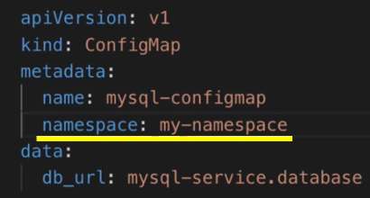

* Bu config dosyasını tekrar `kubectl apply` komutuyla uygularsak ve bu namespace alanında oluşturduğumuz bileşeni almak istersek, `kubectl get` komutuna bayrağı eklememiz gerekir çünkü varsayılan olarak çalıştırırsak, sadece default namespace'leri kontrol eder. Nina, `namespace` özniteliğini yapılandırma dosyasında kullanmamızı tavsiye ediyor. Çünkü 
1) Daha iyi belgelenmektedir. Sadece yapılandırma dosyasına bakarak componentin nerede oluşturulduğunu bilebiliriz ve bu önemli bir bilgi olabilir. 
2) Otomatik dağıtım kullanıyorsak ve sadece config dosyalarını uyguluyorsak, bu daha uygun bir yol olacaktır.

Örneğin, bir ekibin kendi namespace'ine sahip olduğu ve tamamen bu namespace ile çalışması gerektiği bir senaryo düşünürsek, her `kubectl` komutuna bu namespace etiketini eklemek oldukça sinir bozucu olabilir. Bu yüzden, default veya aktif namespace'in; varsayılan namespace'ten seçtiğimizi herhangi bir namespace'e değiştirmek için bir yol var.  Aracımızın adı `Kubens`. Bu aracı yüklememiz gerekiyor. 

Ubuntu'da indirmek için:

`kubectx` ve `kubens` depolarını klonlayalım:
```bash
git clone https://github.com/ahmetb/kubectx.git ~/.kubectx
sudo ln -s ~/.kubectx/kubectx /usr/local/bin/kubectx
sudo ln -s ~/.kubectx/kubens /usr/local/bin/kubens
```
İndirilen dosyaların çalıştırılabilir olduğundan emin olalım:
```bash
chmod +x ~/.kubectx/kubectx
chmod +x ~/.kubectx/kubens
```
`kubectx` ve `kubens`'i kontrol edelim:
```bash
kubectx
kubens
```

`kubens` yüklendikten sonra, sadece `kubens` komutunu çalıştırabiliriz. Bu bize tüm namespace'lerin bir listesini verir ve şu anda aktif olanı (varsayılan olanı) vurgular. 

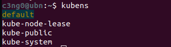

Aktif namespace'i değiştirmek istersek: 
```
kubens <Namespace_ismi>
```

komutunu çalıştırabiliriz. Aktif ad alanını değiştirecektir. `kubens` komutunu tekrar çalıştırırsak, aktif olanın yeni namespace'iniz olduğunu görürüz. Bu şekilde, `kubectl` komutlarını namespace sağlamadan çalıştırabiliriz. Ancak, namespace'ler arasında çok sık geçiş yapıyorsak, bu bizim için pek uygun olmayacaktır.


---

