Bu konuda Ingress'in ne olduğundan, nasıl kullanılacağından ve farklı kullanım senaryolarından bahsedeceğiz.

### External Service vs. Ingress

Öncelikle, basit bir Kubernetes cluster'ı hayal edelim. Bu cluster'ımızda, uygulamamızın bir Pod'u ve buna karşılık gelen bir Servisi (hizmeti) olan `my-app-service` var. Bir UI uygulaması için ilk gereksinim, uygulamanın tarayıcı üzerinden erişilebilir olmasıdır. Bu, dışarıdan gelen isteklerin uygulamaya ulaşabilmesi anlamına gelir. Bunun için kolay bir yol, uygulamaya HTTP protokolü kullanarak, node'un IP adresi ve portu aracılığıyla erişmek olan bir external service (dış hizmet) kullanmaktır.

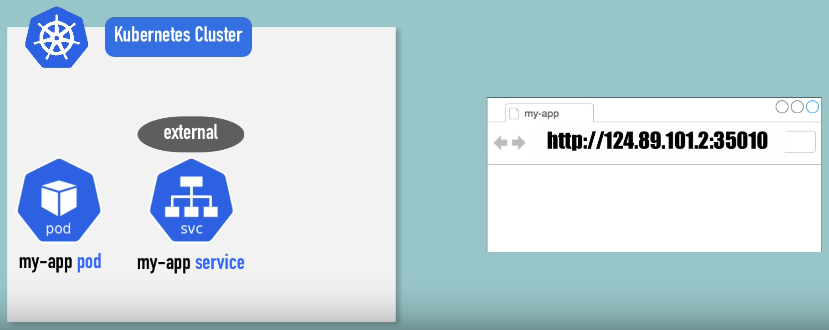

Ancak, bu yöntem test durumları ve hızlı bir şeyler denemek için uygundur, nihai ürün böyle olmamalıdır. Nihai ürün şu şekilde olmalıdır: Uygulamamızın bir alan adı (domain name) ve güvenli bir HTTPS bağlantısı olmalıdır. Bunu yapmanın yolu, Kubernetes componenti olan Ingress'i kullanmaktır. Bu durumda, `my-app-ingress` adında bir Ingress'e ve external service(dış hizmet) yerine bir internal service'e(iç hizmete) sahip oluruz. Yani uygulamamıza IP adresi ve port üzerinden değil, Ingress aracılığıyla erişiriz. Tarayıcıdan gelen istek önce Ingress'e ulaşır, ardından Ingress bu isteği iç hizmete yönlendirir ve en sonunda Pod'a ulaşır.

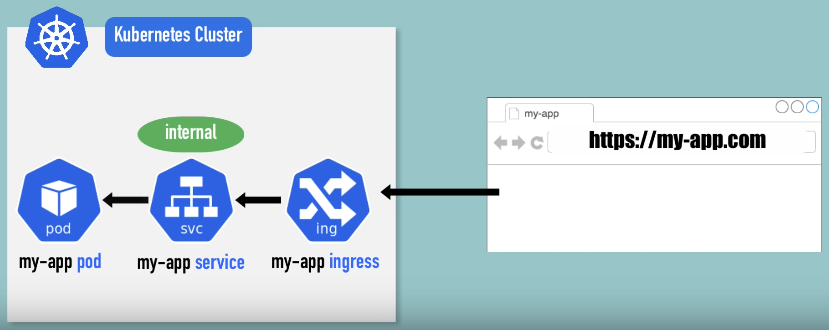

#### External Service YAML Config

Şimdi, external service yapılandırmasının nasıl göründüğüne bir göz atalım.

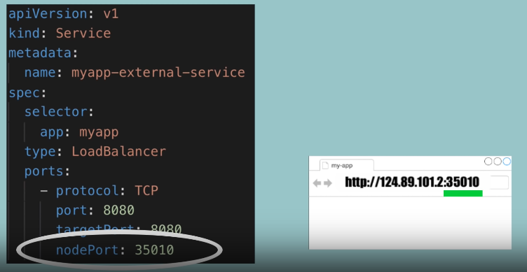

Servisin `loadBalancer` türünde olduğunu görürüz. Bu, servise bir `external IP` adresi atayarak public'e açtığımız anlamına gelir. Kullanıcı bu IP adresi ve belirlenen port numarasını kullanarak uygulamaya erişebilir.


#### Ingress YAML Config

Ingress ile bu konfigürasyon farklıdır. Ingress'in syntax'ına bakalım.

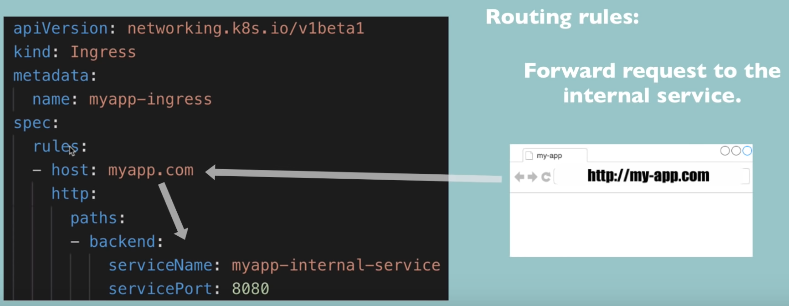

* `kind: Ingress` ile Ingress olduğunu belirtiriz.
* `spec` tüm yapılandırmanın olduğu yerdir.
	* `rules`  veya routing rules aracılığıyla yapılır. Bu tanımlanan rules, belirli bir hosta yapılan tüm isteklerin internal servise yönlendirilmesini tanımlar. *(Yukarıda net bir şekilde gösterilmiştir.)* Kullanıcı tarayıcıda bu hostun adresini girer ve Ingress, bu istekleri internal servise yönlendirir.
	*  `paths` ise alan adından sonraki URL yolunu ifade eder. Domain name'den sonra gelen herşeyi paths içerisinde tanımlarız. 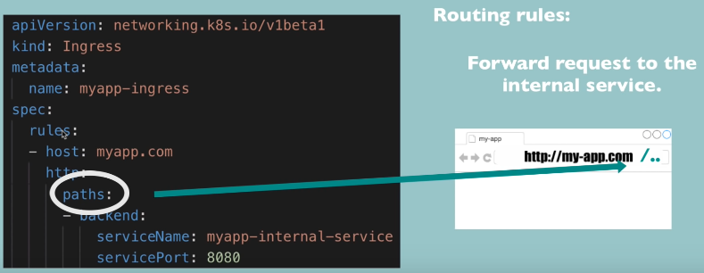

Şu anda yapılandırmada HTTPS bağlantısı için herhangi bir şey ayarlanmamıştır, sadece HTTP protokolü kullanılıyor. Ingress componentini kullanarak HTTPS yapılandırmasının nasıl yapılacağını az sonra göreceğiz.

> [!NOTE]
> Config içerisindeki `http`, URL adresindeki HTTP veya HTTPS'i ifade etmiyor.
> Bu, gelen isteğin internal servise yönlendirildiği protokoldür.
> 	1. Adım: tarayıcıdan Ingress'e istek gönderilmesilidir
> 	Config içerisindeki `http` ise ikinci adımdır. Gelen isteğin internal servise yönlendirildiği protokoldür. Bunu birinci adımla karıştırmamak gerekir.
> 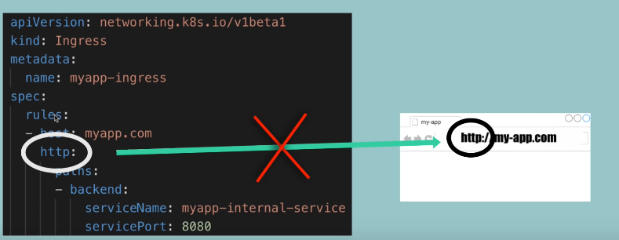


### Ingress Konfigürasyonu

Ve şimdi, internal servisin bu Ingress'e nasıl görüneceğine bakalım. Temelde, backend, gelen isteğin yönlendirileceği hedeftir ve servisin adı, internal servisin adını karşılamalıdır.

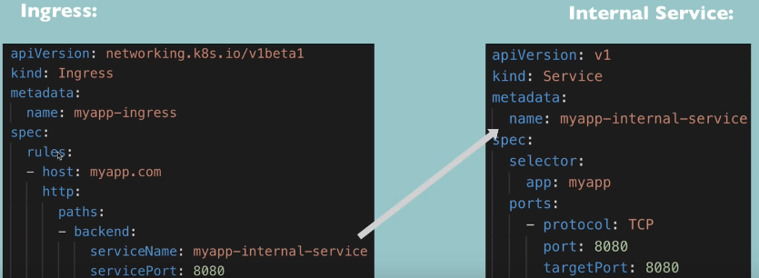

Ayrıca port, internal servis portu olmalıdır.


Burada gördüğünüz gibi, external ve internal servisler arasındaki tek fark, internal serviste node portunun olmamasıdır. Node portu 30000'den başlayan üçüncü port burada yoktur. Ayrıca tipi de bir load balancer değil, cluster IP olan default internal servis tipidir.

```yaml
..
..
spec:
	rules:
	- host: myapp.com
..
```

Bu, geçerli bir domain adresi olmalıdır. Buraya rastgele bir şey yazamayız. Ayrıca bu domain namei, Kubernetes clusterımızın entry point'i olan node'un IP adresine eşlemeliyiz. Örneğin, Kubernetes clusterımızda bir node'u entry point olarak belirlersek, bu domain adını o node'un IP adresine eşlemelisiniz. Veya Kubernetes cluster'ımızın dışında bir sunucu yapılandırırsak, bu sunucunun IP adresine eşlemeliyiz.

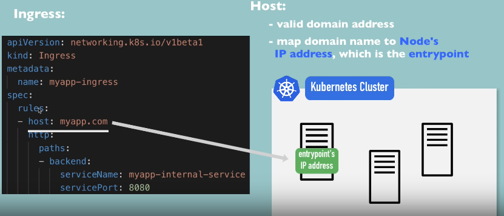

Şimdi, Kubernetes Ingress componentini gördüğümüze göre, Ingress'i clustera nasıl konfigüre edeceğimize bakalım. Başlangıçta gördüğümüz diyagramı hatırlayalım.

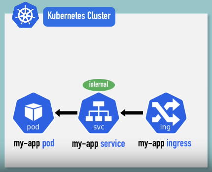

Temelde bir pod, servis ve buna karşılık gelen Ingress var. Ancak, yalnızca Ingress componentini oluşturmak yeterli değildir. Ingress routing rules'un çalışması için ek olarak bir Ingress controller'a ihtiyacımız var.

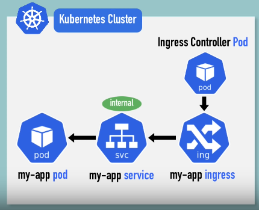

İlk adım, Ingress controllers kurmak olacaktır. Bu, Kubernetes clusterımızdaki nodelarımızda çalışan başka bir pod veya pod setidir ve Ingress rules'un değerlendirilmesi ve işlenmesini sağlar. Az önce gördüğümüz Ingress componentinin YAML dosyası, temelde sadece ingress bölümüdür.

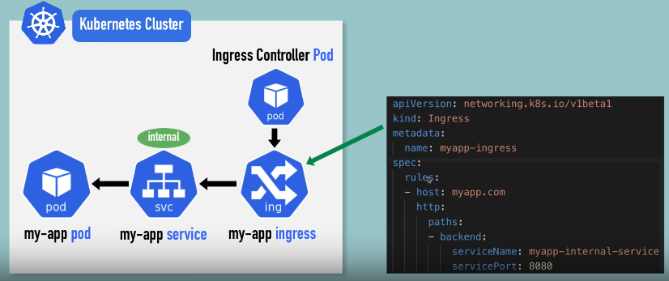

### Ingress Controller

Ingress denetleyicisi tam olarak nedir? Ingress controller'ın işlevi, clusterda tanımladığımız tüm kuralları(rules) değerlendirmek ve bu şekilde tüm yönlendirmeleri yönetmektir.


Ingress Controller, yapılandırdığımız domain name veya subdomain name kuralları için clusterda `entry point` olacaktır ve tüm kuralları değerlendirecektir. Clustera 50 kural veya 50 Ingress componenti oluşturmuş olabiliriz; yine de tüm kuralları değerlendirilecektir ve hangi routing rule'un belirli bir istek için geçerli olduğunu belirleyecektir.

Bu Ingress uygulamasını clusterımıza kurmak için birçok third party uygulamasından hangisini seçeceğimize karar vermemiz gerekir.

[Kubernetes Docs - Ingress Controller](https://kubernetes.io/docs/concepts/services-networking/ingress-controllers/)

burada seçebileceğiniz farklı Ingress denetleyicilerini görebilirsiniz. Kubernetes'in kendi controllerı olan `Kubernetes Nginx Ingress Controller` da var, ancak başka seçenekler de mevcut.

Clusterımıza Ingress controller kurduktan sonra, Ingress rules oluşturup tüm konfigürasyonu çalıştırabiliriz. Ingress'in bir Kubernetes clusterında nasıl kullanılabileceğini gösterdikten sonra, dış istekleri alabilmek için tüm clusterı ayarlama konusunun önemli olduğunu düşünüyorum.

Öncelikle, Kubernetes clusterımızın çalıştığı ortamı düşünmeliyiz. Amazon Web Services, Google Cloud gibi bir cloud service provider kullanıyorsak, bu sağlayıcının sağladığı bir yük loadbalancer kullanabiliriz. Dış istekler önce bu loadbalancer'a ulaşır, ardından Ingress controller'a yönlendirilir. `Cloud Service Provider` kullanmanın avantajı, kendi loadbalancer'ımızı uygulamak zorunda olmamamızdır. Bu, loadbalancer işlemini ve dış isteklerin yönlendirilmesini daha kolay hale getirir. Ancak, bulut ortamında bile farklı yollarla yapılandırma yapabiliriz, fakat bu yöntem en yaygın stratejilerden biridir.

Şimdi, Kubernetes clusterımızı `bare metal` bir ortamda dağıtıyorsak, bu kısmı kendimiz yapmamız gerekecek.

Kubernetes clusterımıza bir entry point yapılandırmamız gerekecektir ve bunu yapmanın birçok farklı yolu vardır. Cluster içinde veya dışında ayrı bir sunucu olarak bir entry point sağlamamız gerekecektir.

* Bu entry point, yazılım veya donanım çözümü olabilecek harici bir proxy sunucusu olabilir ve clustera entry point olarak loadbalancer rolünü üstlenir.

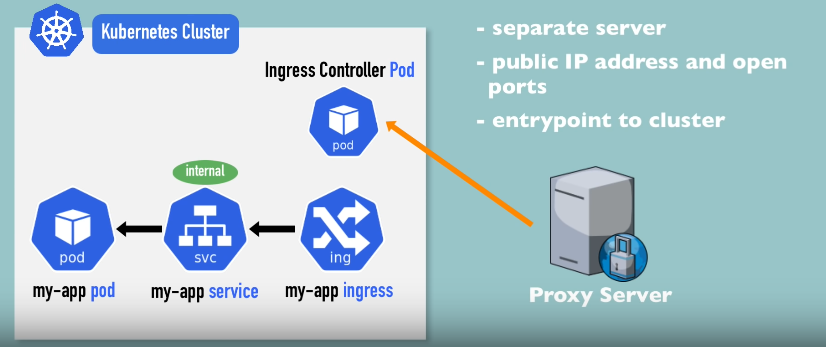

* Temel olarak, bu şu anlama gelir: Ayrı bir sunucuya sahip olacağız ve bu sunucuya bir genel IP adresi vereceğiz, gelen isteklerin kabul edilmesi için portları açacağız. Bu proxy sunucu, clusterımıza tek entry point olarak işlev görecek, yani Kubernetes clusterımızdaki hiçbir sunucu genel olarak erişilebilir bir IP adresine sahip olmayacaktır, bu da oldukça iyi bir güvenlik uygulamasıdır. Tüm istekler proxy sunucuya girecek ve bu, isteği Ingress controller'a yönlendirecektir. Ingress controller daha sonra bu belirli istek için hangi Ingress kuralının(rule) geçerli olduğunu belirleyecek ve tüm internal istek yönlendirmesi gerçekleşecektir.

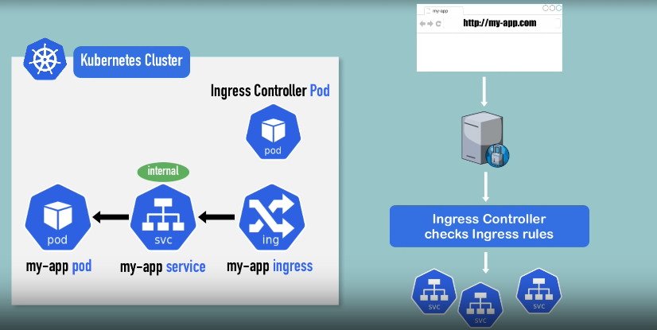

Söylediğimiz gibi farklı ortam ve yaklaşımlara bağlı olarak bunu yapılandırmanın ve ayarlamanın farklı yolları vardır, ancak clusterın nasıl çalıştığını anlamak önemlidir.

### Minikube Ingress Konfigürasyonu


Biz tüm bunları dizüstü bilgisayarımızda Minikube kullanarak yapacağımız için kurulum oldukça basit olacak ve bu, cluster ayarlarımıza tam olarak uygulanmasa bile, tüm bu şeylerin pratikte nasıl çalıştığını görmüş olacağız. İlk olarak, Minikube'da Ingress controller'ı kurmak gerekiyor ve bunu yapmak için şu komutu çalıştırabiliriz:

```bash
minikube addons enable ingress
```

Bu komut, `Kubernetes NGINX Ingress controller`'ı otomatik olarak başlatır ve yapılandırır. Bu, Minikube'un `out of the box` özelliğidir ve üretim ortamlarında da güvenle kullanılabilir. Bu komut ile Ingress controller clusterımızda yapılandırılacak ve:

```bash
kubectl get pod -n kube-system
```

komutunu çalıştırarak Ingress controller pod'unun çalıştığını görebiliriz.

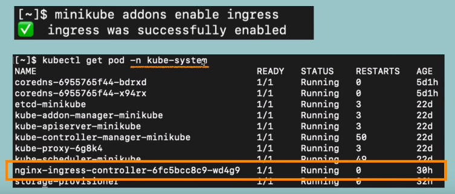

Ingress controller kurulduktan sonra, Ingress controller'ın kullanacağı bir Ingress kuralı oluşturabiliriz.

>[!TIP]
>Eğer `kubernetes-dashboard` componenti yoksa şu komutla indirebilirsiniz
>```bash
>kubectl apply -f https://raw.githubusercontent.com/kubernetes/dashboard/v2.7.0/aio/deploy/recommended.yaml
>```
>Bu komut, Kubernetes Dashboard için gerekli kaynakları oluşturur.

Şu an minikube clusterında harici olarak erişilebilir olmayan bir `kubernetes-dashboard` var.
İç hizmet ve pod zaten mevcut olduğundan, Kubernetes dashboard için bir Ingress kuralı yapılandıracağız, böylece bir tarayıcıdan bir alan adı kullanarak erişebiliriz.

```bash
kubectl get all -n kubernetes-dashboard
```

Bu komut kubernetes-dashboard'daki tüm componentleri gösterir.

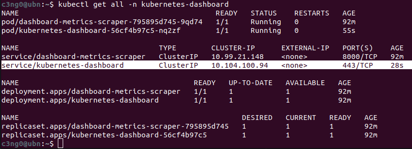
```bash
service/kubernetes-dashboard        ClusterIP   10.104.100.94   <none>        443/TCP    28s
```
Kubernetes Dashboard için zaten bir internal servisimiz ve çalışan bir pod'umuz olduğu için, Kubernetes Dashboard'a erişmek amacıyla bir Ingress kuralı oluşturabiliriz. Hadi bunu yapalım.

Kubernetes Dashboard için bir Ingress oluşturacağım. ,

```yaml
apiVersion: networking.k8s.io/v1
kind: Ingress
metadata:
  name: dashboard-ingress
  namespace: kubernetes-dashboard
spec:
  rules:
```

Bunlar sadece metadata.
* `name:` `dashboard-ingress` olacak.,
* `namespace:` hizmetin ve pod'un olduğu aynı namespace olacak.
* `spec:` içerisinde kuralları tanımlayacağız.

```yaml
apiVersion: networking.k8s.io/v1
kind: Ingress
metadata:
  name: dashboard-ingress
  namespace: kubernetes-dashboard
spec:
  rules:
  - host: dashboard.com
    http:
      paths:
      - backend:
          serviceName: kubernetes-dashboard
          servicePort: 80
```

* İlk kuralımız, `host:` olacak. `dashboard.com` olarak tanımladık.
* `http` forwarding, internal servise yapılacak.
* `paths:`' i (all path) olarak bıraktık.
* `backend:`, servisin backend'i olacak.
* `servicename`, az önceki çıktıda gördüğümüz servis adı.
* `servicePort:` ise servisin dinlediği port. Bunu da az önce paylaştığım çıktıda görüyoruz. `80/TCP`

Bu, Ingress konfigürasyonumuz olacak ve dashboard.com'a yönlendirilen her isteği, internal `kubernetes-dashboard` servisine yönlendirecek. Internal Servis olduğunu biliyoruz çünkü türü `ClusterIP`, yani External IP adresi yok.

```bash
NAME                                TYPE        CLUSTER-IP       EXTERNAL-IP   PORT(S)    AGE
service/kubernetes-dashboard        ClusterIP   10.101.218.170   <none>        80/TCP     82m
```

Bu arada`dashboard.com` hostnamei uydurduk, hiçbir yere kaydedilmedi ve ayrıca bu hostname'in hangi IP adresine çözülmesi gerektiğini hiçbir yere yapılandırmadık. Bu, her zaman yapılandırmamız gereken bir şeydir.

Şimdi bu Ingress rule'u apply edelim.

```bash
kubectl apply -f dashboard-ingress.yaml
```

> [!TIP]
>Eğer oluşturken şu hatayı alırsanız:
>```bash
>c3ng0@ubn:~$ kubectl apply -f dashboard-ingress.yaml Error from server (InternalError):
error when creating "dashboard-ingress.yaml": Internal error occurred: failed calling
webhook "validate.nginx.ingress.kubernetes.io": failed to call webhook: Post "https://ingress-nginx-controller-admission.ingress-nginx.svc:443/networking/v1/ingresses?timeout=10s": service "ingress-nginx-controller-admission" not found
>```
> Yapmanız gereken şey şu komutu kullanmaktır. Gereken `ingress-nginx-controller` indirilecek.
>
>```bash
>kubectl apply -f https://raw.githubusercontent.com/kubernetes/ingress-nginx/master/deploy/static/provider/cloud/deploy.yaml
>```


> [!TIP]
> `ingress-nginx-controller` oluşturduktan sonra da şöyle bir hata alırsanız eğer:
> ```bash
>c3ng0@ubn:~$ kubectl apply -f dashboard-ingress.yaml Error from server (InternalError): error when creating "dashboard-ingress.yaml": Internal error occurred: failed calling webhook "validate.nginx.ingress.kubernetes.io": failed to call webhook: Post "https://ingress-nginx-controller-admission.ingress-nginx.svc:443/networking/v1/ingresses?timeout=10s": service "ingress-nginx-controller-admission" not found
>```
> Bunun çözümü sadece biraz beklemek. Çünkü yeni oluşturduğumuz servisin oluşması biraz zaman alabilir 😁😁

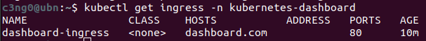

Ingress oluşturuldu. Namespace'te Ingress'i görmeliyiz. Adresin boş olduğunu görebiliriz çünkü Ingress'e adres ataması biraz zaman alır. Bu hostname'e eşlenecek IP adresini almak için beklememiz gerekecek.

Adresi aldıktan sonra bu adresi aşağıdaki şekilde hosts dosyamızda tanımlıyoruz.

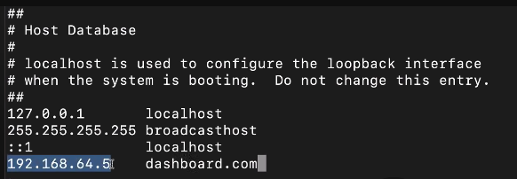

Bu yerel olarak çalışır, tarayıcıda dashboard.com yazarsak, bu IP adresine eşlenecek ve istek Minikube clustera gelecek, Ingress controller'a teslim edilecek ve Ingress controller bu kuralı değerlendirip isteği servise yönlendirecek. İhtiyacımız olan tüm konfigürasyon bu.

Şimdi gidip tarayıcıya `dashboard.com` yazacağız ve Kubernetes Dashboard'umuzu burada göreceğiz.

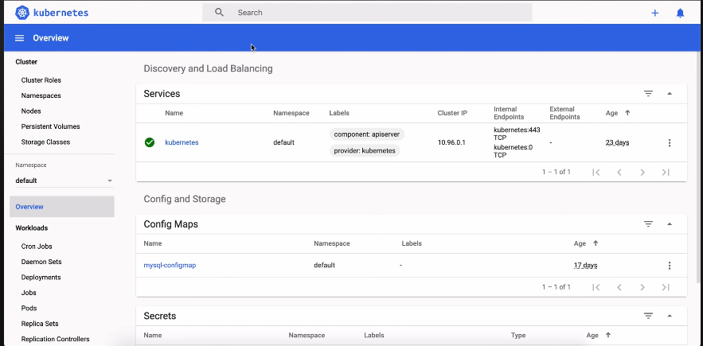

### Ingress Default Backend

Ingress ayrıca `default backend` adlı bir şeye sahiptir, bu nedenle `kubectl describe Ingress` komutunu kullanarak Ingress'in adını ve namespace'ini belirttiğinizde şu çıktıyı elde edersiniz.

```bash
kubectl describe ingress dashboard-ingress -n kubernetes-dashboard
```
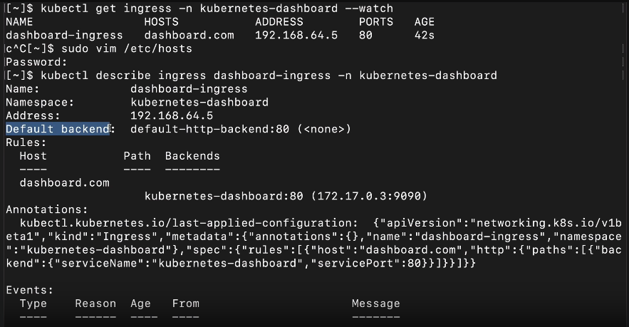

Burada, 80 numaralı `default-http-backend` portuna eşlenen bir `default backend` attribute'u vardır. Bu, Kubernetes clusterına gelen ve herhangi bir backend'e eşlenmeyen istekleri ele alır, yani bu isteği bir servise eşlemek için herhangi bir kural bulunmayan bir istek olduğunda, bu `default backend`'in bu isteği işleyeceği anlamına gelir. Bu servisi clusterımız içinde oluşturup tanımlamazsak, Kubernetes bu servise yönlendirmeye çalışacak, bulamayacak ve bir varsayılan hata yanıtı alacağız.

Örneğin, konfigüre etmediğimiz bir adrese istek gönderirsek, sadece "sayfa bulunamadı" mesajını alırız.

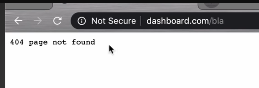

Bu, sayfa bulunamadığında özel hata mesajları tanımlamak veya gelen ve uygulamanızın işleyemeyeceği istekler geldiğinde kullanıcıların anlamlı bir hata mesajı veya özel bir sayfa görmesini sağlamak için kullanılabilir; böylece kullanıcıları ana sayfamıza yönlendirebiliriz.

**Özetle**
Şimdiye kadar Ingress'in ne olduğunu ve nasıl kullanabileceğimizi gördük. Ayrıca Minikube'da bir Ingress kuralının nasıl oluşturulacağına dair bir demo da yaptık, ancak sadece çok temel bir Ingress yaml konfigürasyonu kullandık; sadece bir path ile bir internal servise basit bir yönlendirme yaptık. Ancak Ingress configuration ile sadece temel yönlendirmeden çok daha fazlasını yapabiliriz.

### Multiple paths for Same Host

Şu use case'i düşünelim: Google bir domaine sahip ama birden fazla hizmet sunmaktadır. Örneğin, bir Google hesabımız varsa, Google Analytics'i kullanabiliriz, alışveriş yapabiliriz, bir takvime sahip olabiliriz, Gmail'e sahip olabiliriz vb..
Tüm bunlar, aynı domaine erişilebilen farklı uygulamalardır. Buna benzer bir uygulamamız olduğunu düşünelim; aynı ekosistemin bir parçası olan iki ayrı uygulama sunuyoruz. Ancak bunları ayrı URL'lerde tutmak istiyoruz.

* Yapabileceğimiz şey, "rule" içinde Hostu tanımlamaktır: `myapp.com`. Path bölümünde birden fazla yol tanımlayabiliriz. Kullanıcı, analytics uygulamamıza erişmek isterse, myapp.com/analytics adresini girmesi gerekecek ve bu, isteği pod içindeki internal analytics servise yönlendirecektir. Veya alışveriş uygulamasına erişmek isterse, URL myapp.com/shopping olacaktır. Bu şekilde, tek bir Host ve bir Ingress ile, birden fazla uygulamaya yönlendirme yapabiliriz.

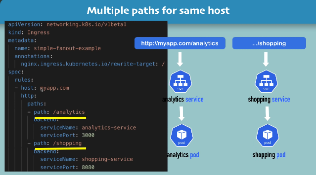

Başka bir use case ise, bazı şirketlerin farklı uygulamaları erişilebilir kılmak için URL'leri kullanmak yerine sub-domains kullanmasıdır. Yani, myapp.com/analytics yerine, bir sub-domain oluştururlar: analytics.myapp.com. Uygulamamız bu şekilde yapılandırılmışsa, şu şekilde görünecektir:

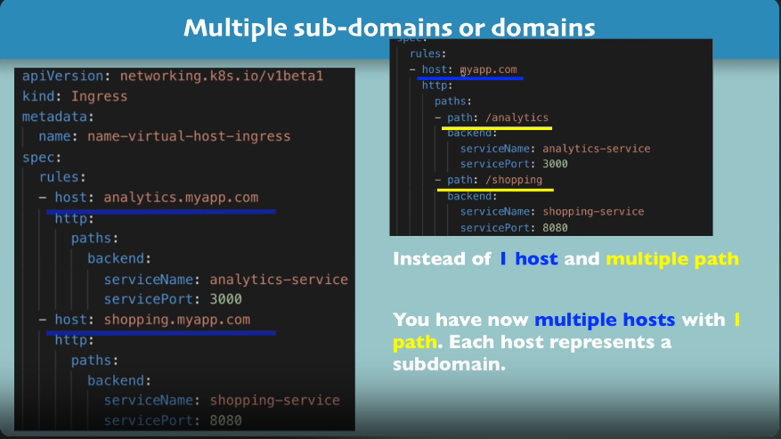

önceki örnekteki gibi tek bir host ve birden fazla path yerine, burada birden fazla host olur ve her host bir subdomaini temsil eder.

### TLS Certificate Konfigürasyonu

Bu başlıkta ele alacağımız son konu, TLS sertifikası yapılandırmasıdır. Şimdiye kadar sadece HTTP istekleri için Ingress yapılandırması gördük, ancak Ingress'te HTTPS yönlendirmeyi yapılandırmak da çok kolaydır. Yapmamız gereken tek şey, `rules` bölümünün üstüne TLS adında bir özellik tanımlamak, host değeri, aynı hostu `myapp.com` ve bir TLS sertifikasını içeren oluşturduğumuz secret'ın adını belirtmektir. Ingress ve Secret konfigürasyonu şu şekilde olacaktır:

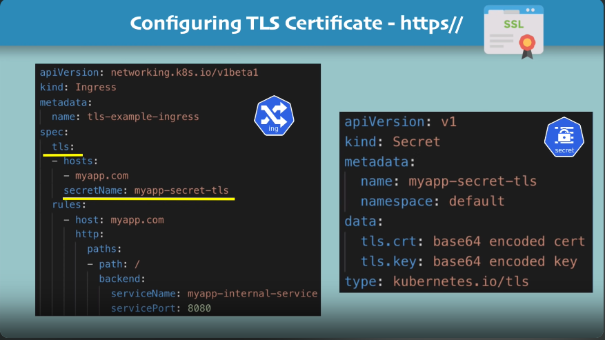

* `name` bir referanstır.
* `data` TLS sertifikası ve TLS anahtarını içerir.

Önceki konulardan hatırlarsanız, `type` belirtiyorduk. Kubernetes'te TLS adında belirli bir secret türü, TLS secret'ı oluştururken bu türü kullanmamız gerekiyor.

Burada tutulması gereken üç küçük not var:
* Birincisi, bu verilerin anahtarlarının tam olarak bu şekilde adlandırılması gerektiğidir. `tls.crt`, `tls.key`.
* İkincisi, bu değerler, sertifika veya anahtar içeriklerinin kendisidir, dosya yolu veya konumu değil, bu nedenle tüm içeriği buraya base64 kodlamamız gerekiyor.
* Üçüncüsü, secret'ı, Ingress bileşeniyle aynı `namespace` ile oluşturmamız gerekiyor. Aksi takdirde, farklı bir namespace'teki bir secret'a referans veremeyiz.
