## Helm Package Manager

Bu konu başlığında Helm'in tüm ana kavramlarını açıklayacağız, böylece kendi projelerinizde kullanabileceksiniz. Ayrıca, Helm versiyondan versiyona çok değişir, bu nedenle temel ilkeleri ve en önemlisi kullanım senaryolarını anlamak, hangi versiyonu seçerseniz seçin, Helm'i pratikte kullanmanızı kolaylaştıracaktır.

Bu başlıkta ele alacağımız konular şunlar: 
* Helm Nedir? 
* Helm Chart Nedir? 
* Nasıl kullanılır? Ne zaman kullanılır?
* Tiller'in nedir? 
* Tiller Helm mimarisinde nasıl bir rol oynar?

Öyleyse başlayalım.

### Helm Nedir?

Helm nedir? Helm'in birkaç ana özelliği vardır. İlk olarak, Kubernetes için bir paket yöneticisi olarak kullanılır, yani `apt`, `yum` veya `Homebrew` gibi düşünebilirsiniz. Bu, Kubernetes yaml dosyalarının koleksiyonlarını paketlemek ve bunları public ve private olarak dağıtmak için kullanışlı bir yoldur.

Bu tanımlar biraz soyut gelebilir, bu yüzden bunları belirli örneklerle açıklayalım.

Diyelim ki uygulamanızı bir Kubernetes kümesinde dağıttınız ve uygulamanızın loglarını toplamak için kümenize ek olarak Elasticsearch dağıtmak istiyorsunuz.

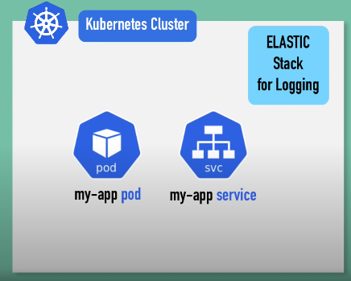

Elasticsearch'i kümenizde dağıtmak için birkaç Kubernetes bileşenine ihtiyacınız olacaktır. 

* Bir stateful-set'e ihtiyacınız olacak, bu stateful uygulamalar (veritabanları gibi) için gereklidir. 
* Bir dış yapılandırma için bir config map'e ihtiyacınız olacak. 
* Bazı kimlik bilgileri ve gizli verilerin saklandığı bir secret'a ihtiyacınız olacak.
* Kubernetes kullanıcısını ve ilgili izinlerini oluşturmanız gerekecek. 
* Ayrıca birkaç hizmet oluşturmanız gerekecek. 

Tüm bu dosyaları manuel olarak oluşturmak veya her birini internetten ayrı ayrı aramak zahmetli bir iş olacaktır, bu yaml dosyalarını toplamak, test etmek ve denemek biraz zaman alabilir. 

ElasticStack dağıtımı, tüm kümelerde oldukça standart olduğundan, diğer insanlar da muhtemelen aynı süreçten geçmek zorunda kalacaktır. Bu yüzden, birinin bu yaml dosyalarını bir kez oluşturup paketleyip bir yerde erişilebilir hale getirmesi mantıklı olurdu, böylece aynı tür dağıtımı kullanan diğer kişiler bunları kendi Kubernetes kümelerinde kullanabilirlerdi. 
**İşte bu yaml dosyaları paketi, `Helm chart` olarak adlandırılır.**

Helm kullanarak kendi Helm chart'larınızı veya bu yaml dosyalarının paketlerini oluşturabilir ve bunları Helm repolarına göndererek başkalarının kullanımına sunabilirsiniz ya da başkalarının oluşturup farklı repolarda erişilebilir hale getirdiği mevcut Helm chart'larını kullanabilirsiniz. Veritabanı uygulamaları, Elasticsearch, MongoDB, MySQL gibi yaygın olarak kullanılan dağıtımlar veya Prometheus gibi izleme uygulamaları, hepsi karmaşık kurulumlara sahip olanlar, farklı Helm kayıtlarında chart'ları bulunmaktadır.

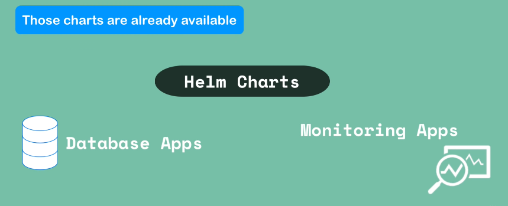

Basit bir `helm install [chart_name]` komutunu kullanarak, başka birinin zaten yaptığı yapılandırmayı ek çaba harcamadan yeniden kullanabilirsiniz ve bazen bu *biri*, uygulamayı oluşturan şirket bile olabilir. Chart'ların paylaşılması işlevselliği, Helm'in alternatif araçlara göre bu kadar popüler olmasının nedenlerinden biri olmuştur. 


Şimdi, eğer bir kümeniz varsa ve dışarıda bulunması gerektiğini düşündüğünüz bir tür dağıtıma ihtiyacınız varsa, bunu ya komut satırını kullanarak, `helm search` ile bir anahtar kelime aratarak ya da Helms'in kamuya açık kayıtları olan `Helm Hub` veya `Helm Charts` sayfalarına giderek veya diğer mevcut depoları kontrol ederek arayabilirsiniz. 

Public Helm chart kayıtlarının(registries) yanı sıra, private kayıtlar da vardır. Çünkü şirketler, bu chart'ları oluşturup kendi içlerinde veya kendi organizasyonlarının içinde dağıtmaya başladılar. Helm chart özel kayıtları için kullanılan birkaç araç bulunmaktadır.

Helm'in bir diğer işlevi, bir `Templating Engine` olmasıdır. Peki, bu ne anlama geliyor? 
Diyelim ki, birden fazla mikro servisten oluşan bir uygulamanız var ve bunları Kubernetes kümenize dağıtıyorsunuz. 

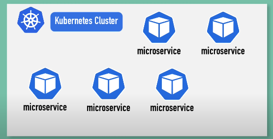

Her mikro servisin dağıtımı hemen hemen aynı, tek farkları uygulama adı ve sürümüdür. 
Veya docker imaj adı ve sürüm etiketleri farklıdır. Helm olmadan, her mikro servis için ayrı yaml dosyaları yazarsınız, yani her biri için kendi uygulama adı ve sürümünün tanımlandığı birden fazla dağıtım servis dosyanız olur. 

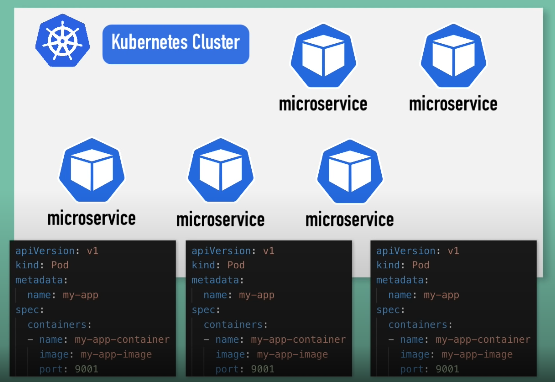

Ancak, bu yaml dosyaları arasındaki tek fark sadece birkaç satır veya birkaç değer olduğundan, Helm kullanarak, tüm mikro servisler için ortak bir `blueprint`(taslak) tanımlayabilir ve dinamik olan veya değişecek değerleri `placeholder`(yer tutucularla) değiştirebilirsiniz ve bu bir `template file`(şablon dosyası) olur. 

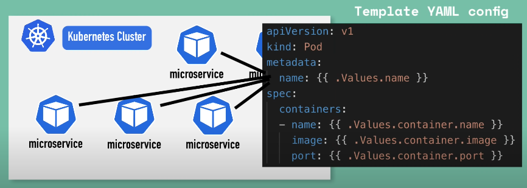

Şablon dosyası, standart bir yaml gibi görünür, ancak bazı yerlerde değerler yerine, dış yapılandırmadan değer aldığınız anlamına gelen bir sözdizimi kullanırsınız. 
Ve bu dış yapılandırmada,  `{{ .Values... }}` değeri, bir values.yaml dosyasından gelir ve bu dosyada, template dosyasında kullanacağınız tüm değerleri tanımlayabilirsiniz. 

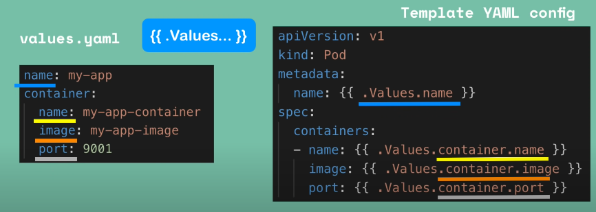

Örneğin, yukarıdaki resimde dört tane değer, values.yaml dosyasında tanımlanmıştır. 
`{{ .Values... }}`, values.yaml dosyasından sağlanan değerlerden oluşturulan bir objedir ve ayrıca komut satırından `-- set flag` kullanarak da sağlanabilir. Hangi yolla tanımlarsanız tanımlayın, bu değerler birleştirilir ve template dosyalarında kullanabileceğiniz {{ .Values... }} objesine yerleştirilir.

Her mikroservis için YAML dosyaları yerine sadece bir tane dosyanız olur ve bu değerleri dinamik olarak değiştirebilirsiniz. Bu, özellikle sürekli teslimat ve CI/CD (Continuous Integration / Continuous Delivery) kullanırken pratiktir çünkü pipeline'nızda bu template YAML dosyalarını kullanabilir ve değerleri dağıtımdan önce anında değiştirebilirsiniz. `On the fly`

Başka bir kullanım durumu, aynı uygulama setini farklı Kubernetes kümelerinde dağıttığınız zamandır. 


Diyelim ki geliştirme, hazırlık ve üretim kümelerine dağıtmak istediğiniz bir mikroservis uygulamanız var. 

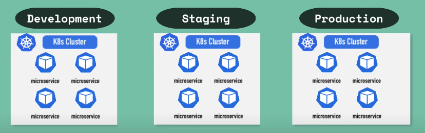

Her bir kümede ayrı ayrı YAML dosyalarını dağıtmak yerine, gerekli tüm YAML dosyalarını içeren kendi uygulamanız için paket oluşturabilirsiniz (own chart) ve bu grafiği kullanarak aynı uygulamayı farklı Kubernetes küme ortamlarında tek bir komutla yeniden dağıtabilirsiniz, bu da tüm dağıtım sürecini kolaylaştırır.

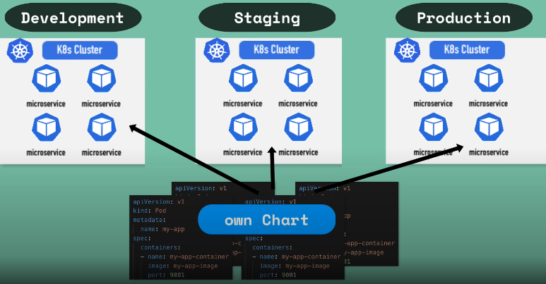

Helm grafikleri ne için kullanıldığını bildiğinize göre, daha iyi anlamak için bir örnek `Helm Chart Structure`a bakalım. 


Tipik olarak, chart böyle bir dizin yapısından oluşur: En üsttte chart adı olur ve dizin içinde de aşağıdakiler bulunur. 
* Chart.yaml, chart hakkında tüm meta bilgileri içeren bir dosyadır; ad, sürüm ve belki bağımlılıkların listesi gibi.. 
* Values.yaml, template dosyaları için tüm değerlerin yapılandırıldığı yerdir ve bunlar daha sonra değiştirebileceğiniz varsayılan değerler olacaktır. 
* Charts dizini, chart bağımlılıklarını(dependencies) içerir; yani, bu chart başka chartlara bağımlıysa, bu bağımlılıklar burada depolanır. 
* Templates klasörü ise template dosyalarının depolandığı yerdir, bu nedenle `Helm install` komutunu çalıştırdığınızda, bu template dosyaları values.yaml'deki değerlerle doldurulur ve geçerli Kubernetes manifest dosyaları üretilir, ardından Kubernetes'e dağıtılabilir. 
* İsteğe bağlı olarak, bu klasörde README veya lisans dosyası gibi diğer dosyalar da olabilir.

Values.yaml'daki değerlerin Helm şablonlarına nasıl enjekte edildiğini daha iyi anlamak için, bu dosyada image name, port ve version gibi üç değer olduğunu düşünün. 

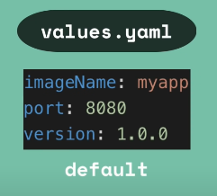

**Burada tanımlanan varsayılan değerler, farklı şekillerde geçersiz kılınabilir. **
* Bir yol, Helm install komutunu çalıştırırken alternatif bir values.yaml dosyası sağlamaktır. 

```bash
helm install --values=my-values.yaml <chartname>
```

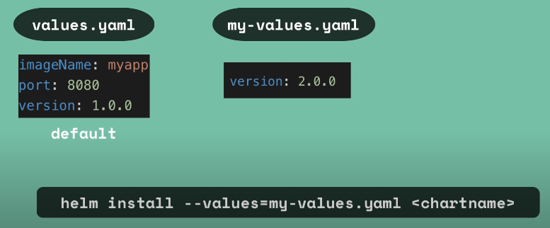

* Örneğin, values.yaml dosyasında image name, port ve version gibi üç değer varsa, kendi values.yaml dosyanızı my-values.yaml olarak adlandırabilir ve bu değerlerden birini geçersiz kılabilirsiniz. Veya yeni nitelikler de ekleyebilirsiniz. Bunlar birleştirilir, bu da şöyle bir values nesnesi oluşturur:  

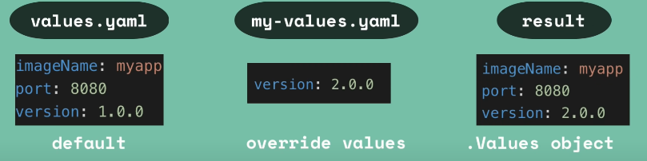

* values.yaml'deki image name ve port ve version için belirlediğimiz yeni değer. 


* Alternatif olarak, set flag kullanarak komut satırında doğrudan ek bireysel değerler de sağlayabilirsiniz.

```bash
helm install --set version=2.0.0
```

* ancak bu değerleri sakladığınız dosyalara sahip olmak daha düzenli ve yönetilebilir bir yöntemdir.