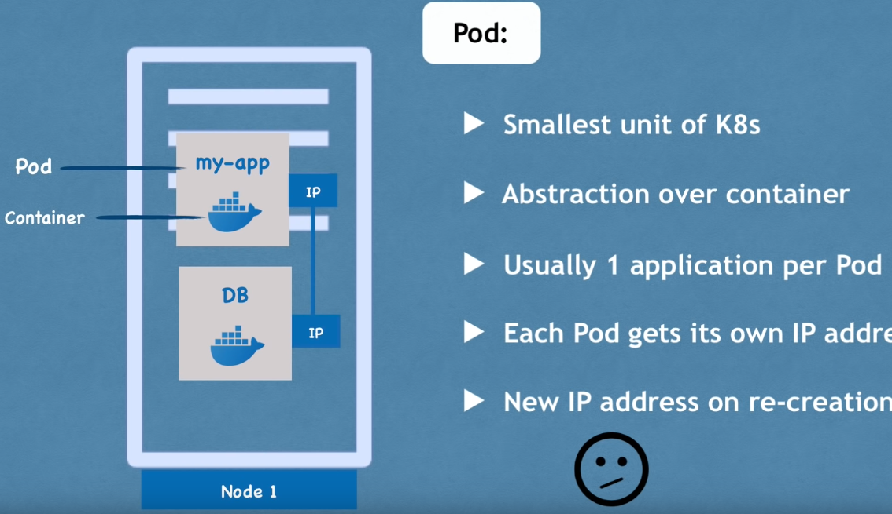

Pod
* Pod Kubernetes'in en küçük birimidir.
* Konteyner üzerinde sanallaştırma yapar. (abstraction)

* Bizler yalnızca Kubernetes katmanıyla etkileşime geçeriz.
* Bir pod içinde birden fazla konteyner çalıştırabiliriz, ancak genellikle bir pod başına bir uygulama bulunur.
* Her pod kendi IP adresine sahiptir. Her pod, birbirleriyle bu internal IP adresini kullanarak iletişim kurabilir.

Ancak, Kubernetes'teki pod bileşenleri de geçicidir: yani çok kolay bir şekilde ölebilirler.
Örneğin, bir veritabanı konteynerını kaybettiğimizi düşünelim (konteyner içindeki uygulama çöktüğü veya sunucu kaynakları tükendiği için pod ölür ve yerine yeni bir tane oluşturulur). Bu durumda da yeni bir IP adresi atanır. Veritabanıyla IP adresini kullanarak iletişim kuruyorsak elbette sakıncalıdır. Her pod yeniden başladığında, iletişimi her seferinde yeniden ayarlamamız gerekir. Bu nedenle, pod'un yeniden başladığında IP adresini ayarlamamıza gerek kalmadan, veritabanıyla iletişim kurmanızı sağlayan başka bir Kubernetes bileşeni olan `Service` kullanılır.

### Service ve Ingress

* Service, her pod'a bağlanabilen sabit bir IP adresidir. Uygulamamızın kendi servisi olacak ve veritabanı pod'u kendi servisine sahip olacak. Buradaki güzel şey, servis ve Pod'un yaşam döngüleri birbirine bağlı değil. Bu yüzden Pod ölse bile servis ve bu servise ait IP adresi kalır. Bu şekilde endpoint'i değiştirmemize gerek yoktur.

* Tabii ki, uygulamamızın bir tarayıcı aracılığıyla erişilebilir olmasını isteriz değil mi? Bunun için bir external service oluşturmamız gerekiyor. `External Service`, dış kaynaklardan iletişimi açan bir servistir. Ancak, veritabanımızı halka açık isteklere açmak istemeyiz. Bunun için `Internal Service` adını verdiğimiz bir şey oluştururuz.

* External Service URL'sinin çok pratik olmadığını fark ettik değil mi? Temelde, bir HTTP protokolüyle bir node IP adresi ve servis port numarasına sahibiz. Bu hızlı bir şekilde bir şeyleri test etmek istiyorsak iyidir, ancak end-product için iyi değildir. Genellikle, uygulamamızla güvenli bir protokol ve bir alan adı kullanmak isteriz.

Bunun için Kubernetes'in başka bir bileşeni olan `Ingress` var. Bu şekilde, istek önce servise değil, Ingress'e gider ve oradan servise yönlendirilir.

### ConfigMap ve Secret

Pod'lar birbirleriyle servis aracılığıyla iletişim kurar. Uygulamamızın, veritabanı ile iletişim kurmak için kullandığı bir database endpoint `örneğin mongodb servisi` olacak. Ancak bu veritabanı URL'sini (ya da endpoint) genellikle nerede yapılandırırız?

Genellikle bunu application properties file veya bazı external environmental variable olarak yaparız, ancak genellikle yapılandırma, uygulamanın içerisindeki built image'tedir.

Örneğin, service endpoint (ya da service name) 'mongodb' olarak değişirse, uygulamadaki bu URL'i ayarlamalıyız. Genellikle yeni bir sürümle uygulamayı rebuild etmemiz ve repoya pushlamamız gerekir. Ardından bu yeni image'i pod'umuzda pull'layıp tüm uygulamayı yeniden başlatmamız gerekebilir.

Veritabanı URL'i gibi küçük bir değişiklik için bu gerçekten zahmetli. Bu sebeple, Kubernetes'in `configmap` adında bir bileşeni var. Yapısı, uygulamamıza `external configuration` sağlar. ConfigMap genellikle kullandığımız veritabanı URL'leri gibi yapılandırma verilerini içerir. Kubernetes'te bunu Pod'a bağlarız. Pod, ConfigMap'in içerdiği verileri alır. Ve şimdi, servis adını değiştirirsek (service end point), sadece ConfigMap'i ayarlamamız yeterlidir. Yeni bir image oluşturmamıza ve tüm döngüyü geçirmemize gerek yoktur. Büyük avantaj!

Şimdi, external configuration'ın bir parçası aynı zamanda database kullanıcı adı ve şifresi olabilir değil mi? Bu veriler de uygulama dağıtım sürecinde değişebilir. Ancak, bir şifreyi veya diğer kimlik bilgilerini düz metin formatında bir configmap'e koymamız güvensiz olur.

>[!WARNING]
>

Bu amaçla, Kubernetes'in `Secret` adında bir başka bileşeni daha var. Yani, Secret, ConfigMap gibi, ancak fark şu ki; şifre gibi gizli verileri saklamak için kullanılır. Ve tabii ki, düz metin formatında değil, base64 formatında kodlanmış olarak saklanır. Yani, Secret, kullanıcı adları gibi kimlik bilgilerini içerecek ve veritabanı kullanıcılarını içerecektir. ConfigMap'e de koyabiliriz, ancak önemli olan şifreler, sertifikalar, başkalarının erişimini istemediğimiz şeyler Secret'e koyulmalıdır. Aynı ConfigMap gibi, sadece Pod'umuza bağlarız, böylece Pod bu verileri görebilir ve Secret'ten okuyabilir. ConfigMap veya Secret'ten verileri, örneğin environment variables olarak veya hatta bir özellikler dosyası olarak uygulamamızın içinde kullanabiliriz.

Aslında en çok kullanılan Kubernetes temel bileşenlerinin neredeyse tamamını gördük. Pod'a göz attık. Hizmetlerin nasıl kullanıldığını, Ingress bileşeninin ne işe yaradığını gördük ve ayrıca ConfigMap ve Secrets'ı kullanan harici yapılandırmayı da gördük.

### Volumes

Sıra geldi çok önemli bir kavrama. `Veri depolama` nedir ve Kubernetes içerisinde nasıl çalışır? Uygulamamızın kullandığı bir database pod'umuz ve de bir miktar verimiz var. Şu anda gördüğünüz bu kurulumla, eğer veritabanı container veya pod'u yeniden başlatılırsa veri kaybolur. Bu açıkça sorunlu ve elverişsizdir çünkü database'deki verilerinizin veya günlük verilerinizin uzun süreli güvenilir ve kalıcı olmasını isteriz. Bunu Kubernetes'te yapmanın yolu, Kubernetes'in başka bir bileşeni olan `Volumes` kullanmaktır.

Çalışma şekli şöyledir: Temelde bir fiziksel depolama birimini -yani bir sabit diski- pod'umuza bağlarız.
* Bu depolama yerel bir makinede olabilir.
* Pod'un çalıştığı aynı sunucu node'unda da olabilir.
* Kubernetes kümesinin dışında(Bulut depolama, Kubernetes kümesinin bir parçası olmayan kendi yerleşke depolamanız) olabilir.
Bu yüzden bununla ilgili external reference var.

Böylece, database pod'u veya container yeniden başlatıldığında, tüm veri kalıcı bir şekilde saklanmış olacaktır.

Kubernetes kümesi ve tüm bileşenlerinin ve depolama arasındaki farkı anlamamız önemlidir. Yerel veya uzak bir depolama olması fark etmeksizin, depolamayı Kubernetes kümesine takılmış harici bir sabit diske benzetebiliriz. Çünkü buradaki önemli nokta; Kubernetes kümesi açıkça hiçbir veri kalıcılığını yönetmez. Kubernetes kullanıcısı veya yöneticisi olarak sizin veriyi yedeklemenizden, çoğaltmanızdan, yönetmenizden ve uygun donanımda saklamanızdan emin olmanız gerektiği anlamına gelir.

### Deployment ve StatefulSet

Şimdi, her şey mükemmel bir şekilde çalışıyor ve bir kullanıcı bir tarayıcı aracılığıyla uygulamaya erişebiliyor. Bu kurulumla, application pod'u ölürse, crashlerse veya yeni bir container image oluşturduğumuz  için pod'u restart etmemiz gerekiyorsa ne olurdu? Basitçe cevap verecek olursak, bir kullanıcının uygulamamıza ulaşamadığı bir süre olan bir kesintimiz olurdu. Böyle bir durum end product'ta gerçekleşmesi çok kötü bir durumdur.

Distributed systems ve konteynerların avantajı tam olarak budur. Yalnızca 1 application pod'u ve 1 database pod'u gibi bir şeye güvenmek yerine, her şeyi birden fazla sunucuda replikasını oluşturuyoruz. Yani uygulamamızın bir klonu veya çoğaltması çalışacağı başka bir node olacak ve bu da servise bağlı olacak. Hatırlarsak servisin, bir pod öldüğünde end point'i sürekli ayarlamamıza gerek olmadığı, kalıcı statik IP adresi ve bir DNS adına sahip olduğunu söylemiştik.

* Service aynı zamanda bir `load balancer`dır. Yani, servis isteği yakalayacak ve en az meşgul olan pod'a yönlendirecektir.

Ancak application pod'unun ikinci replikasını oluşturmak için ikinci bir pod oluşturmayız. Bunun yerine uygulama pod'umuzun bir blueprint'ini tanımlarız ve o pod'un kaç tane replikasının olmasını istediğimizi belirtiriz. Ve bu component veya blueprint'e `deployment` denir. Deployment, Kubernetes'in başka bir componentidir. Pratikte, pod'larla çalışmayız veya pod'lar oluşturmayız. Çünkü zaten kaç tane replika olacağını belirtebilir ve ihtiyacımız olan pod'ların replika sayısını artırabilir veya azaltabiliriz. Yani pod, container'ların üzerinde bir soyutlama katmanıdır(layer of abstraction). Deployment ise, podların üzerinde başka bir soyutlama katmanıdır(layer of abstraction). Bu durum; pod'larla etkileşimi, kopyalama ve diğer yapılandırmaları daha kullanışlı hale getirir.

Yani sonuç olarak çoğunlukla pod'larla değil, deployment'larla çalışırız. Uygulama pod'umuzun replikalarından biri ölürse, servis istekleri başka bir replikaya yönlendirilecektir, bu şekilde uygulamamız kullanıcılar için hala erişilebilir olacaktır.

Şimdi muhtemelen şunu merak ediyoruzdur, database pod'u ne olacak? Çünkü eğer database pod'u ölürse, uygulamanız da erişilemez olacaktır. Bu yüzden, bir database replikasına da ihtiyacımız var. Ancak, `deployment kullanarak bir databese'i kopyalayamayız`. Bunun nedeni, database'in bir state'i olmasıdır, yani veridir. Bu da demektir ki eğer database'in replikaları veya klonları olsaydı, hepsi aynı paylaşılan data storage volume'üne erişmek zorunda kalacaktı. Bu durumda da, hangi pod'ların anlık olarak depolama birimine yazdığını veya hangi pod'ların depolama biriminden okuduğunu yöneten bir mekanizmaya ihtiyacımız olacaktı.

Bu mekanizma, çoğaltma özelliklerinin yanı sıra başka bir Kubernetes componenti olan `StatefulSet` ile sağlanır.

Bu component özellikle database gibi uygulamalar için tasarlanmıştır. Yani, MySQL, MongoDB, Elasticsearch veya herhangi bir diğer stateful applications veya databaseleri; deployments yerine `StatefulSets` kullanılarak oluşturulmalıdır.
Bu çok önemli bir ayrımdır. StatefulSet, aynı deployment gibi, pod'ları replikalamayı yapar ve bunları scaling'e alır. Database reading ve writing işlemlerinin senkronize olduğundan emin olur, böylece database tutarsızlıkları olmaz.

> [!TIP]
> Ancak, bir Kubernetes kümesinde StatefulSets kullanarak database uygulamalarını deploy etmek biraz zahmetli olabilir. Bu yüzden, database uygulamalarını Kubernetes kümesinin dışında barındırmak ve yalnızca dağıtımları veya durumsuz uygulamaları Kubernetes kümesinin içinde sorunsuz bir şekilde çoğaltmak ve ölçeklendirmek ve dış database ile iletişim kurmak yaygın bir uygulamadır.

Şimdi, uygulama pod'umuzun iki replikası ve database'in iki kopyası olduğunda ve hepsi load-balanced olduğunda, kurulumumuz daha güvenlidir. Bu senaryoda eğer Node 1 yeniden başlatılsaydı veya çökseydi, hala uygulama ve database pod'larının çalıştığı ikinci bir node'umuz olurdu. Uygulama, bu iki replikadan yeniden oluşturulana kadar kullanıcı tarafından erişilebilir olacaktır, bu yüzden kesintiyi önlemiş oluruz.

Özetlemek gerekirse, en çok kullanılan Kubernetes bileşenlerini inceledik. Parçalar arasında iletişim kurmak için `pod`lar ve `servis`lerle başladık, ve trafiği clusterlara yönlendirmek için kullanılan `Ingress` bileşenini inceledik. Ayrıca, `ConfigMaps` ve `Secret` kullanarak external configuration, ve `Volumes` kullanarak veri kalıcılığını inceledik. Ve son olarak, `Deployments` ve `StatefulSets` gibi replicating ve blueprintlere baktık.

Burada `stateful applications` özellikle databaseler gibi stateful applications için kullanılır. Ve evet, Kubernetes'in sunduğu çok daha fazla bileşen var, ama bunlar çekirdek, temel olanları. Bu temel bileşenleri kullanarak oldukça güçlü Kubernetes kümesi oluşturabiliriz.

---
- [[4- Kubernetes Mimarisi]]