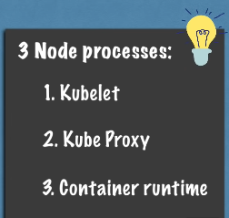
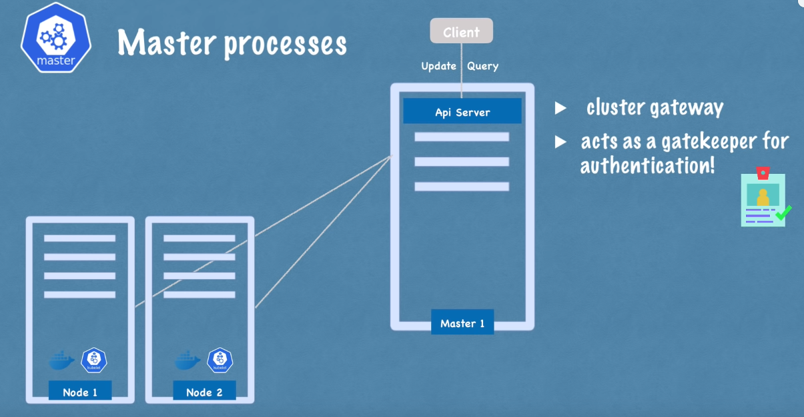
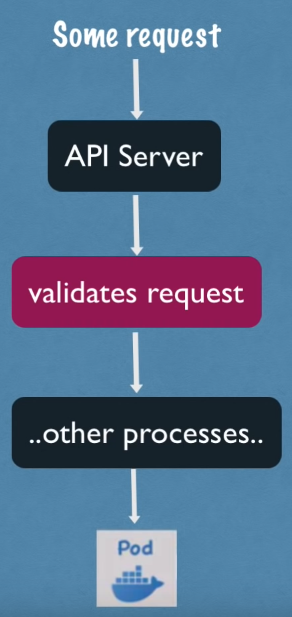
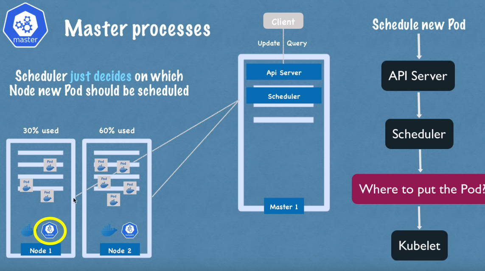
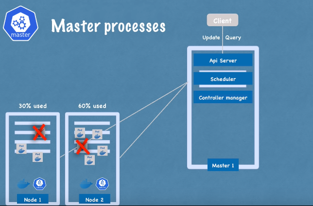
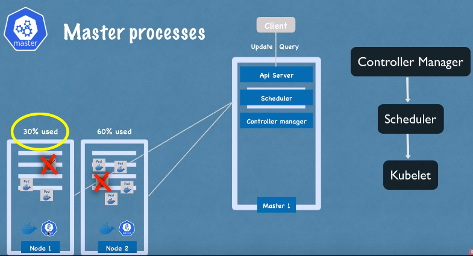
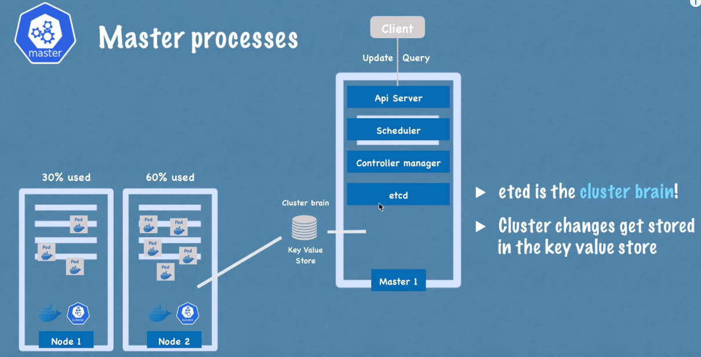
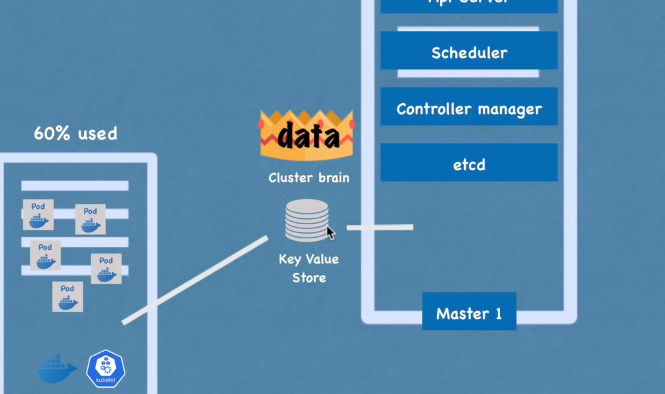
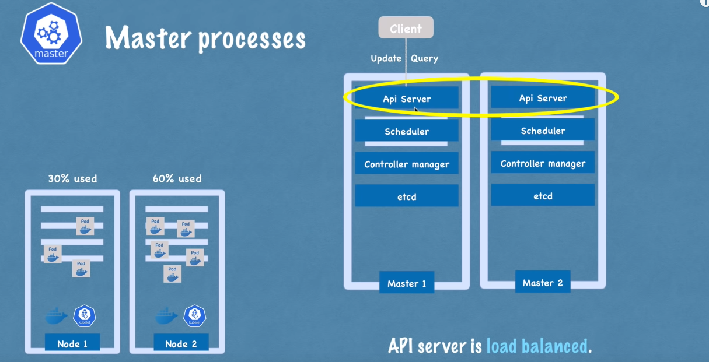

Kubernetes'in temel mimarisinden bahsedeceğiz. Bu yüzden Kubernetes'in çalıştığı iki tür node'u inceleyeceğiz: biri `master` diğeri ise `slave`. Bunların arasındaki fark nedir ve her birinin cluster içindeki rolü nedir, onlara bakacağız.

Kubernetes'in ne yaptığını ve cluster'ın nasıl self-managed, self-healing ve automated olduğunu gösteren temel kavramları ele alacağız.  Bir Kubernetes cluster operatörü olarak, çok daha az manuel çaba harcamamız gerektiğini göreceğiz.

### Node Process

İki application pod'unun çalıştığı tek bir node ile bu temel kurulumla başlayacağız. Kubernetes mimarisinin ana bileşenlerinden biri worker servers veya node'dur. Her node, o node'da çalışan birden fazla application pod'una sahip olacaktır.

Ve Kubernetes'in bunu yapma şekli, her node'da bulunması gereken ve bu pod'ları planlamak ve yönetmek için kullanılan `three process` kullanmasıdır. Yani node'lar, asıl işi yapan cluster serverlardır. Bu yüzden bazen onlara worker nodes da denir.

#### 1) Container Runtime

Her node'da çalışması gereken ilk süreç, `container runtime`dır. Biz Docker ile işlem yapacağız, ancak başka bir teknoloji de olabilir. Applitacion pod'larında içinde çalışan containerlar olduğu için, her node'da bir `container runtime`  kurulmalıdır.

#### 2) Kubelet

Kubernetes'in bir parçası olan kubelet, Pod'ları ve bu Pod'ların altındaki container'ları schedule eder. Container Runtime, node'un kendisiyle arayüz oluştururken, kubelet bu yapılandırmayı alır, bir pod'u çalıştırır (veya içinde bir container başlatır) ve ardından o node'dan container'a CPU, RAM gibi depolama kaynakları atar.

Bu nedenle, genellikle bir Kubernetes cluster kurulu olmalıdır. Kubelet hizmetlerine sahip birden fazla node'dan oluşur. Bu worker node'ları, Örneğimizdeki application ve database pod'larının replikalarını çalıştıracak yüzlerce diğer node'u çalıştırır.

Aralarındaki iletişim şekli, `servisler` ile olur, bu da isteği application parçasına veya örneğin bir database'e yönlendiren bir `load-balancer` gibi çalışır ve ardından ilgili parçaya yönlendirir.

#### 3) Kube Proxy

Hizmetlerden pod'lara istekleri iletmekten sorumlu üçüncü süreç `kube-proxy`dir ve her node'da kurulmalıdır. Kube-proxy, düşük bir işlem yükü ile performanslı bir şekilde iletişim kurulmasını sağlayan akıllı yönlendirme mantığına sahiptir.

Bir uygulama veya bu uygulamanın replikası, bir database'e istek yapıyorsa, hizmet sadece isteği rastgele bir replikaya yönlendirmek yerine; isteği başlatan pod'un çalıştığı aynı node'da çalışan replikaya yönlendirecektir. Bu şekilde, isteği başka bir makineye göndermekle ilgili `ağ işlem yükünden` kaçınılmış olur.

Özetlemek gerekirse; bir kubernetes cluster'ının düzgün çalışabilmesi için `kubelet` ve `kube-proxy` her worker node içerisine `container runtime` ile birlikte kurulmalıdır.

Ancak şimdi soru şu: Bu cluster ile nasıl etkileşime girilir? Yeni bir application pod'u veya database pod'u nerede schedule edilmeli? Bir replika pod'u ölürse, hangi process monitoring, reschedule veya restart işlemleri ile ilgilenir?

### Master Node

Master servers(master nodes), içerisinde tamamen farklı processler çalıştırır. Ve bunlar, cluster state ve worker nodes'ları kontrol eden, `her yönetici düğümünde çalışan dört süreçtir`.

#### 1) API Server

İlk hizmetimiz API server. Bir Kubernetes cluster'ında yeni bir application deploy etmek istediğinizde, bir kullanıcı olarak API server ile interact ederiz. Bir Kubernetes Dashboard gibi bir kullanıcı arayüzü de olabilir, `kubectl` gibi bir command-line tool veya bir Kubernetes API'si de olabilir.

API sunucusu, cluster içine herhangi bir güncelleme talebinin veya hatta clusterdan gelen sorguların ilk isteğini alır. Kimlik doğrulaması(auth) yaparak, yalnızca kimliği doğrulanmış ve yetkilendirilmiş isteklerin clusterlara iletilmesini sağlar.

Bu, yeni pod'lar planlamak, yeni applications deploy etmek, yeni servisler oluşturmak veya herhangi bir component oluşturmak istediğimizde, bu requestimizi master node API sunucusuna iletmek zorunda olduğunuz anlamına gelir. API server daha sonra requestimizi doğrular. Her şey yolundaysa, requestimizi diğer süreçlere ileterek istediğimiz pod'u veya bileşeni schedule için bir node'a yönlendirir.

Ayrıca, dağıtımımızın durumu veya cluster health etc., gibi sorgu isteklerini yapmak isteyebiliriz. Bu sorgular API sunucusuna bir istek gönderir ve o da bize yanıt verir.

> [!NOTE]
> Bu durum güvenlik açısından gayet iyidir çünkü clusterlara yalnızca `bir entry point` vardır.

#### 2) Scheduler

Başka bir Master process ise Scheduler'dır. API serverına yeni bir pod schedule isteği gönderdiğimizi varsayalım. API server bu isteğimizi doğruladıktan sonra, bu pod'un bir worker node'da başlatılması için `Scheduler`'a teslim eder.

Ve tabii ki, herhangi bir node'a rastgele atamak yerine, Scheduler, bir sonraki pod'un hangi belirli worker node'un scheduled olacağı konusunda zekice bir şekilde karar vermektedir. İlk olarak, isteğimizi kontrol eder ve planlamak istediğimiz uygulamanın ne kadar kaynağa ihtiyacı olduğunu kontrol eder. Ne kadar CPU, ne kadar RAM vb.

Ardından, worker node'daki kullanılabilir kaynakları kontrol eder. Eğer bir node'un en çok kaynağa sahip olduğunu söylüyorsa, yeni pod'u o node'a schedule eder.

Önemli bir nokta şu ki, scheduler sadece yeni bir pod'un hangi node'a schedule edileceğine karar verir. Asıl planlamayı yapan ve pod'u konteynerla başlatan işlem ise `kubelet`'tir. Yani kubelet, scheduler'dan gelen isteği alır ve bu isteği ilgili node üzerinde yürütür.

#### 3) Controller Manager

Bir sonraki önemli bileşen ise `controller manager`'dır. Bu bileşen, herhangi bir düğümde pod'lar öldüğünde ne olacağı sorusu açısından kritik öneme sahiptir. Ölü node'ları tespit etmek ve daha sonra bu pod'ları en kısa sürede reschedule etmek gerekir.

Dolayısıyla controller manager, state changes'ları, örneğin pod'ların çökmesini tespit eder. Pod'lar öldüğünde controller manager bunu algılar ve cluster state'ini mümkün olan en kısa sürede kurtarmaya çalışır.

Ölen pod'ları yeniden schedule etme amacıyla scheduler'a bir istek gönderir. Bu döngü içinde, scheduler kaynak hesaplamasına göre hangi worker node'ların bu pod'ları tekrar başlatması gerektiğine karar verir ve bu worker node'lar üzerindeki ilgili `kubelet`lere, pod'ları yeniden başlatmaları için istek gönderir.

#### 4) Etcd

Son olarak, ana işlemlerden biri olan etcd, bir cluster state'inin key-value deposudur. Bunu aslında bir cluster beyni olarak düşünebiliriz. Yani cluster'daki her değişiklik -örneğin yeni bir pod schedule edildiğinde veya bir pod öldüğünde- etcd'nin bu key-value deposunda kaydedilir veya güncellenir.

Etcd deposunun bir küme beyni olarak adlandırılmasının sebebi, scheduler, controller manager gibi tüm bu mekanizmaların, etcd'nin sahip olduğu veriler sayesinde çalışmasıdır.

Örneğin, scheduler her bir worker node'unda hangi kaynakların mevcut olduğunu nasıl bilir? Veya controller manager, cluster durumunda bir değişiklik olduğunu nasıl tespit eder? Pod'ların ölmesi, kubelet'in scheduler'ın isteği üzerine yeni pod'ları başlatması, API sunucusuna cluster health hakkında bir sorgu göndermemiz veya uygulama dağıtım durumumuz gibi bu durum bilgilerini, API sunucusu nereden alır?

Cevap: Tüm bu bilgiler etcd kümesinde saklanır. Etcd'nin key-value deposunda saklanmayan şey ise gerçek uygulama verileridir. Örneğin, bir cluster içinde çalışan bir database uygulamamız varsa, veriler etcd'de değil, başka bir yerde saklanır. Bu, yalnızca master işlemlerinin worker işlemleriyle ve tersiyle iletişim kurması için kullanılan bir cluster state bilgisidir.

Artık muhtemelen ana işlemlerin, özellikle de verileri güvenilir bir şekilde saklanması veya çoğaltılması gereken etcd deposunun, cluster operasyonu için kritik öneme sahip olduğunu anlamışızdır. Bu nedenle, uygulamada bir Kubernetes kümesi genellikle birden fazla master'dan oluşur. Her bir master düğümü kendi ana işlemlerini çalıştırır; elbette API sunucusu load-balanced'dır ve etcd deposu tüm master düğümleri arasında distributed bir depolama oluşturur.

---
- [[5- Cluster Yapısı]]