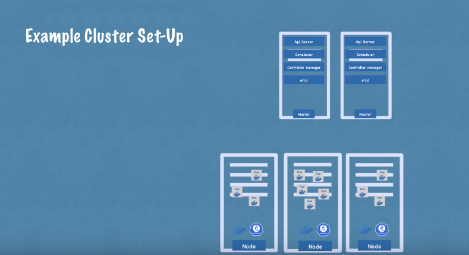
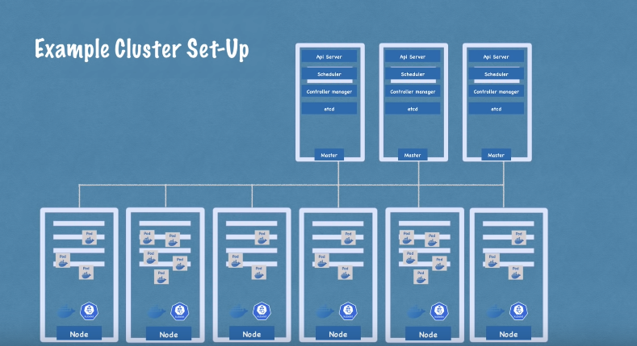

Şimdi worker ve master node'larında çalışan işlemleri gördükten sonra, gerçek hayattaki bir cluster kurulumuna bakalım. Çok küçük bir cluster'da muhtemelen iki master node ve üç worker node olur.

Burada dikkat edilmesi gereken bir diğer nokta ise master node sunucularının donanım kaynaklarının aslında farklı olmasıdır. Master işlemleri daha önemlidir, ancak aslında daha az iş yüküne sahiptirler. Dolayısıyla CPU, RAM ve depolama gibi daha az kaynağa ihtiyaç duyarlar. Worker node'ları ise, containerları çalıştıran pod'ları barındırma gibi asıl işi yaparlar.

Bu nedenle, worker node'larının daha fazla kaynağa ihtiyacı vardır. Uygulamamızın karmaşıklığı ve kaynak gereksinimi arttıkça, aslında cluster'ımıza daha fazla master ve worker node'u ekleyerek daha güçlü ve sağlam bir küme oluşturabiliriz. Böylece uygulama kaynak gereksinimlerimizi karşılayabiliriz.

Var olan bir Kubernetes cluster'ında yeni master veya worker serverları eklemek aslında oldukça kolaydır. Bir master sunucusu eklemek istiyorsak, yeni bir bare metal sunucu ediniyoruz. Üzerine tüm master work'leri kurup  onu Kubernetes kümesine ekliyoruz. Bu kadar..

Yine aynı şekilde, iki worker node'una ihtiyacımız varsa, bare metal sunucular ediniyoruz. Container runtime, kubelet ve kube-proxy gibi tüm worker node işlemlerini üzerlerine kurup onları Kubernetes clusterına ekleyin.

İşte bu kadar.
Bu şekilde, uygulama karmaşıklığı ve kaynak gereksinimi arttıkça, Kubernetes kümemizin gücünü ve kaynaklarını sonsuza kadar artırabiliriz.

---
- [[6- Minikube ve Kubectl Kurulumu]]