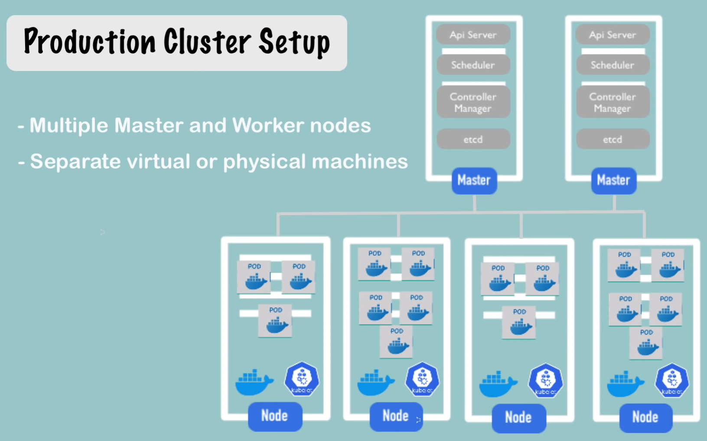
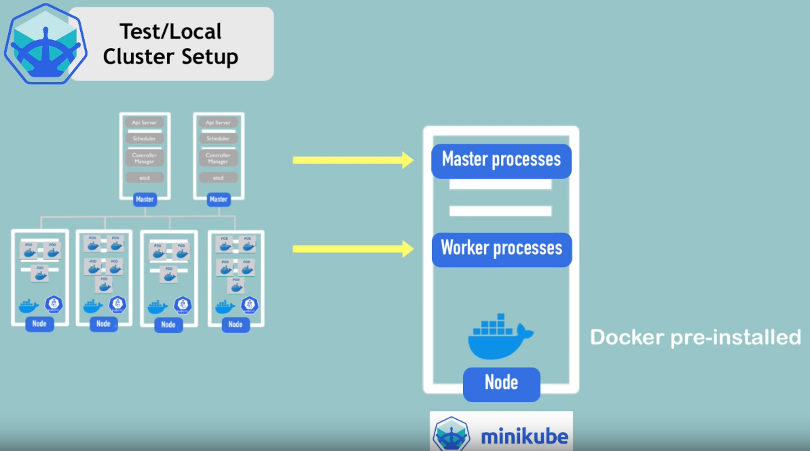
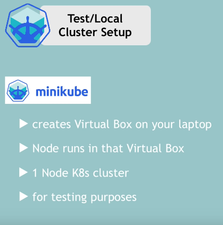
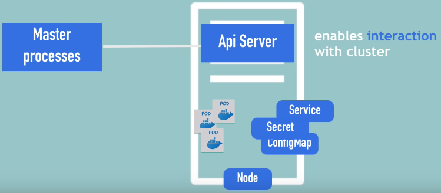
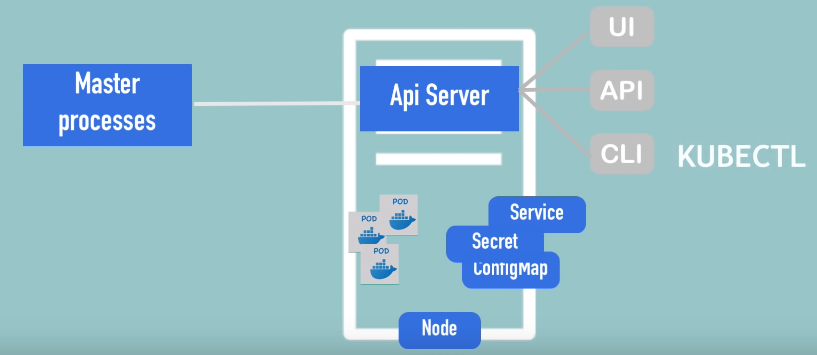
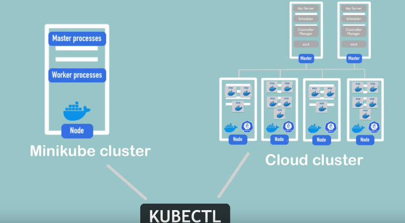
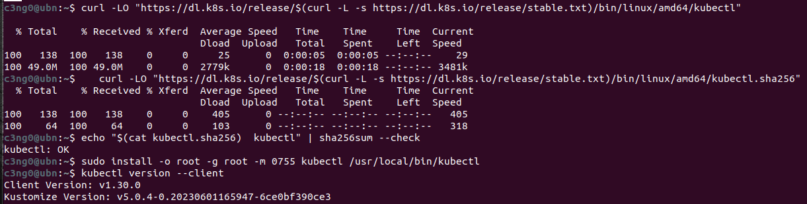

Minikube


Genellikle Kubernetes dünyasında bir production cluster kurduğumuzda, aşağıdaki gibi görünecektir.



En az iki olmak üzere birden fazla Master'a sahip olacağız ve birden fazla worker node olacak. Worker düğümlerinin kendi ayrı sorumlulukları vardır. Diyagramda gördüğümüz gibi, her biri bir node'u temsil eden gerçek ayrı sanal veya fiziksel makinelerimiz olur.

Şimdi, yerel ortamımızda bir şey test etmek istiyorsak veya yeni bir uygulama, yeni bileşenler dağıtarak çok hızlı bir şekilde bir şey denemek istiyorsak ve bunları yerel makinemizde test etmek istiyorsak; açıkçası böyle bir cluster kurmak oldukça zor olacaktır. Bellek ve CPU gibi yeterli kaynağımız yoksa imkansız bile olabilir. İşte tam olarak bu kullanım durumu için `Minikube` adı verilen açık kaynaklı araç var.

Minikube'un ne olduğuna gelirsek, temelde hem master processleri hem de worker processleri tek bir node'da çalıştıran tek node bir clusterdır. Bu node'da önceden yüklenmiş bir Docker container runtime olacak şekilde konteynerleri veya konteynerli pod'ları çalıştırabileceğiz.



Dizüstü bilgisayarımızda VirtualBox, KVM veya başka bir hipervizör aracılığıyla çalışacak. Yani temel olarak, Minikube dizüstü bilgisayarlarımızda bir sanal makine oluşturacak ve burada gördüğümüz node'lar bu sanal makinede çalışacak.

Özetleyecek olursak, Minikube, yerel kurulumumuzda Kubernetes'i test etmek için kullanabileceğimiz dizüstü bilgisayarınızda bir sanallaştırma aracıyla çalışan tek node bir Kubernetes clusterdır.



Yerel makinemizde bir cluster veya mini cluster kurduktan sonra, bu cluster ile etkileşim kurmak için bir yola ihtiyacımız olacaktır. Componentler oluşturmak, yapılandırmak vb. isteyeceğiz. Tam burada `kubectl` devreye giriyor.

### Kubectl

local makinemizde Minikube'u temsil eden bu virtual node'a sahip olduktan sonra, bu cluster ile etkileşim kurmak için bir yola ihtiyacımız vardır. Bunu Kubernetes clusterları için bir command line toolu olan `kubectl` kullanarak yapabiliriz.

Nasıl çalıştığını görelim. Minikube'un hem master hem de worker processleri çalıştırdığını söylemiştik, bu nedenle API server adı verilen master processlerden biri aslında Kubernetes clusterın entry point noktasıdır.



Kubernetes'te bir şey yapmak istiyorsak veya herhangi bir şeyi yapılandırmak istiyorsak, önce API server ile konuşmamız gerekir. API server ile konuşmanın yolu ise farklı istemciler aracılığıyla olur. Bir dashboard gibi bir UI arayüzünüz olabilir, Kubernetes API'sini kullanarak konuşabilir veya `kubectl` command line tool kullanabiliriz.



`kubectl` aslında üç istemcinin de en güçlüsüdür çünkü `kubectl` ile Kubernetes'te istediğimiz her şeyi yapabiliriz.

Bu yazının neredeyse sonuna kadar `kubectl` kullanılmaktadır. `kubectl` API sunucusuna component oluşturmak, component silmek vb. için komutlar gönderdikten sonra, Minikube node'undaki worker processler bunları gerçekleştirecektir. Pod'lar oluşturmak, pod'ları yok etmek, servisler oluşturmak vb. için komutları yürüteceklerdir.

Bu, Minikube çalışma şeklidir. `kubectl` cluster ile nasıl kullanılır? Burada önemli bir nokta, `kubectl`'in yalnızca Minikube cluster için olmadığıdır. Bir cloud cluster'ımız veya hibrit bir cluster'ımız varsa, `kubectl` herhangi bir Kubernetes cluster kurulumuyla etkileşim kurmak için kullanılan araçtır. Bu nedenle burada unutulmaması önemlidir.



Artık Minikube ve `kubectl`'nin ne olduğunu bildiğimize göre, onları pratikte görmek için kuruluma başlayalım.

### Kurulum
Daha önce de belirttiğimiz gibi Minikube bir sanallaştırmaya ihtiyaç duyar, çünkü bazı hipervizörlerde çalışacaktır. Bu nedenle bir tür hipervizör yüklemeliyiz.


Şimdi linux üzerinde minikube ve kubectl kurulumuna geçelim.

```shell
curl -LO https://storage.googleapis.com/minikube/releases/latest/minikube-linux-amd64
sudo install minikube-linux-amd64 /usr/local/bin/minikube && rm minikube-linux-amd64
```

Şimdi her şeyin kurulduğundan emin olalım ve komutları kontrol edelim. Yani, `minikube` komutu çalışmalı:

```
c3ng0@ubn:~$ minikube start

😄  minikube v1.33.1 on Ubuntu 22.04
✨  Automatically selected the docker driver. Other choices: kvm2, qemu2, none, ssh
📌  Using Docker driver with root privileges
👍  Starting "minikube" primary control-plane node in "minikube" cluster
🚜  Pulling base image v0.0.44 ...
💾  Downloading Kubernetes v1.30.0 preload ...
    > preloaded-images-k8s-v18-v1...:  112.62 MiB / 342.90 MiB  32.84% 5.18 MiB
    > gcr.io/k8s-minikube/kicbase...:  70.41 MiB / 481.58 MiB  14.62% 2.65 MiB
    > index.docker.io/kicbase/sta...:  481.58 MiB / 481.58 MiB  100.00% 11.15 M
❗  minikube was unable to download gcr.io/k8s-minikube/kicbase:v0.0.44, but successfully downloaded docker.io/kicbase/stable:v0.0.44 as a fallback image
🔥  Creating docker container (CPUs=2, Memory=2200MB) ...
    > kubectl.sha256:  64 B / 64 B [-------------------------] 100.00% ? p/s 0s
    > kubeadm.sha256:  64 B / 64 B [-------------------------] 100.00% ? p/s 0s
    > kubelet.sha256:  64 B / 64 B [-------------------------] 100.00% ? p/s 0s
    > kubectl:  49.07 MiB / 49.07 MiB [------------] 100.00% 14.58 MiB p/s 3.6s
    > kubeadm:  47.92 MiB / 47.92 MiB [--------------] 100.00% 3.97 MiB p/s 12s
    > kubelet:  95.46 MiB / 95.46 MiB [--------------] 100.00% 6.52 MiB p/s 15s

    ▪ Generating certificates and keys ...
    ▪ Booting up control plane ...
    ▪ Configuring RBAC rules ...
🔗  Configuring bridge CNI (Container Networking Interface) ...
🔎  Verifying Kubernetes components...
    ▪ Using image gcr.io/k8s-minikube/storage-provisioner:v5
🌟  Enabled addons: storage-provisioner, default-storageclass
💡  kubectl not found. If you need it, try: 'minikube kubectl -- get pods -A'
🏄  Done! kubectl is now configured to use "minikube" cluster and "default" namespace by default
```

Ve `kubectl` indirmemiz gerekiyor:

```bash
curl -LO "https://dl.k8s.io/release/$(curl -L -s https://dl.k8s.io/release/stable.txt)/bin/linux/amd64/kubectl"
```

Binary'i doğrula(opsiyonel)

kubectl checksumfile indir:

```bash
curl -LO "https://dl.k8s.io/release/$(curl -L -s https://dl.k8s.io/release/stable.txt)/bin/linux/amd64/kubectl.sha256"   
```

İndirilen checksum file ile binary doğrulama:

```bash
echo "$(cat kubectl.sha256)  kubectl" | sha256sum --check
```

   Doğru ise çıktı aşağıdaki gibi olmalı:

`kubectl: OK`

- Kubectl Kurulumu

```bash
sudo install -o root -g root -m 0755 kubectl /usr/local/bin/kubectl
```

- Son sürümü kurduğumuzu kontrol etme:
```bash
kubectl version --client
```



daha fazlası için [kubernetes.io](https://kubernetes.io/docs/tasks/tools/install-kubectl-linux/)

Minikube oldukça basit bir komut satırı aracı ile birlikte gelir. Tek bir komutla tüm Kubernetes kümesini bu tek düğüm kurulumunda hızlıca başlatabilir, durdurabilir veya silebiliriz.

---
- [[7- İlk Cluster]]
