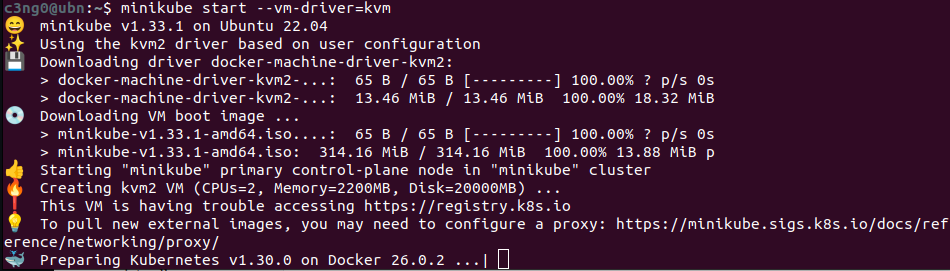
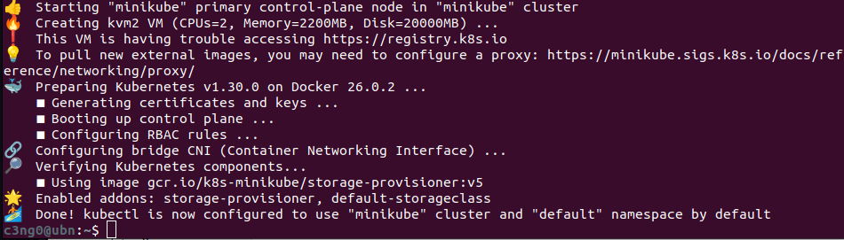
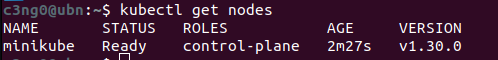

Şimdi her ikisini de kurduğumuza göre, bir Minikube Kubernetes cluster oluşturalım.

```bash
minikube start
```

işte Minikube ile bir Kubernetes cluster nasıl başlatacağımız:

```bash
minikube start --vm-driver=kvm
```

Burada, kurulu hipervizörün devreye girdiğini görebiliriz çünkü Minikube'un bir Sanal ortamda çalışması gerektiğinden, Minikube'a hangi hipervizörü kullanması gerektiğini söyleyeceğiz. Bunun için, `--vm-driver` olarak adlandırılan bir seçenek belirleyeceğiz ve burada bende kurulu olan `kvm`'i ayarladım.

Bunu yürüttüğümde bir şeyler indirecek, yani ilk kez yapıyorsak biraz daha uzun sürebilir.



Ve bahsettiğim gibi, makinenizde Docker yoksa bile çalışacak.

Tamamlandı. Artık `kubectl`, Minikube'u kullanacak şekilde yapılandırılmış durumda, bu da Minikube cluster'ının kurulduğu anlamına gelir.



Kubernetes Kümesi ile etkileşimde bulunmak için tasarlanmış olan `kubectl` komutu da o Minikube kümesi ile bağlantılıdır, eğer şunu yaparsak:

```bash
kubectl get nodes
```

Bu, Kubernetes cluster node'larının durumunu bize bildirir. Bize bir Minikube node'unun hazır olduğunu söyleyecek ve gördüğümüz gibi açıkça master processleri çalıştırmalı çünkü sadece bir node var.



Ve ayrıca Minikube'ın durumunu alabiliriz:

```bash
minikube status
```


Yani, ana makinede kubelet adlı bir hizmetin çalıştığını görüyoruz, bu da aslında konteyner runtime kullanarak pod'ları çalıştıran bir hizmettir, yani her şey çalışıyor.

Buradan itibaren mini Kub kümesi ile `kubectl` komut satırı aracılığıyla etkileşime geçeceğiz. Minicube sadece cluster başlatma ve silme için kullanılır, ancak configuring ve diğer her şeyi `kubectl` aracılığıyla yapacağız.

---
- [[8- Main Kubectl Komutları]]
