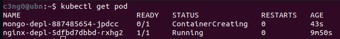

Bu bölümde bazı temel Kubectl komutlarını göreceğiz ve minikube'da nasıl create ve debug pods yapıldığını göreceğiz.

Cubectl'i clusterda herhangi bir şey yapmak için kullanacağız. -components oluşturmak, status almak, vb.-

* İlk olarak, node'ların durumunu alacağız.

```bash
kubectl get nodes
```

Bu komutu kullanarak node'ların durumunu öğrenebiliyoruz.

```bash
c3ng0@ubn:~$ kubectl get nodes
NAME       STATUS   ROLES           AGE    VERSION
minikube   Ready    control-plane   145m   v1.30.0
```

Görüyoruz ki bir node var ve her şey o node'da çalışıyor çünkü bu bir `minikube`.

* Pod'ları kontrol edebiliriz ve herhangi bir pod'umuz olmadığı için sonuç yok.

```bash
kubectl get pod
```

* Services kontrol edebiliriz, varsayılan bir servisimiz var.

```bash
kubectl get services
```

```bash
c3ng0@ubn:~$ kubectl get services
NAME         TYPE        CLUSTER-IP   EXTERNAL-IP   PORT(S)   AGE
kubernetes   ClusterIP   10.96.0.1    <none>        443/TCP   148m
```

Şimdi, herhangi bir Pod'umuz olmadığı için bir tane oluşturacağız ve Kubernetes bileşenleri oluşturmanın bir Kubectl create komutu olduğunu hatırlayalım. Kubectl create komutunu kullanarak tüm bu bileşenleri oluşturabiliriz.

* Ancak listede `Pod` yok çünkü Kubernetes dünyasında, Pod, Kubernetes clusterının en küçük birimidir ve genellikle, Pod'ları doğrudan oluşturulmaz. Veya Pod'larla doğrudan çalışılmaz. Pod'ların üzerinde bir soyutlama katmanı`(abstraction over Pods)` vardır, buna ·`deployment`· denir. İşte bu oluşturmak üzere olduğumuz şey. Bu da, altındaki parçaları oluşturacak.

```bash
Usage:
   kubectl create deployment NAME --image=image -- [COMMAND] [args...] [options]
```

* **NAME**: deployment'a isim vermeliyiz
* **--image=**: oluşturacağımız container image'i

Şimdi bir nginx dağıtımı oluşturalım.

```bash
c3ng0@ubn:~$ kubectl create deployment nginx-depl --image=nginx
deployment.apps/nginx-depl created
```

 * Nginx görüntüsünü, Docker Hub'dan indirecektir. Bu komutu yürüttüğümüz zaman, gördüğünüz gibi nginx deployment oluşturuldu.

```bash
c3ng0@ubn:~$ kubevtl get deployment
NAME         READY   UP-TO-DATE   AVAILABLE   AGE
nginx-depl   0/1     1            0           15s
```

 * Oluşturulmuş bir deployment olduğunu görüyoruz ve burada "hazır değil" durumunda olduğunu da görebiliyoruz.

```bash
c3ng0@ubn:~$ kubectl get pod
NAME                          READY   STATUS    RESTARTS   AGE
nginx-depl-85c9d7c5f4-g4lwt   0/1     Creating  0          31s
```

 * Artık bir Pod'umuz var. Name değeri, prefix ve rastgele bir hash'e sahipt. Burada "konteyner oluşturuluyor" yazıyor, yani henüz hazır değil. Bir süre beklersek `Running`.

 * Bir deployment oluşturduğumuzda, deployment, Pod oluşturmak için gereken tüm bilgilere veya blueprintlere sahip olur.


 * Bu en temel yapılandırmadır, sadece adı ve görüntüsü. Bu kadar.. geri kalanı default.

 * Deployment ve Pod arasında bir başka katman vardır ve bu, otomatik olarak kubernetes tarafından yönetilen `replicaset`'tir.
 * `kubectl get replicaset` yaparsak, bir nginx replica set hash'imiz olduğunu görüyoruz. Ve burada, Pod adının bir deployment prefix, replicaset'in ID'si ve son olarak kendi ID'si olduğunu görebiliriz. Pod adı bu şekilde oluşmaktadır. Replicaset, Pod'un tüm replikalarını yönetir. Biz hiçbir zaman replica set oluşturmayacak, silmeyecek veya güncellemeyeceğiz. Doğrudan deploymentlar ile çalışacağız. Bu daha uygun çünkü deploymentlarda Pod blueprintini tamamen yapılandırabiliriz. Pod'un kaç replikasına ihtiyacımız olduğunu belirtebilir ve geri kalan configuration'u orada yapabiliriz.

### Layerların çalışma şekli:

 * İlk olarak Deployment, ReplicaSet'i yönetir.
 * ReplicaSet, o Pod'un tüm replikalarını yönetir.
 * Pod, bir konteynerin soyutlamasıdır.
 Deployment'tan aşağıdaki her şey otomatik olarak kubernetes tarafından yönetilmelidir.

Örneğin, kullanıldığı image gibi bir şeyi doğrudan bir deployment içerisinde düzenlememiz gerekecek, Pod içinde değil. Öyleyse hemen yapalım.

```python
c3ng0@ubn:~$ kubectl edit deployment nginx-depl
# Please edit the object below. Lines beginning with a '#' will be ignored,
# and an empty file will abort the edit. If an error occurs while saving this file will be
# reopened with the relevant failures.
#
apiVersion: apps/v1
kind: Deployment
metadata:
  annotations:
    deployment.kubernetes.io/revision: "1"
  creationTimestamp: "2024-05-14T11:31:36Z"
  generation: 1
  labels:
    app: nginx-depl
  name: nginx-depl
  namespace: default
  resourceVersion: "9431"
  uid: 66d185d6-b628-4d10-b3bc-4aea093dfc59
spec:
  progressDeadlineSeconds: 600
  replicas: 1
...
...
...
```


Deployment oluştururken verdiğimiz iki seçenek dışında her şeyin otomatik olarak oluşturulmuş bir deployment, otomatik olarak oluşturulmuş bir yapılandırma dosyasını alıyoruz.
Şimdilik sadece resmi açıp istediğim versiyonu 1.16'ya sabitlemek istediğimizi varsayalım ve bu değişikliği kaydedelim.

```
    spec:
      containers:
-       - image: nginx
---
    spec:
      containers:
+       - image: nginx:1.16

```

Ve gördüğünüz gibi dağıtım düzenlendi.


Şimdi `kubectl get pod` yaparsak, eski pod'umuzu görürüz.


* Eski Pod sona erdi ve yeni pod başladı.

Eğer ReplicaSet'i görüntülersek, eski olanın içinde pod olmadığını ve yeni bir tane oluşturulduğunu görüyoruz.


Yani sonuç olarak deployment yapılandırmasını düzenledik ve altındaki her şey otomatik olarak güncellendi. Bu yaptığımız, Kubernetes'in sihrine ve nasıl çalıştığına bir örnektir.


### Debugging Pods

Bir diğer çok pratik komut ise `kubectl logs`, bu aslında Pod içinde çalışan uygulamanın neyi kaydettiğini gösterir.

```bash
kubectl logs [POD_NAME]
```

Logları görüntülemeden önce Nginx hiçbir şey kaydetmediği için başka bir dağıtım oluşturalım. Mongodb'den oluşturalım ve adına `mongo-depl` verelim.


Şimdi mongodb deployment oluşturuluyor.



Şu anda loglara bakabiliriz:


* `kubectl describe pod [POD_NAME]` events sekmesinde bize state değişikliklerini verir.


Loglamak, uygulamanın gerçekte neyi yazdığını görmede ve hata ayıklamada yardımcı olmaktadır.

Başka bir çok kullanışlı komut, `kubectl exec`tir. Debugging yaparken, bir şey çalışmıyorsa veya sadece Pod'un içeriğini kontrol etmek için kullanılır.
Basitçe açıklayacak olursak, çalışan Pod'dan shell alır. bu yüzden:
```
kubectl exec -it [POD_NAME] -- bin/bash
```
* -it = **interactive terminal**


Bu komutla mongodb uygulama konteynerinin terminalini alıyoruz ve şu anda root kullanıcısı olarak mongodb konteynerinin içindeyiz.
Exec, hata ayıklama veya bir şeyleri test etmek veya denemek istediğinizde kullanışlıdır. Konteynera girebilir veya terminali alabilir ve orada bazı komutlar çalıştırabiliriz.


### Deployment Silme ve Apply Configuration File

Tabii ki kubectl ile podları silebiliriz, önce deployment'ları ve podları görüntüleyelim.


```
kubectl delete deployment [deployment_name]
```


kontrol edersek Pod'un sonlandığını ve eğer replica set alırsak, mongodb replicasetinin de gittiğini görebiliriz.

Tüm crud işlemleri (create,update,delete vb.) deployment seviyesinde gerçekleşir ve altındaki her şey otomatik olarak takip eder. Aynı şekilde Services gibi diğer Kubernetes kaynakları oluşturabiliriz.

Ancak fark ettiğiniz gibi, Kubectl ile deployment gibi kubernetes bileşenlerini oluştururken, tüm bu seçenekleri komut satırında belirtmemiz gerekir.

* Adı belirtmemiz gerekir.
* Image'i belirtmemiz gerekir
* option1
* option2..  vb. olabilir.

Elbette bir deployment'ta veya bir Pod'ta yapılandırmak istediğimiz birçok şey olabilir ve açıkçası bunların hepsini komut satırında yazmak pratik olmayacaktır. Bunun için genellikle Kubernetes yapılandırma dosyalarıyla çalışılmaktadır. Yani oluşturduğumuz bileşenin türü, adı, image'i ve diğer tüm seçenekleri bir yapılandırma dosyasında toplanır. Sadece cubectl'e bu yapılandırma dosyasını yürütmesini söyleriz.

Bunu yapmanın yolu `kubectl apply` komutunu kullanmaktır.

### kubectl apply

Apply, temelde dosyayı, yapılandırma dosyasını bir parametre olarak alır ve orada ne yazdıysak yapar.

```bash
kubectl apply -f [file_name]
```

Apply, "-f" için bir seçenek alır ve bu dosyanın adını belirtir ve genellikle bu dosyalar için kullanılan biçim YAML'dir ve bu, dosyadaki her şeyi yürüten komuttur. Bu yüzden aslında bunu yapılandırma dosyası olarak adlandıracağız.

Örnek olarak çok basit, temel bir  `nginx-deployment.yaml` deployment dosyası oluşturalım.

Deployment için temel yapılandırma:

```yaml
apiVersion: apps/v1
kind: Deployment
metadata:
  name: nginx-deployment
  labels:
    app: nginx
spec:
  replicas: 1
  selector:
    matchLabels:
      app: nginx
  template:
    metadata:
      labels:
        app: nginx
    spec:
      containers:
      - name: nginx
        image: nginx:1.16
        ports:
        - containerPort: 80
```

* Şu an için gerekli olan satırları, aşağıda inceleyelim.
```yml
kind: Deployment
## Ne oluşturmak istediğimizi belirtiyoruz, Deployment oluşturmak istiyoruz.
```

```yml
name: nginx-deployment
## Oluşturacağımız Deployment ismi.
```

```yml
spec:            ## specification for deployment
  replicas: 1    ## Pod'lardan oluşturulacak replika sayısı
```

```yml
  template:
    metadata:
      labels:
        app: nginx
    spec:    ## specification for pods
      containers:
      - name: nginx
        image: nginx:1.16   ## Konteyner image'imiz için nginx versiyonu
        ports:
        - containerPort: 80 ## Binding Port
## Bu alan olutşturacağımız deployment'a ait blueprint
```

Bu, bizim config  dosyamız ve buna bir kere sahip olduktan sonra, bu yapılandırmayı istediğimiz zaman uygulayabiliriz.


Deployment oluşturuldu, şimdi podu görüntülersek, nginx dağıtımı podu oluşturuldu ve çalışıyor olduğunu görürüz.


Ayrıca dağıtımın 3 dakika 57 saniye önce oluşturulduğunu görüyoruz. Eğer bu deployment'ta bir şeyleri değiştirmek istersek, sadece yerel yapılandırmamızı değiştirmemiz yeterlidir. Örneğin, bir yerine iki replika istersek, sadece dosyayı düzenleyip tekrar apply ederiz. Ve deployment, nginx dağıtımı olarak tekrar yapılandırılacaktır.


Fark ettiysek çıktıda bize "configured" dendi. Fark şu ki, Kubernetes, nginx deployment'ının var olmadığını algılarsa, yeni bir tane oluşturacak, ancak eğer deployment zaten varsa, yapılandırma dosyasını apply ettiğimizde, onu güncellemesi gerektiğini bilecek ve yeni bir deployment oluşturmak yerine eski deployment'ı cofigure edecek.


Eski deployment hala ayakta (9m45s) fakat yeni bir replika oluşturuldu(3m22s) çünkü replika sayısını arttırdık. yani `kubectl apply` ile bir component oluşturabilir ve güncelleyebiliriz. Elbette Services, Volumes gibi diğer kubernetes bileşenlerine de ayar çekebiliriz.

---

Özetlemek gerekirse, bu yazıda birkaç kubectl komutuna baktık, bir component oluşturmayı, nasıl configure edeceğimizi ve sileceğimizi gördük. Pod'ların, deployment'ların, replikaset'lerinin vb. state'lerini nasıl alacağımızı gördük. Ayrıca Pod'un içindeki uygulamanın konsola yazdığı her şeyi nasıl kaydedeceğimizi gördük ve `kubectl exec`'i kullanarak çalışan bir konteynerdan nasıl shell alacağımızı gördük. Son olarak, kubernetes yapılandırma dosyasını ve `kubectl apply` komutunu kullanarak componentleri nasıl oluşturup güncelleyeceğimizi gördük.
Son olarak azıcık da `kubectl describe` komutunu gördük, bu da bir konteynerin bir Pod'da sorun giderme için ek bilgi almak istediğinizde kullandığınız bir komuttu.


### Komutları Hatırlayalım
> [!NOTE]
> **Crud Komutları**
> * Deployment Oluşturma                 ->        `kubectl create deployment [name]`
> * Deployment Düzenleme                 ->        `kubectl edit deployment [name]`
> * Deployment Silme                     ->        `kubectl delete deployment [name]`
>
> **Farklı Kubernetes Componenetlerin Durumu**
> * `kubectl get nodes | pod | services | replicaset | deployment`
>
> **Podlar ile Debugging**
> * Pod Logları                          ->        `kubectl logs [pod_name]`
> * Terminal ile Poda Bağlanma           ->        `kubectl exec -it [pod_name] -- /bin/bash`
> * Pod Bilgisi                          ->        `kubectl describe pod [pod_name]`  
>
> **CRUD için Config Dosyası Kullanma**
> * Konfigürasyon Dosyasını Uygulama     ->        `kubectl apply -f [file_name]`
> * Konfigürasyon Dosyasıyla Silme       ->        `kubectl delete -f [file_name]`


---
- [[9- Kubernetes YAML Konfigürasyonu]]
