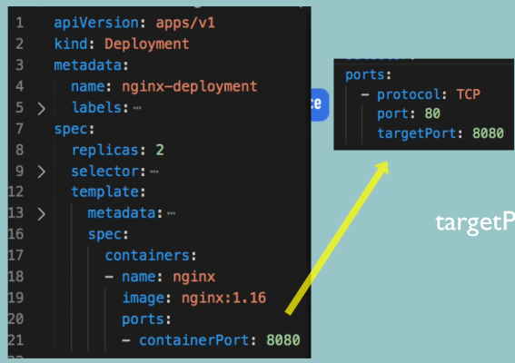

Bu konu başlığında Kubernetes yapılandırma dosyasının sözdizimini ve içeriğini göreceğiz.


Bu dosya, Kubernetes clusterında componentler oluşturmak ve yapılandırmak için ana tooldur. Büyük yapılandırma dosyalarını gördüysek biraz karışık olduklarını düşünebiliriz, ancak aslında oldukça basit ve mantıklı bir yapıya sahiptir. Öyleyse başlayalım!

###  3 Parçada K8s Config Dosyası


Yukarıdaki fotoğrafta yan yana bir `deployment` ve `service` yapılandırma dosyası örnekleri var.

Öncelikle her Kubernetes config(yapılandırma) dosyası üç kısımdan oluşur.

* İlk kısım, oluşturduğunuz componentin `metadata`'larının bulunduğu yerdir.
* İkinci kısım, yapılandırma dosyasındaki `specification`'dur(özellik). Her component config dosyasında, o component için uygulamak istediğimiz her türlü yapılandırmayı bu bölüme koyarız.


Config dosyasındaki İlk iki satır, tam olarak neyi oluşturmak istediğimizi belirtiyor. Soldaki kısımda `deployment` oluşturuyoruz, sağdaki kısımda ise bir `service` oluşturuyoruz.
İlk satırlarda ise API versiyonu belirtiyoruz. Her component için API versiyonu farklı olabilir.
Ve bu, her component için bir API versiyonu araştırmanız gerektiği anlamına gelir.

* *Kubernetes'te her bileşenin farklı API sürümü olmasının temel nedeni, her bileşenin farklı gereksinimlere ve özelliklere sahip olmasıdır. Her bileşenin farklı bir API sürümü olması, bu bileşenin özelliklerini ve davranışını belirleyen özelleştirilmiş bir yapıya sahip olmasını sağlar.*

Specification kısmında belirteceğimiz özellikler, oluşturduğumuz component türüne özgü olacaktır. Aşağıdaki resimde görüldüğü gibi:


Deployment kendi özelliklerine sahip olacak ve tabii servis de kendi şeylerine sahip olacak.

Hatırlarsak config dosyalarının üç parçadan olduğunu söylemiştik ama şu an sadece `metadata` ve `specification`'u gördük. Peki üçüncü parçamız nerede?

* Üçüncü kısım `status`'tur. Kubernetes tarafından otomatik olarak oluşturulup eklenir.

Çalışma şekli şöyledir:

* Kubernetes her zaman `desired state`(istenen durum) ve `actual state`'i(gerçek durum) karşılaştırır. Eğer gerçek durum ve istenen durum uyuşmuyorsa, Kubernetes bir şeylerin düzeltilmesi gerektiğini bilir ve onu düzeltmeye çalışır.
* Bu, Kubernetes'in sağladığı `self-healing` özelliğinin temelidir.

* Örneğin, yukarıdaki deployment kodundaki specification bölümünde, nginx deployment için iki replika istediğimizi belirtmişiz. Bu config dosyasını kullanarak deployment oluşturduğumuzda(apply), Kubernetes, deployment status(durumunu) takip edecek, config dosyamıza status parçamızı da ekleyecek ve bunu sürekli olarak güncelleyecektir.


* Eğer status, bir noktada sadece bir replikanın çalıştığını söylüyorsa, Kubernetes bu statusu özellikle belirttiğimiz iki replikayla karşılaştıracak ve bir sorun olduğunu bilecektir. Başka bir replika oluşturması gerektiğini anlayacak ve bunu otomatik olarak gerçekleştirecektir. `self-healing`.


Bunları görünce aklımıza Kubernetes'in, otomatik olarak buraya ekleyerek veya sürekli olarak güncellemek için status verisini nereden aldığı takılabilir.

* Bu bilgi daha önce bahsettiğimiz `etcd`'den gelir. Master process'lerden biri olan etcd, aslında cluster verilerini depolar. Etcd **her zaman** herhangi bir Kubernetes bileşeninin mevcut durumunu tutar ve bu status bilgisi buradan gelir.

### Config Dosyasının Formatı

Yukarıdaki görüntülerden de gördüğümüz gibi config dosyalarının formatı `YAML`'dır. YAML oldukça basit bir formattır, ancak girintiler konusunda çok katıdır.
Yanlış girintiye sahip bir dosyamız varsa, bu dosya geçersiz olacaktır. Bu yüzden 200 satırdan oluşan bir yapılandırma dosyamız varsa, `YAMLlint` gibi bir online yaml validator kullanmak mantıklı olacaktır.

Başka bahsedilecek bir konu da, bu config dosyalarını nereye kaydedeceğimizdir. Klasik bir uygulama, kodumuzla birlikte saklamaktır. Çünkü deployment ve servis, uygulamaya uygulanacaktır. Bu yapılandırma dosyalarımızı, uygulama kodunun bir parçası olarak saklamak iyi bir yöntemdir.
Bunlar `Infrastructure as a Code` **IaC** kavramının bir parçası olabilir veya config dosyaları için kendi git depolarımızı da oluşturabiliriz.


### Podlar için Blueprint (Template)

Biraz geriye gidersek deployment'ların, kendisinin altındaki podları yönettiğini söylemiştik.


Yani bir deployment'ta bir şeyi düzenlediğimizde, bunun altındaki bütün podlara yayılır ve birkaç pod oluşturmak istediğimizde aslında bir deployment oluştururuz ve bu deployment gerisini halleder.

*Bunlar nasıl gerçekleşir? Bu bahsettiğimiz şeyler konfigürasyonda nerede tanımlanır?

Config dosyamızdaki, `specification` kısmında yer alan `template`'i genişletirsek; template'imizin de kendi `metadata`'sının ve `specification`'u olduğunu görürüz.


Yani basitçe tabir edecek olursak **"configuration file inside of a configuration file"**

Bunun sebebi, template içerisindeki konfigürasyonun bir `pod` için geçerli olmasıdır. Bir podun bir deployment config dosyası içinde kendi yapılandırması olmalıdır. Bu tüm deployment'ların nasıl tanımlanacağını gösterir.


Bu sarı alan ise bir pod için bir blueprint'tir. Hangi image'e dayanacağımızı, hangi portu açacağımızı, konteynerin adının ne olacağını vb. belirler.


### Connecting Components (Labels & Selectors & Ports)

Bağlantının kurulduğu şekil `labels` ve `selectors` kullanılarak gerçekleşir.


* Metadata bölümü `labels` içerir.


* Specification bölümü ise `selectors` içerir.

---

Metadata kısmında bir componente bir `key-value` (anahtar-değer) çifti veririz.
Yukarıdaki örnekte app: nginx var. Bu label, bu componente yapışıyor.

Bu şekilde, bu blueprint kullanılarak oluşturulan podlara `app: nginx` labeli veriyoruz ve deploymenti, "app: nginx" label'iyle eşleşen tüm label'lara bağlamak veya eşleştirmek için ayarlıyoruz.


Bu sayede deployment, hangi podların kendisine ait olduğunu bilecektir.

Dağıtımın kendi "app nginx" labeli var ve bu iki label, `Service` içindeki `selector` tarafından kullanılır. Bu nedenle, Service içerisinde specification bölümünde bir selector tanımlarız ki bu, temelde bir connection oluşturur. (Service ile Deployment veya parçaları arasında)


Çünkü Service, kendisine kayıtlı olan podları, hangi podların o servise ait olduğunu bilmesi gerekir ve bu bağlantı `label`'ın `selector` bölümüyle yapılır.

* Service ve pod içinde yapılandırılması gereken başka bir şey de `Port` lardır.

Yani, servis içerisinde, servisin kendisinin erişilebilir olduğu bir *Port* vardır.


Pod içerisindeki Konteynerın da kendisine ait bir Port'u vardır.


Bu nasıl yapılandırılır? Temelde, bir servisin kendisinin erişilebilir olduğu bir portu vardır, bu yüzden diğer servisler bir istek gönderdiğinde bu nginx servisine isteği 80 numaralı bağlantı noktasında göndermelidir, ancak bu servisin, isteği hangi pod'a yönlendirmesi gerektiğini, aynı zamanda o pod'un hangi portu dinlediğini de bilmesi gerekir ve bu da `target port`tur.


Alttaki resimdeki gibi sağdaki servis config dosyamızdaki `targetPort: 8080`, Deployment config dosyasındaki container'ın portuyla `containerPort:8080` eşleşmelidir.



Böylelikle deployment ve servisimizin temel yapılandırmalarını tamamlamış oluruz. Burada dikkate alınması gereken önemli bir nokta, Aşağıdaki resimdeki her iki bölümde de gördüğümüz çoğu özelliğin zorunlu olduğudur.


* Bu aslında deployment ve servis için minimum yapılandırmadır.

Dosyalarımızı elde ettikten sonra, bunları uygulayabilir veya bunları kullanarak bileşenler oluşturabiliriz. Konsola geçip oluşturmadan önce `nginx-deployment.yaml` dosyası ile `nginx-service.yaml` dosyalarının içeriklerini buraya yazıyoruz.

nginx-deployment.yaml
```yml
apiVersion: apps/v1
kind: Deployment
metadata:
  name: nginx-deployment
  labels:
    app: nginx
spec:
  replicas: 2
  selector:
    matchLabels:
      app: nginx
  template:
    metadata:
      labels:
        app: nginx
    spec:
      containers:
      - name: nginx
        image: nginx:1.16
        ports:
        - containerPort: 8080
```

```yml
apiVersion: v1
kind: Service
metadata:
  name: nginx-service
spec:
  selector:
    app: nginx
  ports:
  - protocol: TCP
    port: 80
    targetPort: 8080
```


`kubectl apply deployment` komutuyla deployment ve servis oluşturuldu.

Şimdi eğer podları listelersem, burada iki replikanın çalıştığını görüyoruz çünkü config dosyamızda böyle tanımlamıştık.


Ayrıca aşağıda görüldüğü gibi; nginx servisimiz de var.


`kubernetes` default servistir, her zaman oradadır. Bizim oluşturduğumuz `nginx-service` ve Port 80'de dinlemede.

Şimdi, servisin istekleri doğru pod'lara ilettiğini nasıl doğrulayabiliriz? Bunun için:

```bash
kubectl describe service [service_name]
```


Ve burada, status bilgilerinin olduğunu görebiliriz. Hedef Bağlantı Noktasını tanımlarız ve burada endpoint'imiz var ve bunlar servisin isteği ileteceği pod'ların IP adresleri ve bağlantı noktaları olmalıdır. Peki, bunların doğru pod'ların IP adresleri olduğunu nasıl bileceğiz?
`kubectl get pod` komutu, IP adresi bilgisi vermez. Bunun için;

```bash
kubectl get pod -o wide
```

`-o wide` ile daha fazla bilgi istiyoruz.


Artık IP adresini de görüyoruz ve baktığımız zaman, servisin doğru end-point'e sahip olduğunu biliyoruz.

Şimdi, config dosyasının üçüncü partını görelim. Hatırlarsak bu Kubernetes'in otomatik olarak oluşturduğu bir durumdu. Bunu yapmanın yolu, config dosyasını yaml formatında alabiliriz.

```bash
kubectl get deployment nginx-deployment -o yaml
```

bu komutu çalıştırdığımızda sonuçları veya güncellenmiş configi alıyoruz. Konsolumuzda yaml çıktısını aldık fakat bunu bir dosyaya kaydedelim ve yazdığımız config ile karşılaştıralım.

```bash
kubectl get deployment nginx-deployment -o yaml > result.yaml
```


Burada eklenen birçok şey var ama sadece status kısmına göz atalım. Daha önce de belirttiğimiz gibi tüm bunlar otomatik olarak kubernetes tarafından düzenlenir ve sürekli olarak güncellenir. Kaç replikanın çalıştığını, bu replikaların durumunu ve bazı diğer bilgileri belirtir. Bu kısım ayrıca debugging yaparken de yardımcı olabilir. Eğer fark ettiysek, metadata ve specification kısmına da yeni şeyler eklenmiş.

Burada dikkate alınması gereken bir şey:
* örneğin, bir deploymenti kopyalamak istersek, *-belki otomatikleştirilmiş betikler kullanarak-*  yapmanız gereken bu oluşturulan extra verileri kaldırmak ve temizlemektir.
* Yani bu son result deployment config dosyasını önce temizlersek, ardından o blueprint konfigürasyonundan başka bir deployment oluşturabiliriz.
* Son olarak, deployment'ı veya servisi silmek istersem, bunu config dosyasını kullanarak da yapabiliriz.

```bash
kubectl delete -f nginx-deployment.yml
```


---
- [[10- İlk Demo Uygulama]]
