# Kubernetes Türkçe Döküman

---

[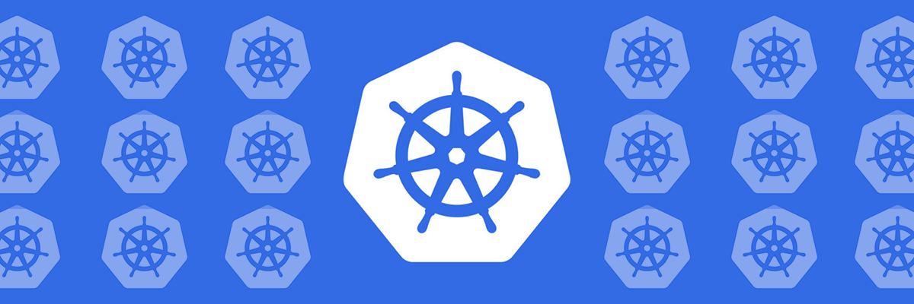](https://www.kubernetes.io)

---

 

* TechWorld Nina kanalına ait olan 4 saatlik "Kubernetes Tutorial for Beginners [FULL COURSE in 4 Hours]" videosunu döküman formatında Türkçeye çeviriyorum. İngilizce konusunda sıkıntı yaşayanlar için faydalı bir *full tutorial* olacağına inanıyorum.

* **Video linki aşağıda yer almaktadır**.
[](https://www.youtube.com/watch?v=X48VuDVv0do&t=2949s)


## İçindekiler


- [1- Kubernetes Nedir?](#kubernetes-nedir)
- [2- Kubernetes Avantajları?](#kubernetes-avantajları)
- [3- Kubernetes Componentleri?](#kubernetes-componentleri)
  - [Pod](#pod)
  - [Service ve Ingress](#service-ve-ingress)
  - [ConfigMap ve Secret](#configmap-ve-secret)
  - [Volumes](#volumes)
  - [Deployment ve StatefulSet](#deployment-ve-statefulset)
- [4- Kubernetes Mimarisi](#kubernetes-mimarisi)
  - [Node Process](#node-process)
    - [1) Container Runtime](#1-container-runtime)
    - [2) Kubelet](#2-kubelet)
    - [3) Kube Proxy](#3-kube-proxy)
  - [Master Node](#master-node)
    - [1) API Server](#1-api-server)
    - [2) Scheduler](#2-scheduler)
    - [3) Controller Manager](#3-controller-manager)
    - [4) Etcd](#4-etcd)
- [5- Cluster Yapısı](#cluster-yapısı)
- [6- Minikube ve Kubectl Kurulumu](#minikube-ve-kubectl-kurulumu)
  - [Minikube](#minikube)
  - [Kubectl](#kubectl)
  - [Kurulum](#kurulum)
- [7- İlk Cluster](#İlk-cluster)
- [8- Main Kubectl Komutları](#main-kubectl-komutları)
  - [Layerların Çalışma Şekli](#layerların-çalışma-şekli)
  - [Debugging Pods](#debugging-pods)
  - [Deployment Silme ve Apply Configuration File](#deployment-silme-ve-apply-configuration-file)
  - [Kubectl Apply](#kubectl-apply)
    - [Komutları Hatırlayalım](#komutları-hatırlayalım)
- [9- Kubernetes YAML Konfigürasyonu](#kubernetes-yaml-konfigürasyonu)
  - [3 Parçada K8s Config Dosyası](#3-parçada-k8s-config-dosyası)
  - [Config Dosyasının Formatı](#config-dosyasının-formatı)
  - [Podlar için Blueprint (Template)](#podlar-için-blueprint-template)
  - [Connecting Components *Labels - Selectors - Ports*](#connecting-components-labels--selectors--ports)
- [10- İlk Demo Uygulama](#İlk-demo-uygulama)
  - [1) MongoDB Pod](#1-mongodb-pod)
  - [2) Secret ve Referans](#2-secret-ve-referans)
  - [3) MongoDB Internal Service](#3-mongodb-internal-service)
  - [4) Mongo Express Deployment & Service & ConfigMap](#4-mongo-express-deployment--service--configmap)
  - [5) Mongo Express External Service](#4-mongo-express-external-service)

---


## Kubernetes Nedir?
- **Kubernetes**, açık kaynaklı bir konteyner yönetim aracıdır.
- Google tarafından geliştirilmiştir.
- Farklı dağıtım ortamlarında konteynerleştirilmiş uygulamaları yönetmenize yardımcı olur.
    - fiziksel ortamda
    - sanal ortamda
    - bulut ortamında

---

## Kubernetes Avantajları:

- **Yüksek erişilebilirlik** veya kesintisiz çalışma
- **Ölçeklenebilirlik** veya yüksek performans
- **Afet kurtarma** - yedekleme ve geri yükleme

---

## Kubernetes Componentleri
### Pod
* Pod Kubernetes'in en küçük birimidir.
* Konteyner üzerinde sanallaştırma yapar. (abstraction)


* Bizler yalnızca Kubernetes katmanıyla etkileşime geçeriz.
* Bir pod içinde birden fazla konteyner çalıştırabiliriz, ancak genellikle bir pod başına bir uygulama bulunur.
* Her pod kendi IP adresine sahiptir. Her pod, birbirleriyle bu internal IP adresini kullanarak iletişim kurabilir.

Ancak, Kubernetes'teki pod bileşenleri de geçicidir: yani çok kolay bir şekilde ölebilirler.
Örneğin, bir veritabanı konteynerını kaybettiğimizi düşünelim (konteyner içindeki uygulama çöktüğü veya sunucu kaynakları tükendiği için pod ölür ve yerine yeni bir tane oluşturulur). Bu durumda da yeni bir IP adresi atanır. Veritabanıyla IP adresini kullanarak iletişim kuruyorsak elbette sakıncalıdır. Her pod yeniden başladığında, iletişimi her seferinde yeniden ayarlamamız gerekir. Bu nedenle, pod'un yeniden başladığında IP adresini ayarlamamıza gerek kalmadan, veritabanıyla iletişim kurmanızı sağlayan başka bir Kubernetes bileşeni olan `Service` kullanılır.

### Service ve Ingress

* Service, her pod'a bağlanabilen sabit bir IP adresidir. Uygulamamızın kendi servisi olacak ve veritabanı pod'u kendi servisine sahip olacak. Buradaki güzel şey, servis ve Pod'un yaşam döngüleri birbirine bağlı değil. Bu yüzden Pod ölse bile servis ve bu servise ait IP adresi kalır. Bu şekilde endpoint'i değiştirmemize gerek yoktur.


* Tabii ki, uygulamamızın bir tarayıcı aracılığıyla erişilebilir olmasını isteriz değil mi? Bunun için bir external service oluşturmamız gerekiyor. `External Service`, dış kaynaklardan iletişimi açan bir servistir. Ancak, veritabanımızı halka açık isteklere açmak istemeyiz. Bunun için `Internal Service` adını verdiğimiz bir şey oluştururuz.


* External Service URL'sinin çok pratik olmadığını fark ettik değil mi? Temelde, bir HTTP protokolüyle bir node IP adresi ve servis port numarasına sahibiz. Bu hızlı bir şekilde bir şeyleri test etmek istiyorsak iyidir, ancak end-product için iyi değildir. Genellikle, uygulamamızla güvenli bir protokol ve bir alan adı kullanmak isteriz.


Bunun için Kubernetes'in başka bir bileşeni olan `Ingress` var. Bu şekilde, istek önce servise değil, Ingress'e gider ve oradan servise yönlendirilir.


### ConfigMap ve Secret

Pod'lar birbirleriyle servis aracılığıyla iletişim kurar. Uygulamamızın, veritabanı ile iletişim kurmak için kullandığı bir database endpoint `örneğin mongodb servisi` olacak. Ancak bu veritabanı URL'sini (ya da endpoint) genellikle nerede yapılandırırız?


Genellikle bunu application properties file veya bazı external environmental variable olarak yaparız, ancak genellikle yapılandırma, uygulamanın içerisindeki built image'tedir.

Örneğin, service endpoint (ya da service name) 'mongodb' olarak değişirse, uygulamadaki bu URL'i ayarlamalıyız. Genellikle yeni bir sürümle uygulamayı rebuild etmemiz ve repoya pushlamamız gerekir. Ardından bu yeni image'i pod'umuzda pull'layıp tüm uygulamayı yeniden başlatmamız gerekebilir.


Veritabanı URL'i gibi küçük bir değişiklik için bu gerçekten zahmetli. Bu sebeple, Kubernetes'in `configmap` adında bir bileşeni var. Yapısı, uygulamamıza `external configuration` sağlar. ConfigMap genellikle kullandığımız veritabanı URL'leri gibi yapılandırma verilerini içerir. Kubernetes'te bunu Pod'a bağlarız. Pod, ConfigMap'in içerdiği verileri alır. Ve şimdi, servis adını değiştirirsek (service end point), sadece ConfigMap'i ayarlamamız yeterlidir. Yeni bir image oluşturmamıza ve tüm döngüyü geçirmemize gerek yoktur. Büyük avantaj!


Şimdi, external configuration'ın bir parçası aynı zamanda database kullanıcı adı ve şifresi olabilir değil mi? Bu veriler de uygulama dağıtım sürecinde değişebilir. Ancak, bir şifreyi veya diğer kimlik bilgilerini düz metin formatında bir configmap'e koymamız güvensiz olur.

>[!WARNING]
>

Bu amaçla, Kubernetes'in `Secret` adında bir başka bileşeni daha var. Yani, Secret, ConfigMap gibi, ancak fark şu ki; şifre gibi gizli verileri saklamak için kullanılır. Ve tabii ki, düz metin formatında değil, base64 formatında kodlanmış olarak saklanır. Yani, Secret, kullanıcı adları gibi kimlik bilgilerini içerecek ve veritabanı kullanıcılarını içerecektir. ConfigMap'e de koyabiliriz, ancak önemli olan şifreler, sertifikalar, başkalarının erişimini istemediğimiz şeyler Secret'e koyulmalıdır. Aynı ConfigMap gibi, sadece Pod'umuza bağlarız, böylece Pod bu verileri görebilir ve Secret'ten okuyabilir. ConfigMap veya Secret'ten verileri, örneğin environment variables olarak veya hatta bir özellikler dosyası olarak uygulamamızın içinde kullanabiliriz.


Aslında en çok kullanılan Kubernetes temel bileşenlerinin neredeyse tamamını gördük. Pod'a göz attık. Hizmetlerin nasıl kullanıldığını, Ingress bileşeninin ne işe yaradığını gördük ve ayrıca ConfigMap ve Secrets'ı kullanan harici yapılandırmayı da gördük.


### Volumes

Sıra geldi çok önemli bir kavrama. `Veri depolama` nedir ve Kubernetes içerisinde nasıl çalışır? Uygulamamızın kullandığı bir database pod'umuz ve de bir miktar verimiz var. Şu anda gördüğünüz bu kurulumla, eğer veritabanı container veya pod'u yeniden başlatılırsa veri kaybolur. Bu açıkça sorunlu ve elverişsizdir çünkü database'deki verilerinizin veya günlük verilerinizin uzun süreli güvenilir ve kalıcı olmasını isteriz. Bunu Kubernetes'te yapmanın yolu, Kubernetes'in başka bir bileşeni olan `Volumes` kullanmaktır.


Çalışma şekli şöyledir: Temelde bir fiziksel depolama birimini -yani bir sabit diski- pod'umuza bağlarız.
* Bu depolama yerel bir makinede olabilir.
* Pod'un çalıştığı aynı sunucu node'unda da olabilir.
* Kubernetes kümesinin dışında(Bulut depolama, Kubernetes kümesinin bir parçası olmayan kendi yerleşke depolamanız) olabilir.
Bu yüzden bununla ilgili external reference var.


Böylece, database pod'u veya container yeniden başlatıldığında, tüm veri kalıcı bir şekilde saklanmış olacaktır.

Kubernetes kümesi ve tüm bileşenlerinin ve depolama arasındaki farkı anlamamız önemlidir. Yerel veya uzak bir depolama olması fark etmeksizin, depolamayı Kubernetes kümesine takılmış harici bir sabit diske benzetebiliriz. Çünkü buradaki önemli nokta; Kubernetes kümesi açıkça hiçbir veri kalıcılığını yönetmez. Kubernetes kullanıcısı veya yöneticisi olarak sizin veriyi yedeklemenizden, çoğaltmanızdan, yönetmenizden ve uygun donanımda saklamanızdan emin olmanız gerektiği anlamına gelir.

### Deployment ve StatefulSet

Şimdi, her şey mükemmel bir şekilde çalışıyor ve bir kullanıcı bir tarayıcı aracılığıyla uygulamaya erişebiliyor. Bu kurulumla, application pod'u ölürse, crashlerse veya yeni bir container image oluşturduğumuz  için pod'u restart etmemiz gerekiyorsa ne olurdu? Basitçe cevap verecek olursak, bir kullanıcının uygulamamıza ulaşamadığı bir süre olan bir kesintimiz olurdu. Böyle bir durum end product'ta gerçekleşmesi çok kötü bir durumdur.


Distributed systems ve konteynerların avantajı tam olarak budur. Yalnızca 1 application pod'u ve 1 database pod'u gibi bir şeye güvenmek yerine, her şeyi birden fazla sunucuda replikasını oluşturuyoruz. Yani uygulamamızın bir klonu veya çoğaltması çalışacağı başka bir node olacak ve bu da servise bağlı olacak. Hatırlarsak servisin, bir pod öldüğünde end point'i sürekli ayarlamamıza gerek olmadığı, kalıcı statik IP adresi ve bir DNS adına sahip olduğunu söylemiştik.

* Service aynı zamanda bir `load balancer`dır. Yani, servis isteği yakalayacak ve en az meşgul olan pod'a yönlendirecektir.


Ancak application pod'unun ikinci replikasını oluşturmak için ikinci bir pod oluşturmayız. Bunun yerine uygulama pod'umuzun bir blueprint'ini tanımlarız ve o pod'un kaç tane replikasının olmasını istediğimizi belirtiriz. Ve bu component veya blueprint'e `deployment` denir. Deployment, Kubernetes'in başka bir componentidir. Pratikte, pod'larla çalışmayız veya pod'lar oluşturmayız. Çünkü zaten kaç tane replika olacağını belirtebilir ve ihtiyacımız olan pod'ların replika sayısını artırabilir veya azaltabiliriz. Yani pod, container'ların üzerinde bir soyutlama katmanıdır(layer of abstraction). Deployment ise, podların üzerinde başka bir soyutlama katmanıdır(layer of abstraction). Bu durum; pod'larla etkileşimi, kopyalama ve diğer yapılandırmaları daha kullanışlı hale getirir.


Yani sonuç olarak çoğunlukla pod'larla değil, deployment'larla çalışırız. Uygulama pod'umuzun replikalarından biri ölürse, servis istekleri başka bir replikaya yönlendirilecektir, bu şekilde uygulamamız kullanıcılar için hala erişilebilir olacaktır.


Şimdi muhtemelen şunu merak ediyoruzdur, database pod'u ne olacak? Çünkü eğer database pod'u ölürse, uygulamanız da erişilemez olacaktır. Bu yüzden, bir database replikasına da ihtiyacımız var. Ancak, `deployment kullanarak bir databese'i kopyalayamayız`. Bunun nedeni, database'in bir state'i olmasıdır, yani veridir. Bu da demektir ki eğer database'in replikaları veya klonları olsaydı, hepsi aynı paylaşılan data storage volume'üne erişmek zorunda kalacaktı. Bu durumda da, hangi pod'ların anlık olarak depolama birimine yazdığını veya hangi pod'ların depolama biriminden okuduğunu yöneten bir mekanizmaya ihtiyacımız olacaktı.

Bu mekanizma, çoğaltma özelliklerinin yanı sıra başka bir Kubernetes componenti olan `StatefulSet` ile sağlanır.


Bu component özellikle database gibi uygulamalar için tasarlanmıştır. Yani, MySQL, MongoDB, Elasticsearch veya herhangi bir diğer stateful applications veya databaseleri; deployments yerine `StatefulSets` kullanılarak oluşturulmalıdır.
Bu çok önemli bir ayrımdır. StatefulSet, aynı deployment gibi, pod'ları replikalamayı yapar ve bunları scaling'e alır. Database reading ve writing işlemlerinin senkronize olduğundan emin olur, böylece database tutarsızlıkları olmaz.


> [!TIP]
> Ancak, bir Kubernetes kümesinde StatefulSets kullanarak database uygulamalarını deploy etmek biraz zahmetli olabilir. Bu yüzden, database uygulamalarını Kubernetes kümesinin dışında barındırmak ve yalnızca dağıtımları veya durumsuz uygulamaları Kubernetes kümesinin içinde sorunsuz bir şekilde çoğaltmak ve ölçeklendirmek ve dış database ile iletişim kurmak yaygın bir uygulamadır.

Şimdi, uygulama pod'umuzun iki replikası ve database'in iki kopyası olduğunda ve hepsi load-balanced olduğunda, kurulumumuz daha güvenlidir. Bu senaryoda eğer Node 1 yeniden başlatılsaydı veya çökseydi, hala uygulama ve database pod'larının çalıştığı ikinci bir node'umuz olurdu. Uygulama, bu iki replikadan yeniden oluşturulana kadar kullanıcı tarafından erişilebilir olacaktır, bu yüzden kesintiyi önlemiş oluruz.


Özetlemek gerekirse, en çok kullanılan Kubernetes bileşenlerini inceledik. Parçalar arasında iletişim kurmak için `pod`lar ve `servis`lerle başladık, ve trafiği clusterlara yönlendirmek için kullanılan `Ingress` bileşenini inceledik. Ayrıca, `ConfigMaps` ve `Secret` kullanarak external configuration, ve `Volumes` kullanarak veri kalıcılığını inceledik. Ve son olarak, `Deployments` ve `StatefulSets` gibi replicating ve blueprintlere baktık.

Burada `stateful applications` özellikle databaseler gibi stateful applications için kullanılır. Ve evet, Kubernetes'in sunduğu çok daha fazla bileşen var, ama bunlar çekirdek, temel olanları. Bu temel bileşenleri kullanarak oldukça güçlü Kubernetes kümesi oluşturabiliriz.

---

## Kubernetes Mimarisi

Kubernetes'in temel mimarisinden bahsedeceğiz. Bu yüzden Kubernetes'in çalıştığı iki tür node'u inceleyeceğiz: biri `master` diğeri ise `slave`. Bunların arasındaki fark nedir ve her birinin cluster içindeki rolü nedir, onlara bakacağız.

Kubernetes'in ne yaptığını ve cluster'ın nasıl self-managed, self-healing ve automated olduğunu gösteren temel kavramları ele alacağız.  Bir Kubernetes cluster operatörü olarak, çok daha az manuel çaba harcamamız gerektiğini göreceğiz.

### Node Process

İki application pod'unun çalıştığı tek bir node ile bu temel kurulumla başlayacağız. Kubernetes mimarisinin ana bileşenlerinden biri worker servers veya node'dur. Her node, o node'da çalışan birden fazla application pod'una sahip olacaktır.

Ve Kubernetes'in bunu yapma şekli, her node'da bulunması gereken ve bu pod'ları planlamak ve yönetmek için kullanılan `three process` kullanmasıdır. Yani node'lar, asıl işi yapan cluster serverlardır. Bu yüzden bazen onlara worker nodes da denir.

#### 1) Container Runtime

Her node'da çalışması gereken ilk süreç, `container runtime`dır. Biz Docker ile işlem yapacağız, ancak başka bir teknoloji de olabilir. Applitacion pod'larında içinde çalışan containerlar olduğu için, her node'da bir `container runtime`  kurulmalıdır.

#### 2) Kubelet

Kubernetes'in bir parçası olan kubelet, Pod'ları ve bu Pod'ların altındaki container'ları schedule eder. Container Runtime, node'un kendisiyle arayüz oluştururken, kubelet bu yapılandırmayı alır, bir pod'u çalıştırır (veya içinde bir container başlatır) ve ardından o node'dan container'a CPU, RAM gibi depolama kaynakları atar.

Bu nedenle, genellikle bir Kubernetes cluster kurulu olmalıdır. Kubelet hizmetlerine sahip birden fazla node'dan oluşur. Bu worker node'ları, Örneğimizdeki application ve database pod'larının replikalarını çalıştıracak yüzlerce diğer node'u çalıştırır.

Aralarındaki iletişim şekli, `servisler` ile olur, bu da isteği application parçasına veya örneğin bir database'e yönlendiren bir `load-balancer` gibi çalışır ve ardından ilgili parçaya yönlendirir.

#### 3) Kube Proxy

Hizmetlerden pod'lara istekleri iletmekten sorumlu üçüncü süreç `kube-proxy`dir ve her node'da kurulmalıdır. Kube-proxy, düşük bir işlem yükü ile performanslı bir şekilde iletişim kurulmasını sağlayan akıllı yönlendirme mantığına sahiptir.

Bir uygulama veya bu uygulamanın replikası, bir database'e istek yapıyorsa, hizmet sadece isteği rastgele bir replikaya yönlendirmek yerine; isteği başlatan pod'un çalıştığı aynı node'da çalışan replikaya yönlendirecektir. Bu şekilde, isteği başka bir makineye göndermekle ilgili `ağ işlem yükünden` kaçınılmış olur.

Özetlemek gerekirse; bir kubernetes cluster'ının düzgün çalışabilmesi için `kubelet` ve `kube-proxy` her worker node içerisine `container runtime` ile birlikte kurulmalıdır.


Ancak şimdi soru şu: Bu cluster ile nasıl etkileşime girilir? Yeni bir application pod'u veya database pod'u nerede schedule edilmeli? Bir replika pod'u ölürse, hangi process monitoring, reschedule veya restart işlemleri ile ilgilenir?

### Master Node

Master servers(master nodes), içerisinde tamamen farklı processler çalıştırır. Ve bunlar, cluster state ve worker nodes'ları kontrol eden, `her yönetici düğümünde çalışan dört süreçtir`.

#### 1) API Server

İlk hizmetimiz API server. Bir Kubernetes cluster'ında yeni bir application deploy etmek istediğinizde, bir kullanıcı olarak API server ile interact ederiz. Bir Kubernetes Dashboard gibi bir kullanıcı arayüzü de olabilir, `kubectl` gibi bir command-line tool veya bir Kubernetes API'si de olabilir.

API sunucusu, cluster içine herhangi bir güncelleme talebinin veya hatta clusterdan gelen sorguların ilk isteğini alır. Kimlik doğrulaması(auth) yaparak, yalnızca kimliği doğrulanmış ve yetkilendirilmiş isteklerin clusterlara iletilmesini sağlar.


Bu, yeni pod'lar planlamak, yeni applications deploy etmek, yeni servisler oluşturmak veya herhangi bir component oluşturmak istediğimizde, bu requestimizi master node API sunucusuna iletmek zorunda olduğunuz anlamına gelir. API server daha sonra requestimizi doğrular. Her şey yolundaysa, requestimizi diğer süreçlere ileterek istediğimiz pod'u veya bileşeni schedule için bir node'a yönlendirir.


Ayrıca, dağıtımımızın durumu veya cluster health etc., gibi sorgu isteklerini yapmak isteyebiliriz. Bu sorgular API sunucusuna bir istek gönderir ve o da bize yanıt verir.

> [!NOTE]
> Bu durum güvenlik açısından gayet iyidir çünkü clusterlara yalnızca `bir entry point` vardır.

#### 2) Scheduler

Başka bir Master process ise Scheduler'dır. API serverına yeni bir pod schedule isteği gönderdiğimizi varsayalım. API server bu isteğimizi doğruladıktan sonra, bu pod'un bir worker node'da başlatılması için `Scheduler`'a teslim eder.

Ve tabii ki, herhangi bir node'a rastgele atamak yerine, Scheduler, bir sonraki pod'un hangi belirli worker node'un scheduled olacağı konusunda zekice bir şekilde karar vermektedir. İlk olarak, isteğimizi kontrol eder ve planlamak istediğimiz uygulamanın ne kadar kaynağa ihtiyacı olduğunu kontrol eder. Ne kadar CPU, ne kadar RAM vb.

Ardından, worker node'daki kullanılabilir kaynakları kontrol eder. Eğer bir node'un en çok kaynağa sahip olduğunu söylüyorsa, yeni pod'u o node'a schedule eder.


Önemli bir nokta şu ki, scheduler sadece yeni bir pod'un hangi node'a schedule edileceğine karar verir. Asıl planlamayı yapan ve pod'u konteynerla başlatan işlem ise `kubelet`'tir. Yani kubelet, scheduler'dan gelen isteği alır ve bu isteği ilgili node üzerinde yürütür.

#### 3) Controller Manager

Bir sonraki önemli bileşen ise `controller manager`'dır. Bu bileşen, herhangi bir düğümde pod'lar öldüğünde ne olacağı sorusu açısından kritik öneme sahiptir. Ölü node'ları tespit etmek ve daha sonra bu pod'ları en kısa sürede reschedule etmek gerekir.


Dolayısıyla controller manager, state changes'ları, örneğin pod'ların çökmesini tespit eder. Pod'lar öldüğünde controller manager bunu algılar ve cluster state'ini mümkün olan en kısa sürede kurtarmaya çalışır.

Ölen pod'ları yeniden schedule etme amacıyla scheduler'a bir istek gönderir. Bu döngü içinde, scheduler kaynak hesaplamasına göre hangi worker node'ların bu pod'ları tekrar başlatması gerektiğine karar verir ve bu worker node'lar üzerindeki ilgili `kubelet`lere, pod'ları yeniden başlatmaları için istek gönderir.


#### 4) Etcd

Son olarak, ana işlemlerden biri olan etcd, bir cluster state'inin key-value deposudur. Bunu aslında bir cluster beyni olarak düşünebiliriz. Yani cluster'daki her değişiklik -örneğin yeni bir pod schedule edildiğinde veya bir pod öldüğünde- etcd'nin bu key-value deposunda kaydedilir veya güncellenir.


Etcd deposunun bir küme beyni olarak adlandırılmasının sebebi, scheduler, controller manager gibi tüm bu mekanizmaların, etcd'nin sahip olduğu veriler sayesinde çalışmasıdır.


Örneğin, scheduler her bir worker node'unda hangi kaynakların mevcut olduğunu nasıl bilir? Veya controller manager, cluster durumunda bir değişiklik olduğunu nasıl tespit eder? Pod'ların ölmesi, kubelet'in scheduler'ın isteği üzerine yeni pod'ları başlatması, API sunucusuna cluster health hakkında bir sorgu göndermemiz veya uygulama dağıtım durumumuz gibi bu durum bilgilerini, API sunucusu nereden alır?

Cevap: Tüm bu bilgiler etcd kümesinde saklanır. Etcd'nin key-value deposunda saklanmayan şey ise gerçek uygulama verileridir. Örneğin, bir cluster içinde çalışan bir database uygulamamız varsa, veriler etcd'de değil, başka bir yerde saklanır. Bu, yalnızca master işlemlerinin worker işlemleriyle ve tersiyle iletişim kurması için kullanılan bir cluster state bilgisidir.

Artık muhtemelen ana işlemlerin, özellikle de verileri güvenilir bir şekilde saklanması veya çoğaltılması gereken etcd deposunun, cluster operasyonu için kritik öneme sahip olduğunu anlamışızdır. Bu nedenle, uygulamada bir Kubernetes kümesi genellikle birden fazla master'dan oluşur. Her bir master düğümü kendi ana işlemlerini çalıştırır; elbette API sunucusu load-balanced'dır ve etcd deposu tüm master düğümleri arasında distributed bir depolama oluşturur.


---

## Cluster Yapısı


Şimdi worker ve master node'larında çalışan işlemleri gördükten sonra, gerçek hayattaki bir cluster kurulumuna bakalım. Çok küçük bir cluster'da muhtemelen iki master node ve üç worker node olur.


Burada dikkat edilmesi gereken bir diğer nokta ise master node sunucularının donanım kaynaklarının aslında farklı olmasıdır. Master işlemleri daha önemlidir, ancak aslında daha az iş yüküne sahiptirler. Dolayısıyla CPU, RAM ve depolama gibi daha az kaynağa ihtiyaç duyarlar. Worker node'ları ise, containerları çalıştıran pod'ları barındırma gibi asıl işi yaparlar.

Bu nedenle, worker node'larının daha fazla kaynağa ihtiyacı vardır. Uygulamamızın karmaşıklığı ve kaynak gereksinimi arttıkça, aslında cluster'ımıza daha fazla master ve worker node'u ekleyerek daha güçlü ve sağlam bir küme oluşturabiliriz. Böylece uygulama kaynak gereksinimlerimizi karşılayabiliriz.


Var olan bir Kubernetes cluster'ında yeni master veya worker serverları eklemek aslında oldukça kolaydır. Bir master sunucusu eklemek istiyorsak, yeni bir bare metal sunucu ediniyoruz. Üzerine tüm master work'leri kurup  onu Kubernetes kümesine ekliyoruz. Bu kadar..

Yine aynı şekilde, iki worker node'una ihtiyacımız varsa, bare metal sunucular ediniyoruz. Container runtime, kubelet ve kube-proxy gibi tüm worker node işlemlerini üzerlerine kurup onları Kubernetes clusterına ekleyin.

İşte bu kadar.
Bu şekilde, uygulama karmaşıklığı ve kaynak gereksinimi arttıkça, Kubernetes kümemizin gücünü ve kaynaklarını sonsuza kadar artırabiliriz.

---

## Minikube ve Kubectl Kurulumu

### Minikube


Genellikle Kubernetes dünyasında bir production cluster kurduğumuzda, aşağıdaki gibi görünecektir.


En az iki olmak üzere birden fazla Master'a sahip olacağız ve birden fazla worker node olacak. Worker düğümlerinin kendi ayrı sorumlulukları vardır. Diyagramda gördüğümüz gibi, her biri bir node'u temsil eden gerçek ayrı sanal veya fiziksel makinelerimiz olur.

Şimdi, yerel ortamımızda bir şey test etmek istiyorsak veya yeni bir uygulama, yeni bileşenler dağıtarak çok hızlı bir şekilde bir şey denemek istiyorsak ve bunları yerel makinemizde test etmek istiyorsak; açıkçası böyle bir cluster kurmak oldukça zor olacaktır. Bellek ve CPU gibi yeterli kaynağımız yoksa imkansız bile olabilir. İşte tam olarak bu kullanım durumu için `Minikube` adı verilen açık kaynaklı araç var.

Minikube'un ne olduğuna gelirsek, temelde hem master processleri hem de worker processleri tek bir node'da çalıştıran tek node bir clusterdır. Bu node'da önceden yüklenmiş bir Docker container runtime olacak şekilde konteynerleri veya konteynerli pod'ları çalıştırabileceğiz.


Dizüstü bilgisayarımızda VirtualBox, KVM veya başka bir hipervizör aracılığıyla çalışacak. Yani temel olarak, Minikube dizüstü bilgisayarlarımızda bir sanal makine oluşturacak ve burada gördüğümüz node'lar bu sanal makinede çalışacak.

Özetleyecek olursak, Minikube, yerel kurulumumuzda Kubernetes'i test etmek için kullanabileceğimiz dizüstü bilgisayarınızda bir sanallaştırma aracıyla çalışan tek node bir Kubernetes clusterdır.


Yerel makinemizde bir cluster veya mini cluster kurduktan sonra, bu cluster ile etkileşim kurmak için bir yola ihtiyacımız olacaktır. Componentler oluşturmak, yapılandırmak vb. isteyeceğiz. Tam burada `kubectl` devreye giriyor.

### Kubectl

local makinemizde Minikube'u temsil eden bu virtual node'a sahip olduktan sonra, bu cluster ile etkileşim kurmak için bir yola ihtiyacımız vardır. Bunu Kubernetes clusterları için bir command line toolu olan `kubectl` kullanarak yapabiliriz.

Nasıl çalıştığını görelim. Minikube'un hem master hem de worker processleri çalıştırdığını söylemiştik, bu nedenle API server adı verilen master processlerden biri aslında Kubernetes clusterın entry point noktasıdır.


Kubernetes'te bir şey yapmak istiyorsak veya herhangi bir şeyi yapılandırmak istiyorsak, önce API server ile konuşmamız gerekir. API server ile konuşmanın yolu ise farklı istemciler aracılığıyla olur. Bir dashboard gibi bir UI arayüzünüz olabilir, Kubernetes API'sini kullanarak konuşabilir veya `kubectl` command line tool kullanabiliriz.


`kubectl` aslında üç istemcinin de en güçlüsüdür çünkü `kubectl` ile Kubernetes'te istediğimiz her şeyi yapabiliriz.

Bu yazının neredeyse sonuna kadar `kubectl` kullanılmaktadır. `kubectl` API sunucusuna component oluşturmak, component silmek vb. için komutlar gönderdikten sonra, Minikube node'undaki worker processler bunları gerçekleştirecektir. Pod'lar oluşturmak, pod'ları yok etmek, servisler oluşturmak vb. için komutları yürüteceklerdir.

Bu, Minikube çalışma şeklidir. `kubectl` cluster ile nasıl kullanılır? Burada önemli bir nokta, `kubectl`'in yalnızca Minikube cluster için olmadığıdır. Bir cloud cluster'ımız veya hibrit bir cluster'ımız varsa, `kubectl` herhangi bir Kubernetes cluster kurulumuyla etkileşim kurmak için kullanılan araçtır. Bu nedenle burada unutulmaması önemlidir.


Artık Minikube ve `kubectl`'nin ne olduğunu bildiğimize göre, onları pratikte görmek için kuruluma başlayalım.

### Kurulum
Daha önce de belirttiğimiz gibi Minikube bir sanallaştırmaya ihtiyaç duyar, çünkü bazı hipervizörlerde çalışacaktır. Bu nedenle bir tür hipervizör yüklemeliyiz.


Şimdi linux üzerinde minikube ve kubectl kurulumuna geçelim.

```shell
curl -LO https://storage.googleapis.com/minikube/releases/latest/minikube-linux-amd64
sudo install minikube-linux-amd64 /usr/local/bin/minikube && rm minikube-linux-amd64
```

Şimdi her şeyin kurulduğundan emin olalım ve komutları kontrol edelim. Yani, `minikube` komutu çalışmalı:

```
c3ng0@ubn:~$ minikube start

😄  minikube v1.33.1 on Ubuntu 22.04
✨  Automatically selected the docker driver. Other choices: kvm2, qemu2, none, ssh
📌  Using Docker driver with root privileges
👍  Starting "minikube" primary control-plane node in "minikube" cluster
🚜  Pulling base image v0.0.44 ...
💾  Downloading Kubernetes v1.30.0 preload ...
    > preloaded-images-k8s-v18-v1...:  112.62 MiB / 342.90 MiB  32.84% 5.18 MiB
    > gcr.io/k8s-minikube/kicbase...:  70.41 MiB / 481.58 MiB  14.62% 2.65 MiB
    > index.docker.io/kicbase/sta...:  481.58 MiB / 481.58 MiB  100.00% 11.15 M
❗  minikube was unable to download gcr.io/k8s-minikube/kicbase:v0.0.44, but successfully downloaded docker.io/kicbase/stable:v0.0.44 as a fallback image
🔥  Creating docker container (CPUs=2, Memory=2200MB) ...
    > kubectl.sha256:  64 B / 64 B [-------------------------] 100.00% ? p/s 0s
    > kubeadm.sha256:  64 B / 64 B [-------------------------] 100.00% ? p/s 0s
    > kubelet.sha256:  64 B / 64 B [-------------------------] 100.00% ? p/s 0s
    > kubectl:  49.07 MiB / 49.07 MiB [------------] 100.00% 14.58 MiB p/s 3.6s
    > kubeadm:  47.92 MiB / 47.92 MiB [--------------] 100.00% 3.97 MiB p/s 12s
    > kubelet:  95.46 MiB / 95.46 MiB [--------------] 100.00% 6.52 MiB p/s 15s

    ▪ Generating certificates and keys ...
    ▪ Booting up control plane ...
    ▪ Configuring RBAC rules ...
🔗  Configuring bridge CNI (Container Networking Interface) ...
🔎  Verifying Kubernetes components...
    ▪ Using image gcr.io/k8s-minikube/storage-provisioner:v5
🌟  Enabled addons: storage-provisioner, default-storageclass
💡  kubectl not found. If you need it, try: 'minikube kubectl -- get pods -A'
🏄  Done! kubectl is now configured to use "minikube" cluster and "default" namespace by default
```

Ve `kubectl` indirmemiz gerekiyor:

```bash
curl -LO "https://dl.k8s.io/release/$(curl -L -s https://dl.k8s.io/release/stable.txt)/bin/linux/amd64/kubectl"
```

Binary'i doğrula(opsiyonel)

kubectl checksumfile indir:

```bash
curl -LO "https://dl.k8s.io/release/$(curl -L -s https://dl.k8s.io/release/stable.txt)/bin/linux/amd64/kubectl.sha256"   
```

İndirilen checksum file ile binary doğrulama:

```bash
echo "$(cat kubectl.sha256)  kubectl" | sha256sum --check
```

   Doğru ise çıktı aşağıdaki gibi olmalı:

`kubectl: OK`

- Kubectl Kurulumu

```bash
sudo install -o root -g root -m 0755 kubectl /usr/local/bin/kubectl
```

- Son sürümü kurduğumuzu kontrol etme:
```bash
kubectl version --client
```


daha fazlası için [kubernetes.io](https://kubernetes.io/docs/tasks/tools/install-kubectl-linux/)

Minikube oldukça basit bir komut satırı aracı ile birlikte gelir. Tek bir komutla tüm Kubernetes kümesini bu tek düğüm kurulumunda hızlıca başlatabilir, durdurabilir veya silebiliriz.

---

## İlk Cluster

Şimdi her ikisini de kurduğumuza göre, bir Minikube Kubernetes cluster oluşturalım.

```bash
minikube start
```

işte Minikube ile bir Kubernetes cluster nasıl başlatacağımız:

```bash
minikube start --vm-driver=kvm
```

Burada, kurulu hipervizörün devreye girdiğini görebiliriz çünkü Minikube'un bir Sanal ortamda çalışması gerektiğinden, Minikube'a hangi hipervizörü kullanması gerektiğini söyleyeceğiz. Bunun için, `--vm-driver` olarak adlandırılan bir seçenek belirleyeceğiz ve burada bende kurulu olan `kvm`'i ayarladım.

Bunu yürüttüğümde bir şeyler indirecek, yani ilk kez yapıyorsak biraz daha uzun sürebilir.


Ve bahsettiğim gibi, makinenizde Docker yoksa bile çalışacak.

Tamamlandı. Artık `kubectl`, Minikube'u kullanacak şekilde yapılandırılmış durumda, bu da Minikube cluster'ının kurulduğu anlamına gelir.


Kubernetes Kümesi ile etkileşimde bulunmak için tasarlanmış olan `kubectl` komutu da o Minikube kümesi ile bağlantılıdır, eğer şunu yaparsak:

```bash
kubectl get nodes
```

Bu, Kubernetes cluster node'larının durumunu bize bildirir. Bize bir Minikube node'unun hazır olduğunu söyleyecek ve gördüğümüz gibi açıkça master processleri çalıştırmalı çünkü sadece bir node var.


Ve ayrıca Minikube'ın durumunu alabiliriz:

```bash
minikube status
```


Yani, ana makinede kubelet adlı bir hizmetin çalıştığını görüyoruz, bu da aslında konteyner runtime kullanarak pod'ları çalıştıran bir hizmettir, yani her şey çalışıyor.

Buradan itibaren mini Kub kümesi ile `kubectl` komut satırı aracılığıyla etkileşime geçeceğiz. Minicube sadece cluster başlatma ve silme için kullanılır, ancak configuring ve diğer her şeyi `kubectl` aracılığıyla yapacağız.

---

## Main Kubectl Komutları

Bu bölümde bazı temel Kubectl komutlarını göreceğiz ve minikube'da nasıl create ve debug pods yapıldığını göreceğiz.

Cubectl'i clusterda herhangi bir şey yapmak için kullanacağız. -components oluşturmak, status almak, vb.-

* İlk olarak, node'ların durumunu alacağız.

```bash
kubectl get nodes
```

Bu komutu kullanarak node'ların durumunu öğrenebiliyoruz.

```bash
c3ng0@ubn:~$ kubectl get nodes
NAME       STATUS   ROLES           AGE    VERSION
minikube   Ready    control-plane   145m   v1.30.0
```

Görüyoruz ki bir node var ve her şey o node'da çalışıyor çünkü bu bir `minikube`.

* Pod'ları kontrol edebiliriz ve herhangi bir pod'umuz olmadığı için sonuç yok.

```bash
kubectl get pod
```

* Services kontrol edebiliriz, varsayılan bir servisimiz var.

```bash
kubectl get services
```

```bash
c3ng0@ubn:~$ kubectl get services
NAME         TYPE        CLUSTER-IP   EXTERNAL-IP   PORT(S)   AGE
kubernetes   ClusterIP   10.96.0.1    <none>        443/TCP   148m
```

Şimdi, herhangi bir Pod'umuz olmadığı için bir tane oluşturacağız ve Kubernetes bileşenleri oluşturmanın bir Kubectl create komutu olduğunu hatırlayalım. Kubectl create komutunu kullanarak tüm bu bileşenleri oluşturabiliriz.

* Ancak listede `Pod` yok çünkü Kubernetes dünyasında, Pod, Kubernetes clusterının en küçük birimidir ve genellikle, Pod'ları doğrudan oluşturulmaz. Veya Pod'larla doğrudan çalışılmaz. Pod'ların üzerinde bir soyutlama katmanı`(abstraction over Pods)` vardır, buna ·`deployment`· denir. İşte bu oluşturmak üzere olduğumuz şey. Bu da, altındaki parçaları oluşturacak.

```bash
Usage:
   kubectl create deployment NAME --image=image -- [COMMAND] [args...] [options]
```

* **NAME**: deployment'a isim vermeliyiz
* **--image=**: oluşturacağımız container image'i

Şimdi bir nginx dağıtımı oluşturalım.

```bash
c3ng0@ubn:~$ kubectl create deployment nginx-depl --image=nginx
deployment.apps/nginx-depl created
```

 * Nginx görüntüsünü, Docker Hub'dan indirecektir. Bu komutu yürüttüğümüz zaman, gördüğünüz gibi nginx deployment oluşturuldu.

```bash
c3ng0@ubn:~$ kubevtl get deployment
NAME         READY   UP-TO-DATE   AVAILABLE   AGE
nginx-depl   0/1     1            0           15s
```

 * Oluşturulmuş bir deployment olduğunu görüyoruz ve burada "hazır değil" durumunda olduğunu da görebiliyoruz.

```bash
c3ng0@ubn:~$ kubectl get pod
NAME                          READY   STATUS    RESTARTS   AGE
nginx-depl-85c9d7c5f4-g4lwt   0/1     Creating  0          31s
```

 * Artık bir Pod'umuz var. Name değeri, prefix ve rastgele bir hash'e sahipt. Burada "konteyner oluşturuluyor" yazıyor, yani henüz hazır değil. Bir süre beklersek `Running`.

 * Bir deployment oluşturduğumuzda, deployment, Pod oluşturmak için gereken tüm bilgilere veya blueprintlere sahip olur.


 * Bu en temel yapılandırmadır, sadece adı ve görüntüsü. Bu kadar.. geri kalanı default.

 * Deployment ve Pod arasında bir başka katman vardır ve bu, otomatik olarak kubernetes tarafından yönetilen `replicaset`'tir.
 * `kubectl get replicaset` yaparsak, bir nginx replica set hash'imiz olduğunu görüyoruz. Ve burada, Pod adının bir deployment prefix, replicaset'in ID'si ve son olarak kendi ID'si olduğunu görebiliriz. Pod adı bu şekilde oluşmaktadır. Replicaset, Pod'un tüm replikalarını yönetir. Biz hiçbir zaman replica set oluşturmayacak, silmeyecek veya güncellemeyeceğiz. Doğrudan deploymentlar ile çalışacağız. Bu daha uygun çünkü deploymentlarda Pod blueprintini tamamen yapılandırabiliriz. Pod'un kaç replikasına ihtiyacımız olduğunu belirtebilir ve geri kalan configuration'u orada yapabiliriz.

### Layerların çalışma şekli:

 * İlk olarak Deployment, ReplicaSet'i yönetir.
 * ReplicaSet, o Pod'un tüm replikalarını yönetir.
 * Pod, bir konteynerin soyutlamasıdır.
 Deployment'tan aşağıdaki her şey otomatik olarak kubernetes tarafından yönetilmelidir.

Örneğin, kullanıldığı image gibi bir şeyi doğrudan bir deployment içerisinde düzenlememiz gerekecek, Pod içinde değil. Öyleyse hemen yapalım.

```python
c3ng0@ubn:~$ kubectl edit deployment nginx-depl
# Please edit the object below. Lines beginning with a '#' will be ignored,
# and an empty file will abort the edit. If an error occurs while saving this file will be
# reopened with the relevant failures.
#
apiVersion: apps/v1
kind: Deployment
metadata:
  annotations:
    deployment.kubernetes.io/revision: "1"
  creationTimestamp: "2024-05-14T11:31:36Z"
  generation: 1
  labels:
    app: nginx-depl
  name: nginx-depl
  namespace: default
  resourceVersion: "9431"
  uid: 66d185d6-b628-4d10-b3bc-4aea093dfc59
spec:
  progressDeadlineSeconds: 600
  replicas: 1
...
...
...
```


Deployment oluştururken verdiğimiz iki seçenek dışında her şeyin otomatik olarak oluşturulmuş bir deployment, otomatik olarak oluşturulmuş bir yapılandırma dosyasını alıyoruz.
Şimdilik sadece resmi açıp istediğim versiyonu 1.16'ya sabitlemek istediğimizi varsayalım ve bu değişikliği kaydedelim.

```
    spec:
      containers:
-       - image: nginx
---
    spec:
      containers:
+       - image: nginx:1.16

```

Ve gördüğünüz gibi dağıtım düzenlendi.


Şimdi `kubectl get pod` yaparsak, eski pod'umuzu görürüz.


* Eski Pod sona erdi ve yeni pod başladı.

Eğer ReplicaSet'i görüntülersek, eski olanın içinde pod olmadığını ve yeni bir tane oluşturulduğunu görüyoruz.


Yani sonuç olarak deployment yapılandırmasını düzenledik ve altındaki her şey otomatik olarak güncellendi. Bu yaptığımız, Kubernetes'in sihrine ve nasıl çalıştığına bir örnektir.


### Debugging Pods

Bir diğer çok pratik komut ise `kubectl logs`, bu aslında Pod içinde çalışan uygulamanın neyi kaydettiğini gösterir.

```bash
kubectl logs [POD_NAME]
```

Logları görüntülemeden önce Nginx hiçbir şey kaydetmediği için başka bir dağıtım oluşturalım. Mongodb'den oluşturalım ve adına `mongo-depl` verelim.


Şimdi mongodb deployment oluşturuluyor.


Şu anda loglara bakabiliriz:


* `kubectl describe pod [POD_NAME]` events sekmesinde bize state değişikliklerini verir.


Loglamak, uygulamanın gerçekte neyi yazdığını görmede ve hata ayıklamada yardımcı olmaktadır.

Başka bir çok kullanışlı komut, `kubectl exec`tir. Debugging yaparken, bir şey çalışmıyorsa veya sadece Pod'un içeriğini kontrol etmek için kullanılır.
Basitçe açıklayacak olursak, çalışan Pod'dan shell alır. bu yüzden:
```
kubectl exec -it [POD_NAME] -- bin/bash
```
* -it = **interactive terminal**


Bu komutla mongodb uygulama konteynerinin terminalini alıyoruz ve şu anda root kullanıcısı olarak mongodb konteynerinin içindeyiz.
Exec, hata ayıklama veya bir şeyleri test etmek veya denemek istediğinizde kullanışlıdır. Konteynera girebilir veya terminali alabilir ve orada bazı komutlar çalıştırabiliriz.


### Deployment Silme ve Apply Configuration File

Tabii ki kubectl ile podları silebiliriz, önce deployment'ları ve podları görüntüleyelim.


```
kubectl delete deployment [deployment_name]
```


kontrol edersek Pod'un sonlandığını ve eğer replica set alırsak, mongodb replicasetinin de gittiğini görebiliriz.

Tüm crud işlemleri (create,update,delete vb.) deployment seviyesinde gerçekleşir ve altındaki her şey otomatik olarak takip eder. Aynı şekilde Services gibi diğer Kubernetes kaynakları oluşturabiliriz.

Ancak fark ettiğiniz gibi, Kubectl ile deployment gibi kubernetes bileşenlerini oluştururken, tüm bu seçenekleri komut satırında belirtmemiz gerekir.

* Adı belirtmemiz gerekir.
* Image'i belirtmemiz gerekir
* option1
* option2..  vb. olabilir.

Elbette bir deployment'ta veya bir Pod'ta yapılandırmak istediğimiz birçok şey olabilir ve açıkçası bunların hepsini komut satırında yazmak pratik olmayacaktır. Bunun için genellikle Kubernetes yapılandırma dosyalarıyla çalışılmaktadır. Yani oluşturduğumuz bileşenin türü, adı, image'i ve diğer tüm seçenekleri bir yapılandırma dosyasında toplanır. Sadece cubectl'e bu yapılandırma dosyasını yürütmesini söyleriz.

Bunu yapmanın yolu `kubectl apply` komutunu kullanmaktır.

### kubectl apply

Apply, temelde dosyayı, yapılandırma dosyasını bir parametre olarak alır ve orada ne yazdıysak yapar.

```bash
kubectl apply -f [file_name]
```

Apply, "-f" için bir seçenek alır ve bu dosyanın adını belirtir ve genellikle bu dosyalar için kullanılan biçim YAML'dir ve bu, dosyadaki her şeyi yürüten komuttur. Bu yüzden aslında bunu yapılandırma dosyası olarak adlandıracağız.

Örnek olarak çok basit, temel bir  `nginx-deployment.yaml` deployment dosyası oluşturalım.

Deployment için temel yapılandırma:

```yaml
apiVersion: apps/v1
kind: Deployment
metadata:
  name: nginx-deployment
  labels:
    app: nginx
spec:
  replicas: 1
  selector:
    matchLabels:
      app: nginx
  template:
    metadata:
      labels:
        app: nginx
    spec:
      containers:
      - name: nginx
        image: nginx:1.16
        ports:
        - containerPort: 80
```

* Şu an için gerekli olan satırları, aşağıda inceleyelim.
```yml
kind: Deployment
## Ne oluşturmak istediğimizi belirtiyoruz, Deployment oluşturmak istiyoruz.
```

```yml
name: nginx-deployment
## Oluşturacağımız Deployment ismi.
```

```yml
spec:            ## specification for deployment
  replicas: 1    ## Pod'lardan oluşturulacak replika sayısı
```

```yml
  template:
    metadata:
      labels:
        app: nginx
    spec:    ## specification for pods
      containers:
      - name: nginx
        image: nginx:1.16   ## Konteyner image'imiz için nginx versiyonu
        ports:
        - containerPort: 80 ## Binding Port
## Bu alan olutşturacağımız deployment'a ait blueprint
```

Bu, bizim config  dosyamız ve buna bir kere sahip olduktan sonra, bu yapılandırmayı istediğimiz zaman uygulayabiliriz.


Deployment oluşturuldu, şimdi podu görüntülersek, nginx dağıtımı podu oluşturuldu ve çalışıyor olduğunu görürüz.


Ayrıca dağıtımın 3 dakika 57 saniye önce oluşturulduğunu görüyoruz. Eğer bu deployment'ta bir şeyleri değiştirmek istersek, sadece yerel yapılandırmamızı değiştirmemiz yeterlidir. Örneğin, bir yerine iki replika istersek, sadece dosyayı düzenleyip tekrar apply ederiz. Ve deployment, nginx dağıtımı olarak tekrar yapılandırılacaktır.


Fark ettiysek çıktıda bize "configured" dendi. Fark şu ki, Kubernetes, nginx deployment'ının var olmadığını algılarsa, yeni bir tane oluşturacak, ancak eğer deployment zaten varsa, yapılandırma dosyasını apply ettiğimizde, onu güncellemesi gerektiğini bilecek ve yeni bir deployment oluşturmak yerine eski deployment'ı cofigure edecek.


Eski deployment hala ayakta (9m45s) fakat yeni bir replika oluşturuldu(3m22s) çünkü replika sayısını arttırdık. yani `kubectl apply` ile bir component oluşturabilir ve güncelleyebiliriz. Elbette Services, Volumes gibi diğer kubernetes bileşenlerine de ayar çekebiliriz.

---

Özetlemek gerekirse, bu yazıda birkaç kubectl komutuna baktık, bir component oluşturmayı, nasıl configure edeceğimizi ve sileceğimizi gördük. Pod'ların, deployment'ların, replikaset'lerinin vb. state'lerini nasıl alacağımızı gördük. Ayrıca Pod'un içindeki uygulamanın konsola yazdığı her şeyi nasıl kaydedeceğimizi gördük ve `kubectl exec`'i kullanarak çalışan bir konteynerdan nasıl shell alacağımızı gördük. Son olarak, kubernetes yapılandırma dosyasını ve `kubectl apply` komutunu kullanarak componentleri nasıl oluşturup güncelleyeceğimizi gördük.
Son olarak azıcık da `kubectl describe` komutunu gördük, bu da bir konteynerin bir Pod'da sorun giderme için ek bilgi almak istediğinizde kullandığınız bir komuttu.


### Komutları Hatırlayalım
> [!NOTE]
> **Crud Komutları**
> * Deployment Oluşturma                 ->        `kubectl create deployment [name]`
> * Deployment Düzenleme                 ->        `kubectl edit deployment [name]`
> * Deployment Silme                     ->        `kubectl delete deployment [name]`
>
> **Farklı Kubernetes Componenetlerin Durumu**
> * `kubectl get nodes | pod | services | replicaset | deployment`
>
> **Podlar ile Debugging**
> * Pod Logları                          ->        `kubectl logs [pod_name]`
> * Terminal ile Poda Bağlanma           ->        `kubectl exec -it [pod_name] -- /bin/bash`
> * Pod Bilgisi                          ->        `kubectl describe pod [pod_name]`  
>
> **CRUD için Config Dosyası Kullanma**
> * Konfigürasyon Dosyasını Uygulama     ->        `kubectl apply -f [file_name]`
> * Konfigürasyon Dosyasıyla Silme       ->        `kubectl delete -f [file_name]`


---


## Kubernetes YAML Konfigürasyonu

Bu konu başlığında Kubernetes yapılandırma dosyasının sözdizimini ve içeriğini göreceğiz.

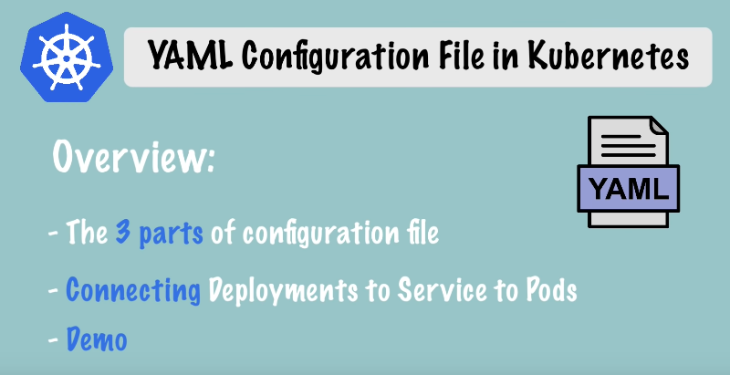

Bu dosya, Kubernetes clusterında componentler oluşturmak ve yapılandırmak için ana tooldur. Büyük yapılandırma dosyalarını gördüysek biraz karışık olduklarını düşünebiliriz, ancak aslında oldukça basit ve mantıklı bir yapıya sahiptir. Öyleyse başlayalım!

###  3 Parçada K8s Config Dosyası

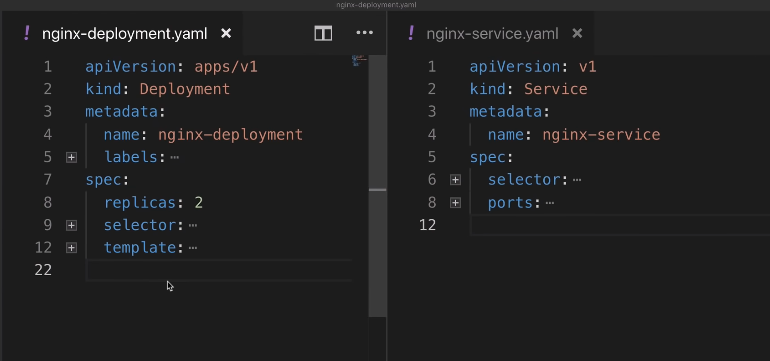

Yukarıdaki fotoğrafta yan yana bir `deployment` ve `service` yapılandırma dosyası örnekleri var.

Öncelikle her Kubernetes config(yapılandırma) dosyası üç kısımdan oluşur.

* İlk kısım, oluşturduğunuz componentin `metadata`'larının bulunduğu yerdir.
* İkinci kısım, yapılandırma dosyasındaki `specification`'dur(özellik). Her component config dosyasında, o component için uygulamak istediğimiz her türlü yapılandırmayı bu bölüme koyarız.

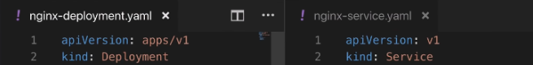

Config dosyasındaki İlk iki satır, tam olarak neyi oluşturmak istediğimizi belirtiyor. Soldaki kısımda `deployment` oluşturuyoruz, sağdaki kısımda ise bir `service` oluşturuyoruz.
İlk satırlarda ise API versiyonu belirtiyoruz. Her component için API versiyonu farklı olabilir.
Ve bu, her component için bir API versiyonu araştırmanız gerektiği anlamına gelir.

* *Kubernetes'te her bileşenin farklı API sürümü olmasının temel nedeni, her bileşenin farklı gereksinimlere ve özelliklere sahip olmasıdır. Her bileşenin farklı bir API sürümü olması, bu bileşenin özelliklerini ve davranışını belirleyen özelleştirilmiş bir yapıya sahip olmasını sağlar.*

Specification kısmında belirteceğimiz özellikler, oluşturduğumuz component türüne özgü olacaktır. Aşağıdaki resimde görüldüğü gibi:

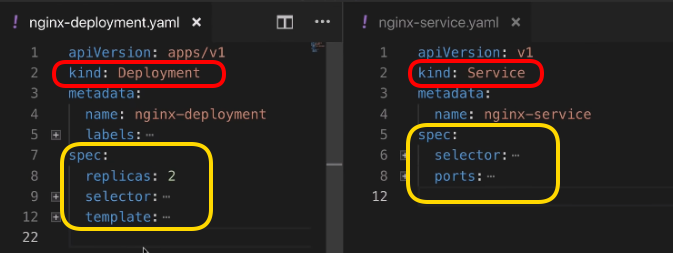

Deployment kendi özelliklerine sahip olacak ve tabii servis de kendi şeylerine sahip olacak.

Hatırlarsak config dosyalarının üç parçadan olduğunu söylemiştik ama şu an sadece `metadata` ve `specification`'u gördük. Peki üçüncü parçamız nerede?

* Üçüncü kısım `status`'tur. Kubernetes tarafından otomatik olarak oluşturulup eklenir.

Çalışma şekli şöyledir:

* Kubernetes her zaman `desired state`(istenen durum) ve `actual state`'i(gerçek durum) karşılaştırır. Eğer gerçek durum ve istenen durum uyuşmuyorsa, Kubernetes bir şeylerin düzeltilmesi gerektiğini bilir ve onu düzeltmeye çalışır.
* Bu, Kubernetes'in sağladığı `self-healing` özelliğinin temelidir.

* Örneğin, yukarıdaki deployment kodundaki specification bölümünde, nginx deployment için iki replika istediğimizi belirtmişiz. Bu config dosyasını kullanarak deployment oluşturduğumuzda(apply), Kubernetes, deployment status(durumunu) takip edecek, config dosyamıza status parçamızı da ekleyecek ve bunu sürekli olarak güncelleyecektir.

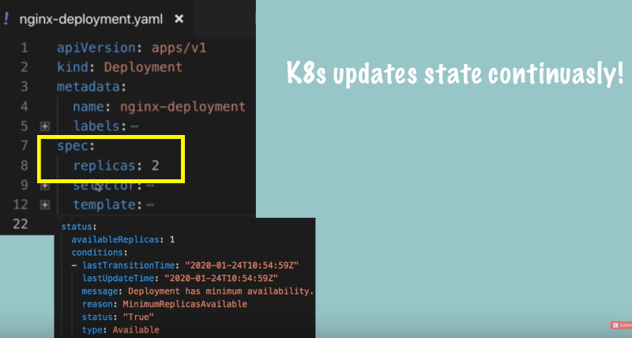

* Eğer status, bir noktada sadece bir replikanın çalıştığını söylüyorsa, Kubernetes bu statusu özellikle belirttiğimiz iki replikayla karşılaştıracak ve bir sorun olduğunu bilecektir. Başka bir replika oluşturması gerektiğini anlayacak ve bunu otomatik olarak gerçekleştirecektir. `self-healing`.

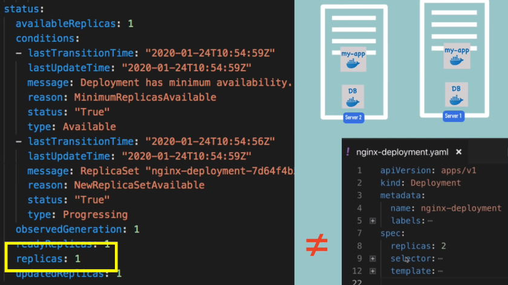

Bunları görünce aklımıza Kubernetes'in, otomatik olarak buraya ekleyerek veya sürekli olarak güncellemek için status verisini nereden aldığı takılabilir.

* Bu bilgi daha önce bahsettiğimiz `etcd`'den gelir. Master process'lerden biri olan etcd, aslında cluster verilerini depolar. Etcd **her zaman** herhangi bir Kubernetes bileşeninin mevcut durumunu tutar ve bu status bilgisi buradan gelir.

### Config Dosyasının Formatı

Yukarıdaki görüntülerden de gördüğümüz gibi config dosyalarının formatı `YAML`'dır. YAML oldukça basit bir formattır, ancak girintiler konusunda çok katıdır.
Yanlış girintiye sahip bir dosyamız varsa, bu dosya geçersiz olacaktır. Bu yüzden 200 satırdan oluşan bir yapılandırma dosyamız varsa, `YAMLlint` gibi bir online yaml validator kullanmak mantıklı olacaktır.

Başka bahsedilecek bir konu da, bu config dosyalarını nereye kaydedeceğimizdir. Klasik bir uygulama, kodumuzla birlikte saklamaktır. Çünkü deployment ve servis, uygulamaya uygulanacaktır. Bu yapılandırma dosyalarımızı, uygulama kodunun bir parçası olarak saklamak iyi bir yöntemdir.
Bunlar `Infrastructure as a Code` **IaC** kavramının bir parçası olabilir veya config dosyaları için kendi git depolarımızı da oluşturabiliriz.


### Podlar için Blueprint (Template)

Biraz geriye gidersek deployment'ların, kendisinin altındaki podları yönettiğini söylemiştik.

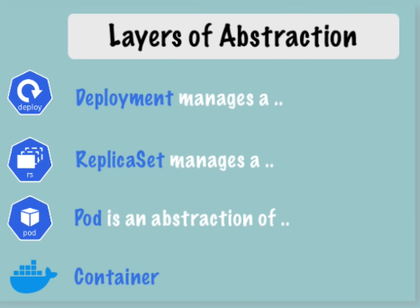

Yani bir deployment'ta bir şeyi düzenlediğimizde, bunun altındaki bütün podlara yayılır ve birkaç pod oluşturmak istediğimizde aslında bir deployment oluştururuz ve bu deployment gerisini halleder.

*Bunlar nasıl gerçekleşir? Bu bahsettiğimiz şeyler konfigürasyonda nerede tanımlanır?

Config dosyamızdaki, `specification` kısmında yer alan `template`'i genişletirsek; template'imizin de kendi `metadata`'sının ve `specification`'u olduğunu görürüz.

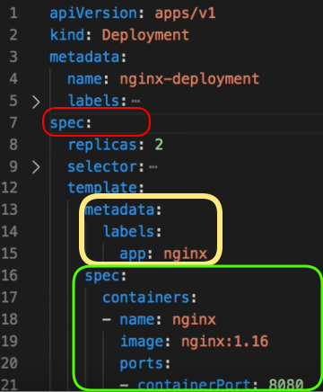
Yani basitçe tabir edecek olursak **"configuration file inside of a configuration file"**

Bunun sebebi, template içerisindeki konfigürasyonun bir `pod` için geçerli olmasıdır. Bir podun bir deployment config dosyası içinde kendi yapılandırması olmalıdır. Bu tüm deployment'ların nasıl tanımlanacağını gösterir.

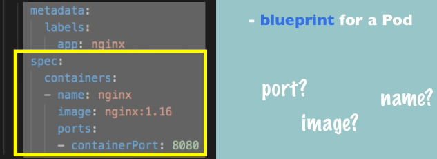
Bu sarı alan ise bir pod için bir blueprint'tir. Hangi image'e dayanacağımızı, hangi portu açacağımızı, konteynerin adının ne olacağını vb. belirler.


### Connecting Components (Labels & Selectors & Ports)

Bağlantının kurulduğu şekil `labels` ve `selectors` kullanılarak gerçekleşir.

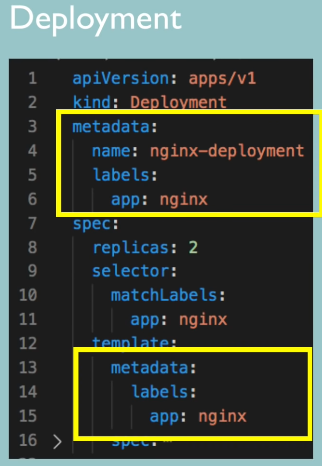
* Metadata bölümü `labels` içerir.

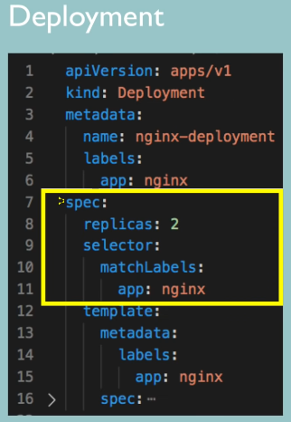
* Specification bölümü ise `selectors` içerir.

---

Metadata kısmında bir componente bir `key-value` (anahtar-değer) çifti veririz.
Yukarıdaki örnekte app: nginx var. Bu label, bu componente yapışıyor.

Bu şekilde, bu blueprint kullanılarak oluşturulan podlara `app: nginx` labeli veriyoruz ve deploymenti, "app: nginx" label'iyle eşleşen tüm label'lara bağlamak veya eşleştirmek için ayarlıyoruz.

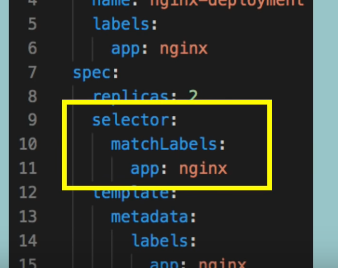

Bu sayede deployment, hangi podların kendisine ait olduğunu bilecektir.

Dağıtımın kendi "app nginx" labeli var ve bu iki label, `Service` içindeki `selector` tarafından kullanılır. Bu nedenle, Service içerisinde specification bölümünde bir selector tanımlarız ki bu, temelde bir connection oluşturur. (Service ile Deployment veya parçaları arasında)

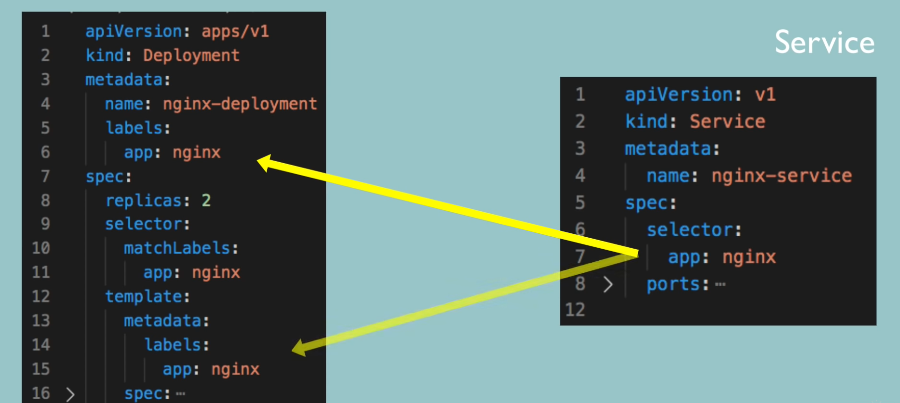

Çünkü Service, kendisine kayıtlı olan podları, hangi podların o servise ait olduğunu bilmesi gerekir ve bu bağlantı `label`'ın `selector` bölümüyle yapılır.

* Service ve pod içinde yapılandırılması gereken başka bir şey de `Port` lardır.

Yani, servis içerisinde, servisin kendisinin erişilebilir olduğu bir *Port* vardır.

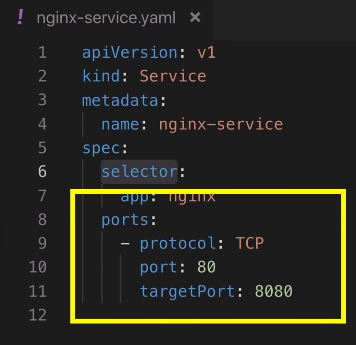

Pod içerisindeki Konteynerın da kendisine ait bir Port'u vardır.

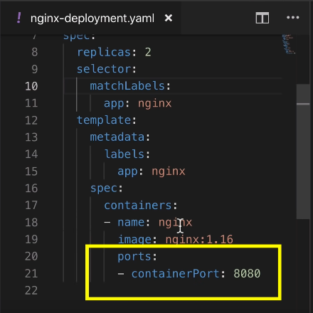

Bu nasıl yapılandırılır? Temelde, bir servisin kendisinin erişilebilir olduğu bir portu vardır, bu yüzden diğer servisler bir istek gönderdiğinde bu nginx servisine isteği 80 numaralı bağlantı noktasında göndermelidir, ancak bu servisin, isteği hangi pod'a yönlendirmesi gerektiğini, aynı zamanda o pod'un hangi portu dinlediğini de bilmesi gerekir ve bu da `target port`tur.

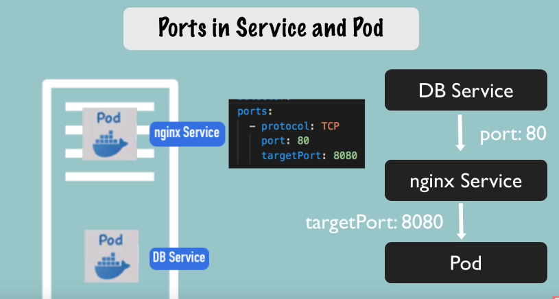


Alttaki resimdeki gibi sağdaki servis config dosyamızdaki `targetPort: 8080`, Deployment config dosyasındaki container'ın portuyla `containerPort:8080` eşleşmelidir.

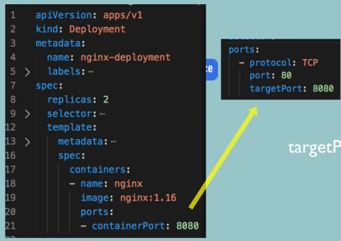

Böylelikle deployment ve servisimizin temel yapılandırmalarını tamamlamış oluruz. Burada dikkate alınması gereken önemli bir nokta, Aşağıdaki resimdeki her iki bölümde de gördüğümüz çoğu özelliğin zorunlu olduğudur.

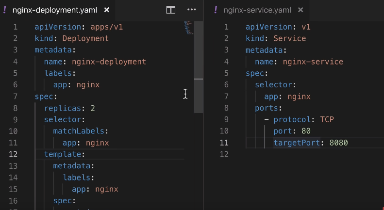
* Bu aslında deployment ve servis için minimum yapılandırmadır.

Dosyalarımızı elde ettikten sonra, bunları uygulayabilir veya bunları kullanarak bileşenler oluşturabiliriz. Konsola geçip oluşturmadan önce `nginx-deployment.yaml` dosyası ile `nginx-service.yaml` dosyalarının içeriklerini buraya yazıyoruz.

nginx-deployment.yaml
```yml
apiVersion: apps/v1
kind: Deployment
metadata:
  name: nginx-deployment
  labels:
    app: nginx
spec:
  replicas: 2
  selector:
    matchLabels:
      app: nginx
  template:
    metadata:
      labels:
        app: nginx
    spec:
      containers:
      - name: nginx
        image: nginx:1.16
        ports:
        - containerPort: 8080
```

```yml
apiVersion: v1
kind: Service
metadata:
  name: nginx-service
spec:
  selector:
    app: nginx
  ports:
  - protocol: TCP
    port: 80
    targetPort: 8080
```

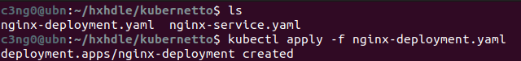


`kubectl apply deployment` komutuyla deployment ve servis oluşturuldu.

Şimdi eğer podları listelersem, burada iki replikanın çalıştığını görüyoruz çünkü config dosyamızda böyle tanımlamıştık.
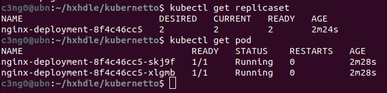

Ayrıca aşağıda görüldüğü gibi; nginx servisimiz de var.

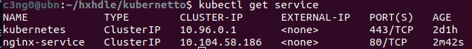

`kubernetes` default servistir, her zaman oradadır. Bizim oluşturduğumuz `nginx-service` ve Port 80'de dinlemede.

Şimdi, servisin istekleri doğru pod'lara ilettiğini nasıl doğrulayabiliriz? Bunun için:

```bash
kubectl describe service [service_name]
```

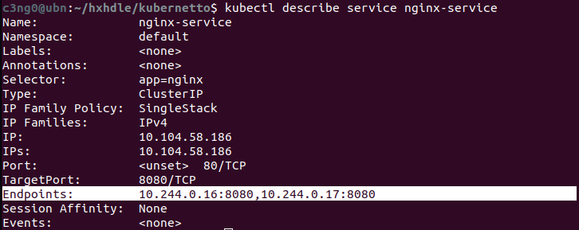

Ve burada, status bilgilerinin olduğunu görebiliriz. Hedef Bağlantı Noktasını tanımlarız ve burada endpoint'imiz var ve bunlar servisin isteği ileteceği pod'ların IP adresleri ve bağlantı noktaları olmalıdır. Peki, bunların doğru pod'ların IP adresleri olduğunu nasıl bileceğiz?
`kubectl get pod` komutu, IP adresi bilgisi vermez. Bunun için;

```bash
kubectl get pod -o wide
```

`-o wide` ile daha fazla bilgi istiyoruz.

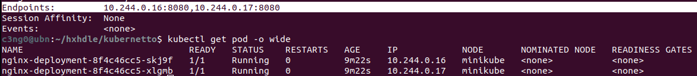

Artık IP adresini de görüyoruz ve baktığımız zaman, servisin doğru end-point'e sahip olduğunu biliyoruz.

Şimdi, config dosyasının üçüncü partını görelim. Hatırlarsak bu Kubernetes'in otomatik olarak oluşturduğu bir durumdu. Bunu yapmanın yolu, config dosyasını yaml formatında alabiliriz.

```bash
kubectl get deployment nginx-deployment -o yaml
```

bu komutu çalıştırdığımızda sonuçları veya güncellenmiş configi alıyoruz. Konsolumuzda yaml çıktısını aldık fakat bunu bir dosyaya kaydedelim ve yazdığımız config ile karşılaştıralım.

```bash
kubectl get deployment nginx-deployment -o yaml > result.yaml
```

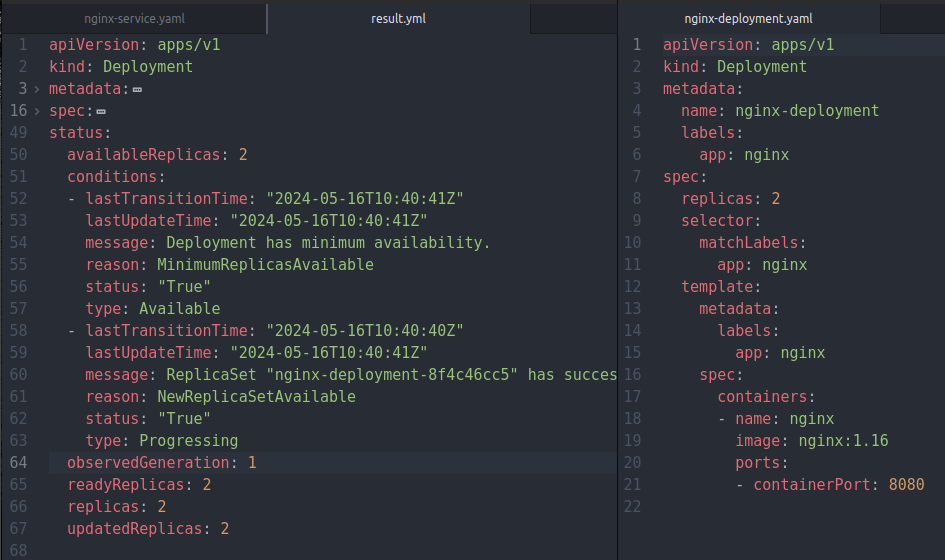

Burada eklenen birçok şey var ama sadece status kısmına göz atalım. Daha önce de belirttiğimiz gibi tüm bunlar otomatik olarak kubernetes tarafından düzenlenir ve sürekli olarak güncellenir. Kaç replikanın çalıştığını, bu replikaların durumunu ve bazı diğer bilgileri belirtir. Bu kısım ayrıca debugging yaparken de yardımcı olabilir. Eğer fark ettiysek, metadata ve specification kısmına da yeni şeyler eklenmiş.

Burada dikkate alınması gereken bir şey:
* örneğin, bir deploymenti kopyalamak istersek, *-belki otomatikleştirilmiş betikler kullanarak-*  yapmanız gereken bu oluşturulan extra verileri kaldırmak ve temizlemektir.
* Yani bu son result deployment config dosyasını önce temizlersek, ardından o blueprint konfigürasyonundan başka bir deployment oluşturabiliriz.
* Son olarak, deployment'ı veya servisi silmek istersem, bunu config dosyasını kullanarak da yapabiliriz.

```bash
kubectl delete -f nginx-deployment.yml
```

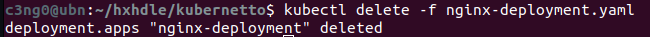

---

## İlk Demo Uygulama

Bu bölümde iki uygulama deploy edeceğiz: MongoDB ve Express. Bu iki uygulama ile basit bir web app ve database kurulumunun tipik bir örneğini çok iyi görebileceğiz. O zaman yapmaya başlayalım..
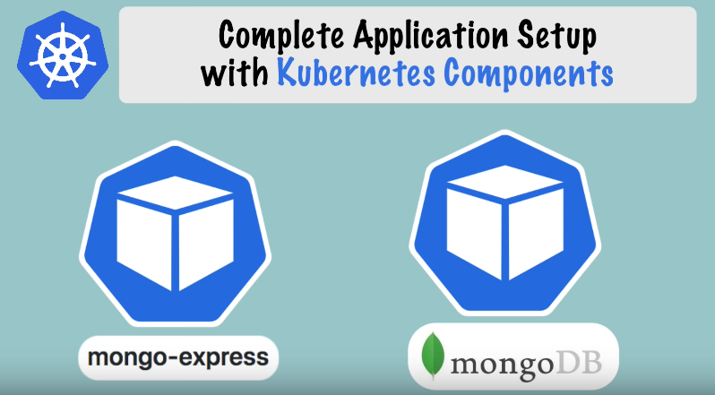

* İlk olarak bir MongoDB pod'u oluşturacağız.
* Bu pod ile iletişim kurabilmek için bir servise ihtiyacımız olacak. Internal servis oluşturacağız, yani bu pod'a dışarıdan gelen(external request) istekler engellenecek ve yalnızca aynı cluster içindeki componentler iletişim kurabilecek. Bu bizim istediğimiz şey.
* Daha sonra bir Mongo Express deployment oluşturacağız. İki şeye ihtiyacımız olacak: biri MongoDB'nin veritabanı URL'si, böylece Express bu URL'ye bağlanabilecek; diğeri ise veritabanının kullanıcı adı ve şifresi, böylece kimlik doğrulaması yapabilecek.

* Bu bilgileri Mongo Express deployment'a geçirebilmenin yolu, deployment config dosyasında `environmental variables`(çevresel değişkenler) aracılığıyla olacak, çünkü uygulama bu şekilde yapılandırılmış.
* Veritabanı URL'sini içeren bir `ConfigMap` ve kimlik bilgilerini içeren bir `Secret` oluşturacağız ve bunları deployment dosyasının içine referans olarak ekleyeceğiz.
* Bu kurulum tamamlandığında, Mongo Express'in tarayıcı üzerinden erişilebilir olması gerekecek. Bunu yapmak için, `external request`(dış istek)lerin pod'a iletilmesine izin verecek bir `external service` oluşturacağız.

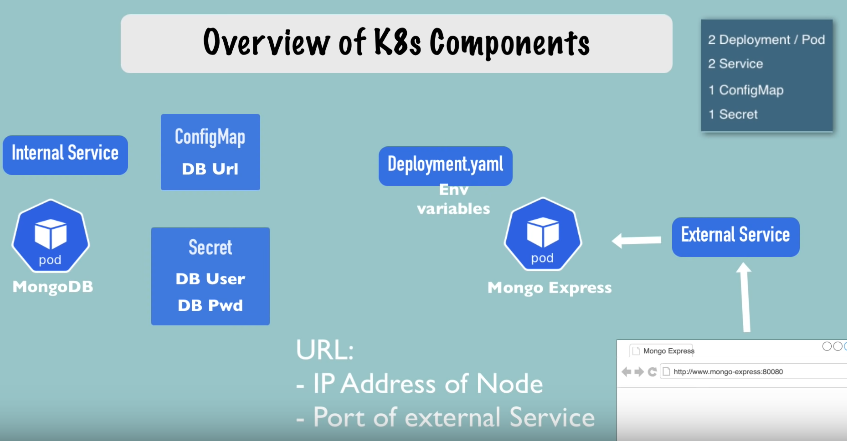

Bu kurulumla birlikte istek akışı aşağıdaki gibi görünecek.

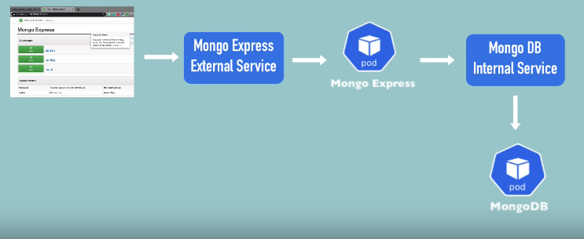

* İstek tarayıcıdan gelecek ve Mongo Express'in external servisine gidecek.
* Bu servis isteği Mongo Express pod'una iletecek.
* Pod, MongoDB'nin internal servisine bağlanacak ve isteği MongoDB pod'una iletecek. Burada kimlik doğrulama yapılacak.
**Şimdi bu kurulumun tamamını Kubernetes yapılandırma dosyalarını kullanarak oluşturalım.**

### 1) MongoDB Pod
İlk olarak, çalışan bir Minikube clusterımız var. `kubectl get all` komutunu kullanarak kümedeki tüm bileşenleri listelediğimde yalnızca default Kubernetes servisini görüyoruz.

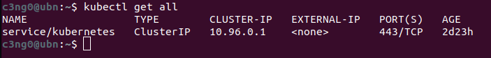

Yani clusterımız boş ve sıfırdan başlıyoruz. İlk yapacağımız şey bir MongoDB deployment oluşturmak.

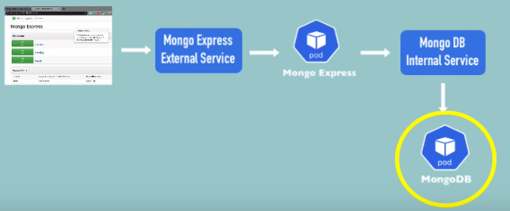

MongoDB için hazır olan deployment dosyası aşağıdaki şekilde.
```yaml
apiVersion: apps/v1
kind: Deployment
metadata:
  name: mongodb-deployment
  labels:
    app: mongodb
spec:
  replicas: 1
  selector:
    matchLabels:
      app: mongodb
  template:
    metadata:
      labels:
        app: mongodb
    spec:
      containers:
      - name: mongodb
        image: mongo
```

Bu dağıtıma `mongodb-deployment` adını verelim. Konteyner `mongodb` olarak adlandırılacak ve kullanacağımız image bu olacak. Hadi Docker-Hub'a gidip MongoDB image yapılandırmasını kontrol edelim.
* https://hub.docker.com/_/mongo

Aradığımız şey, bu konteyneri nasıl kullanacağımız, yani hangi portları açacağı ve hangi harici yapılandırmaları alacağız.

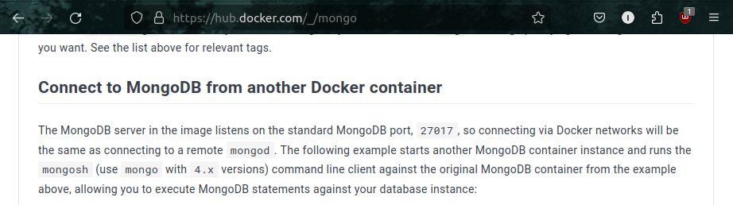

MongoDB konteynerinin varsayılan portu 27017'miş, bu yüzden bunu kullanacağız.

Ayrıca `Environment Variables`(çevresel değişkenler) kullanacağız.

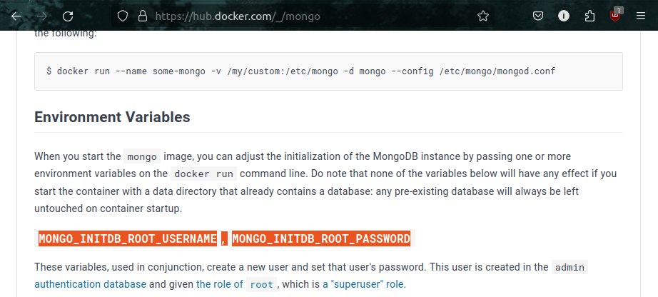

root kullanıcı adı ve root şifresi. Yani konteyner başlatıldığında admin kullanıcı adı ve şifresini tanımlayabiliriz. Şimdi bunu config dosyamızda ayarlayalım.

```yaml
apiVersion: apps/v1
kind: Deployment
metadata:
  name: mongodb-deployment
  labels:
    app: mongodb
spec:
  replicas: 1
  selector:
    matchLabels:
      app: mongodb
  template:
    metadata:
      labels:
        app: mongodb
    spec:
      containers:
      - name: mongodb
        image: mongo
        ports:
        - containerPort: 27017
        env:
        - name: MONGO_INITDB_ROOT_USERNAME
          value:
        - name: MONGO_INITDB_ROOT_PASSWORD
          value:
```
 * `ports` özelliği ve `containerPort` ile hangi portu açmak istediğimizi belirttik. Standart portu kullandık.
 Altında iki environment variables(`env`) belirttik.
 * Birincisi `MONGO_INITDB_ROOT_USERNAME` ve boş bırakacağız.
 * Diğeri ise `MONGO_INITDB_ROOT_PASSWORD` olacak ve bunu da boş bırakacağız.

> [!CAUTION]
> **Şunu unutmamalıyız ki bu, bir repository içine kaydedilecek bir config dosyasıdır. Bu yüzden admin kullanıcı adı ve şifresini yapılandırma dosyasının içine yazmamalıyız.**

### 2) Secret ve Referans

Şimdi yapacağımız şey, değerleri referans alacağımız bir `secret` oluşturmak olacak.

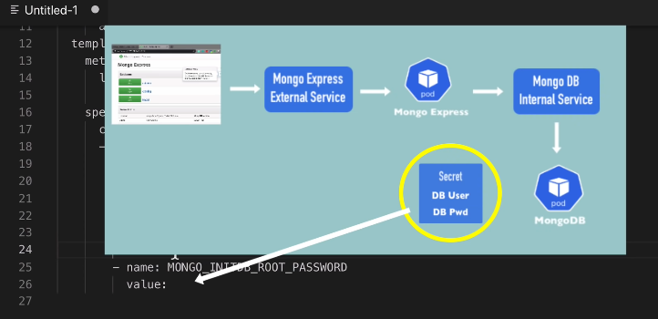

Yani bu gizli dosya Kubernetes'te yer alacak ve kimse git reposunda buna erişemeyecek.
**Secret lives in K8s, not in the repository**

Şimdilik az önce yazdığımız henüz bitmemiş olan deployment config dosyasını kaydedelim. Adını `mongo-depoyment.yml` olarak koyup kaydedelim.

Şimdi bu yapılandırmayı apply etmeden önce, root kullanıcı adı ve şifresinin yer alacağı `Secret` oluşturacağız. Yeni bir dosya oluşturalım ve aşağıdaki *Secret* configi yapıştıralım.

```yaml
apiVersion: v1
kind: Secret
metadata:
  name: mongodb-secret
type: Opaque
data:
  username:
  password:
```

Oldukça basit bir yapısı var.
* `kind: Secret` var.
* `metadata` var, ve bu sadece adını içeriyor. Buna `mongodb-secret` diyeceğiz.
* `type: Opaque` aslında en temel `key-value` secret türüdür. Diğer türler örneğin TLS sertifikalarını içerir. Yani bir gizli dosya oluşturabiliriz ve bunu TLS sertifikası türünde yapabiliriz. Ancak çoğunlukla default türü (Opaque) kullanacağız.
* `data` var ve burada `key-value` çiftleri bulunuyor. Elbette bunlar bizim belirlediğimiz isimler olacak. Mesela data kısmında değişiklik yapalım.
```yaml
data:
  mongo-root-username:
  mongo-root-password:
```
* Kullanıcı adını `root-username` ve şifreyi `root-password` olarak belirleyeceğiz.

> [!IMPORTANT]
>**Buradaki önemli nokta, bu anahtar-değer çiftlerindeki değerlerin düz metin olmamasıdır. Bir gizli dosya oluştururken değerlerin base64 ile kodlanması gerekir.**

Bunu yapmanın en basit yolu terminale gitmektir. Burada, `echo -n` komutunu kullanacağız.
```bash
echo -n "username" | base64
echo -n "password" | base64
```
Buraya istediğim düz metin değerini koyalım. `username` ve `password` kullanalım ve base64 ile kodlayalım. Elde ettiğimiz değerleri secret confige kopyalayalım.

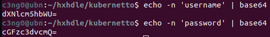

Tamamladıktan sonra dosyayı `mongo-secret.yaml` olarak kaydedelim.
```yaml
apiVersion: v1
kind: Secret
metadata:
  name: mongodb-secret
type: Opaque
data:
  mongo-root-username: dXNlcm5hbWU=
  mongo-root-password: cGFzc3dvcmQ=
```

Şimdiye kadar sadece config dosyaları yazdık, clusterda henüz bir şey oluşturmadık. Deploymenti referans alacağımız secret'tan önce oluşturmalıyız. Eğer secret içermeyen bir deployment oluşturursak, hata alırız ve deployment başlatılamaz.

İlk componentimiz hazır olduğuna göre, şimdi config dosyasından bir secret oluşturabiliriz. Şu an her iki dosyamız da mevcut.

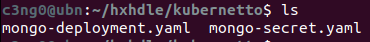

Aşağıdaki komutu çalıştırıyoruz ve `secret` oluşturuluyor.

```bash
kubectl apply -f mongo-secret-yaml
```

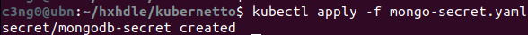

Secretlarımızı listelemek için de aşağıdaki komutu çalıştırdığımızda, Yeni Secret'ımızın oluşturulduğunu görmeliyiz.

```bash
kubectl get secret
```


Artık Secret'ımızı deployment config dosyamızda referans alabiliriz. Config dosyamıza geri dönelim ve Secret'taki belirli `key-value` verilerini referans alalım.

```yaml
          env:
          - name: MONGO_INITDB_ROOT_USERNAME
            valueFrom:
              secretKeyRef:
                name: mongodb-secret
                key: mongo-root-username
          - name: MONGO_INITDB_ROOT_PASSWORD
            valueFrom:
              secretKeyRef:
                name: mongodb-secret
                key: mongo-root-password
```

* `value` yerine `valueFrom` yazıyoruz ve altına `secretKeyRef` yazıyoruz.
* `secretKeyRef`  name'i, `Secret` dosyamızın adı olacak.
* `key` değerini almak için de, Secret dosyamızdan isimleriyle referans alacağız. `mongo-root-username`, `mongo-root-password`.

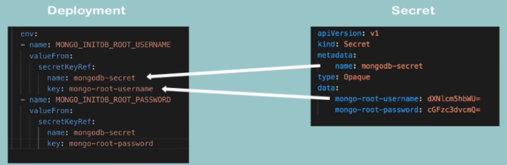

Bu şekilde referans almayı tamamlıyoruz.

* Unutmayın, YAML dosyası girintilere çok dikkat eder.

Böylece root kullanıcı adı ve şifresi, Secret'tan referans alınacak ve config dosyasının içinde gerçek değerler bulunmayacak. Bu güvenlik açısından oldukça iyidir çünkü kimlik bilgilerimizin kod reposunda bulunmasını asla istemeyiz.

Deployment dosyamız artık hazır, Artık apply edebiliriz.

```bash
kubectl apply -f [YAML_file]
```

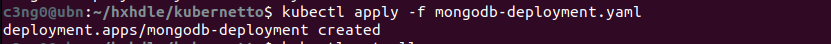
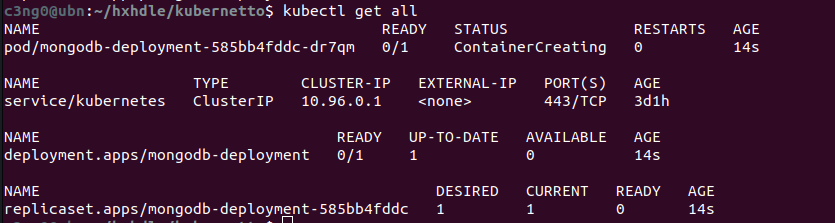

Deployment oluşturuldu, yani `get all` komutunu çalıştırırsam Pod'un başlatıldığını, deploymenti ve ReplicaSet'i görmeliyim.

Şimdi Pod'un statusunu kontrol edelim. Konteyner oluşturuluyor, bu yüzden izlememiz gerekiyor. Eğer uzun sürerse ve bir sorun olup olmadığını görmek isterseniz, `kubectl describe pod` ve Pod adımızı yazıyoruz.

```bash
kubectl describe pod [POD_NAME]
```

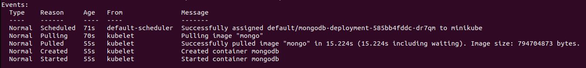

Görüyoruz ki sadece image çekiyor, bu yüzden uzun sürüyor.

Tekrar `kubectl get pod` komutunu çalıştırırsak, Pod'un çalıştığını göreceğiz. Şu anda bir MongoDB deployment ve bir replika Pod çalışıyor.

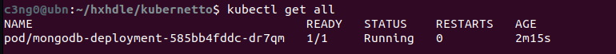

### 3) MongoDB Internal Service

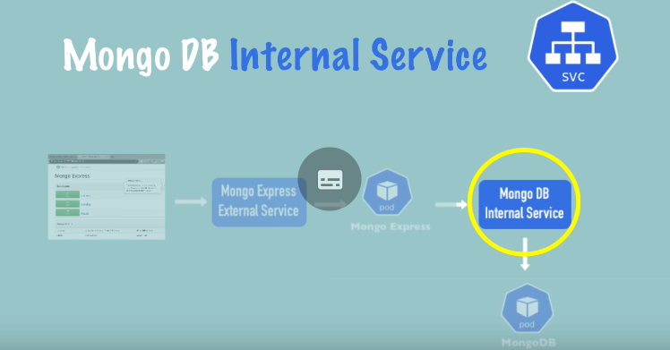

Şimdiki adımda, diğer componentlerin veya diğer Pod'ların bu MongoDB ile konuşabilmesi için bir `internal service` oluşturacağız. Önce servisconfiguration oluşturalım.

YAML dosyamıza geri dönelim.

> [!TIP]
> **YAML'da tek dosyada, birden fazla yaml yazabiliriz. YAML'da 3 tire `---`  belge ayırma sözdizimidir. Yani yeni bir belge başladığını belirtmiş oluyoruz.**

Hatta deployment ve servisi aynı config dosyasına koyabiliriz çünkü genelde bu iki dosya birlikte bulunur.

```yaml
apiVersion: apps/v1
kind: Deployment
metadata:
  name: mongodb-deployment
  labels:
    app: mongodb
spec:
  replicas: 1
  selector:
    matchLabels:
      app: mongodb
  template:
    metadata:
      labels:
        app: mongodb
    spec:
      containers:
      - name: mongodb
        image: mongo
        ports:
        - containerPort: 27017
        env:
        - name: MONGO_INITDB_ROOT_USERNAME
          valueFrom:
            secretKeyRef:
              name: mongodb-secret
              key: mongo-root-username
        - name: MONGO_INITDB_ROOT_PASSWORD
          valueFrom:
            secretKeyRef:
              name: mongodb-secret
              key: mongo-root-password
---
apiVersion: v1
kind: Service
metadata:
  name: mongodb-service
spec:
  selector:
    app: mongodb
  ports:
    - protocol: TCP
      port: 27017
      targetPort: 27017
```

Bu MongoDB için bir servis. Bazı nitelikleri gözden geçirelim.

* `kind: Service` ve `name: mongodb-service` olarak adlandırdık.
* `selector` önemli çünkü biz bu oluşturacağımız servisin Pod'a bağlanmasını istiyoruz ve bunu yapmanın yolu Servisten `selector`, Deployment'tan `label` kullanmaktır. Bu etiketleri kullanarak, deployment ve Pod'un sahip olduğu labelları, servis bulup bağlanabilir.
* `ports:` Burada servisin bağlantı noktasını (port) açıyoruz.
	* `port: 27017` Servis portudur.
	* `targetPort: 27017` Konteyner veya Pod portudur.
	Deployment config içerisindeki `containerPort` ile, Servisteki `targetPort` birbiriyle eşleşmelidir. Tabii ki, bu iki bağlantı noktası *farklı olabilir*, ama biz bu seferlik aynı portu kullanalım.

Hadi şimdi servisi oluşturalım. Bu dosyayı kaydedelim ve aynı dosyayı tekrar uygulayalım. Böylece az önce deployment oluşturulduğu gibi şimdi de servis oluşacak. Bakalım ne olacak?

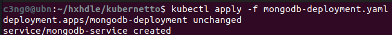

Hem dağıtım hem de servis yapılandırması olmasına rağmen, Kubernetes deploymenti değiştirmediğimizi anlıyor. Bu nedenle sadece servisi oluşturuyor.

Şimdi servisimizin oluşturulduğunu kontrol edelim.

```bash
kubectl get services
```

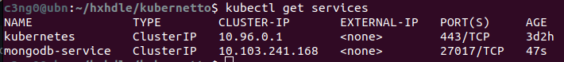

Oluşan servisimiz 27017 portunda dinliyor. Hatırlarsanız, servisin doğru Pod'a bağlı olup olmadığını da kontrol edebiliyorduk. Bunu yapmak için;

```bash
kubectl describe service [SERVICE_NAME]
```

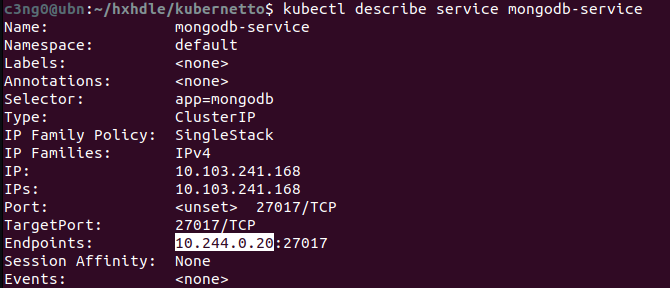

Burada bir IP adresi ve Pod'un içinde dinleyen uygulama portu var. Bu doğru Pod olup olmadığını kontrol edelim.  `-o wide` ile ek çıktıyla çalıştırıyorum.

```bash
kubectl get pod -o wide
```

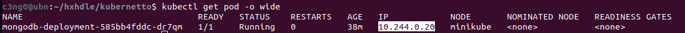

Bu IP adresi, Pod IP adresi ile eşleşiyor ve uygulamanın Pod içinde dinlediği port doğru.

Her şey mükemmel şekilde ayarlandı. MongoDB dağıtımı ve servisi oluşturuldu.

> [!TIP]
> Bir uygulamanın tüm componentlerini görmek istersek, `kubectl get all` ve `grep` komutunu birlikte kullanabiliriz. Böylece hem tüm componentleri listeleyip hem de isme göre  filtreleyebiliriz.

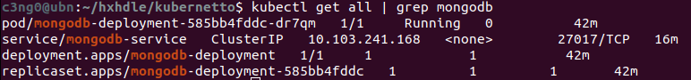

İşte bu şekilde tek komutla servisimizi, deploymentımızı, replicasetimizi ve Podumuzu görüntüleyebiliriz. Tüm component tipleri burada görünüyor.

### 4) Mongo Express Deployment & Service & ConfigMap

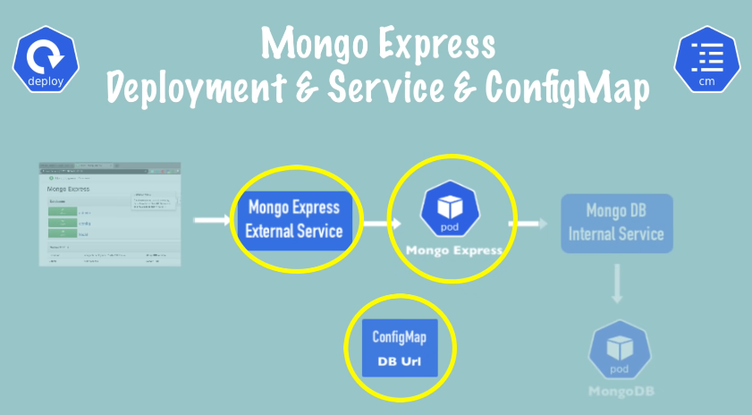

Şimdi sıradaki adımda, `Mongo Express Deployment ve Servisi` oluşturacağız. Ayrıca MongoDB için veritabanı URL'sini içeren `External Configuration` oluşturacağız. Yeni bir dosya oluşturarak başlayalım.

```yaml
apiVersion: apps/v1
kind: Deployment
metadata:
  name: mongo-express
  labels:
    app: mongo-express
spec:
  replicas: 1
  selector:
    matchLabels:
      app: mongo-express
  template:
    metadata:
      labels:
        app: mongo-express
    spec:
      containers:
      - name: mongo-express
        image: mongo-express
```

Bu, MongoExpress deployment taslağı. İsim `express`.
* `template:` Pod tanımımız var. Image adı `express`. Bu imajı da kontrol edelim. image adı `mongo-express`.

*https://hub.docker.com/_/mongo-express*

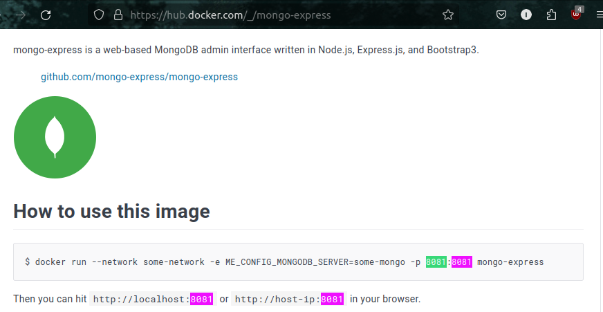

Konteyner içindeki MongoExpress Port 8081'deymiş.
Biraz aşağı inersek de çevresel değişkenleri(environmental variables) görebiliriz.

* MongoExpress için üç şeye ihtiyacımız var: MongoDB adresi(veritabanı adresi) ve kimlik doğrulama bilgileri.
	* MongoDB Adresi                        ->          ...MONGODB_SERVER
	* Kimlik Doğrulama Bİlgileri          ->          ...ADMIN_USERNAME, ...ADMIN_PASSWORD


Bu çevresel değişkenleri kullanacağız. O zaman ilk olarak konteyner portlarını açabiliriz.

```yaml
...  
...
  template:
    metadata:
      labels:
        app: mongo-express
    spec:
      containers:
      - name: mongo-express
        image: mongo-express
        ports:
        - containerPort: 8081
```

* İçerideki Pod'da birden fazla port açabileceğimiz için birden fazla port olabileceği anlamına gelen `ports` kullanılır. Bu değerimiz, 8081 olacak.

Şimdi bağlantı için `ENV`(environment variables) ekleyeceğiz.

```yaml
...
...
        ports:
        - containerPort: 8081
        env:
        - name: ME_CONFIG_MONGODB_ADMINUSERNAME
          valueFrom:
            secretKeyRef:
              name: mongodb-secret
              key: mongo-root-username
        - name: ME_CONFIG_MONGODB_ADMINPASSWORD
          valueFrom:
            secretKeyRef:
              name: mongodb-secret
              key: mongo-root-username
```

Tabiiki tanımladığımız aynı kullanıcı adı ve şifre, deploymentta tanımladığımız ile aynı olacak. Bu yüzden yaptığımız şey onları kopyalamak. Aynı `valueFrom` ile zaten orada olan secret içerisinden okumuş olacağız.

Son olarak database server:

```yaml
...
...
        - name: ME_CONFIG_MONGODB_ADMINPASSWORD
          valueFrom:
            secretKeyRef:
              name: mongodb-secret
              key: mongo-root-username
        - name: ME_CONFIG_MONGODB_SERVER
          value:
```

Bu da harici bir yapılandırma olduğu için ya burada `value` kullanabilir ve mongodb sunucu adresini doğrudan buraya yazabiliriz. Ya da diyagramda gösterildiği gibi, merkezi bir yapılandırma olan bir configmap'e koyabiliriz. Bu şekilde merkezi bir yerde saklanır ve diğer componentler de kullanabilir.
* Örneğin, iki uygulamam mongodb veritabanını kullanıyorsa, bu harici yapılandırmayı referans alabiliriz ve bir noktada değişiklik yapmamız gerekirse; sadece bir yerde değişiklik yaparak diğer dosyaları güncellemeden devam edebiliriz.
Bu nedenle, şu an için eksik olan bu deployment configi kenara kaydedip, mongodb sunucu adresini içeren configmap'i oluşturacağız. Yeni bir dosya oluşturalım, bu eksik dağıtımı kaydedelim, adını `mongo-express.yaml` koyalım ve daha sonra geri dönelim!

```yaml
apiVersion: v1
kind: ConfigMap
metadata:
  name: mongodb-configmap
data:
  database_url:
```

Bu da secret key gibi oldukça basit. Beraber göz atalım:
* `kind: ConfigMap` olan aynı Secret gibi bir yapı görüyoruz.


* Tıpkı yukarıda gördüğünüz gibi `data` içerisinde `key-value` çifti var.
* `type:` yok çünkü sadece configmapin sadece bir türü var. Sonuç olarak veritabanı URL'si ve server adı aslında Servisin adı. Bu kadar basit.

Hizmetimize  `mongodb-service` adını vermiştik. Bu yüzden hizmet adını kopyalayalım ve bunu veritabanı sunucusu URL'sine yazalım. Dosyayı mongo-configmap.yaml olarak kaydedelim.

> [!NOTE]
> Gizli anahtar gibi, çalıştırma veya oluşturma sırası önemlidir. ConfigMap'in zaten clusterda olması gerekiyor ki onu referans alabilelim. Bu yüzden işimiz bittiğinde, önce configmap'i oluşturmalı daha sonra deploymenti yapmalıyız.

Yapılandırma haritasını deployment içinde referans almaya geldik. mongo-express.yaml dosyamıza geri dönelim.

> [!TIP]
> Yapılandırma haritasını deployment içinde referans almanın yolu gizli anahtara çok benzer. Tek fark burada `secret` yerine `configMap` yazacağız. Tamamı küçük ve büyük harf karışık olacak ve elbette adı `config map` olacak.
>
> 

Deploymenti tamamladık. Şimdi önce config map'i ve sonra Express dağıtımını oluşturalım.

```bash
kubectl apply -f mongo-configmap.yaml
kubectl apply -f mongo-express.yaml
```


Herhangi bir hata almadık. Pod'un durumuna bakalım.

```bash
kubectl get pod
```


Konteyner oluşturuluyor. Gayet iyi. Biraz bekleyip tekrar kontrol edelim ve bum!


Doğru çalışıp çalışmadığını öğrenmek için Logları görüntülemek önemlidir.

```bash
kubectl logs [POD_NAME]
```


### 5) Mongo Express External Service


Şimdi son adımımız, Express'e bir tarayıcıdan erişmektir. Bunu yapmak için mongo-express için bir External Service ihtiyacımız olacak. Öyleyse hadi bunu da oluşturalım.

>[!TIP]
>Daha önce yaptığımız gibi yine MongoExpress servisimizi, deploymentı ile aynı dosyada oluşturacağız. Çünkü zaten pratikte hiçbir zaman servis olmadan deploymentı olmaz. Bu yüzden onları aynı yaml dosyasında yazmak mantıklıdır.

```yaml
---
apiVersion: v1
kind: Service
metadata:
  name: mongo-express-service
spec:
  selector:
    app: mongo-express
  ports:
    - protocol: TCP
      port: 8081
      targetPort: 8081
```

Deployment dosyamızın devamına yukarıdaki servis configi yapıştırıyoruz. Bu, Mongo Express'in external servisi ve bu farkettiyseniz tamamen mongodb servisinin yapılandırmasıyla aynı görünüyor.


* Servis portunu 8081 olarak açtık ve yine target Port, container Port'un dinlediği yerdir.

**Peki bu servisi external(harici) yapacak olan şey nedir?**
Bu servisi iki şey yaparak external yaparız:

* *1) `spec` bölümünde, `selector` altına `type: Loadbalancer` yazarız.

>[!INFO]
>Sanıyoruz ki `external servis` için bu isim "LoadBalancer" olarak düzgün seçilmemiş çünkü `internal servis` de istekleri dengeleyip Load Balance yapabilir. İki mongodb podumuz olsa, internal servis de bu podlara gelen istekleri dengeleyebilirdi. Yani gerçekten de tür adı olarak `Load Balancer` seçilmesi çok iyi değil gibi çünkü kafa karışıklığına neden olabilir. Ancak, bu yük dengeleyici türü basitçe servise `external IP adres`i atar ve `external request`leri kabul eder.

```yaml
apiVersion: v1
kind: Service
metadata:
  name: mongo-express-service
spec:
  selector:
    app: mongo-express
  type: LoadBalancer         ## Tam burası..
  ports:
    - protocol: TCP
      port: 8081
      targetPort: 8081
```

* 2) `nodePort: 30000`

Yapacağımız ikinci şey ise, bu servisi harici yapmak için üçüncü bir port sağlamak. Bu da node port olacak ve bu, External IP adresinin açık olacağı port olacak. Ayrıca belirtelim ki bu port, Tarayıcıdan erişmek için kullanacağımız port olacak.

Bu port aslında bir aralığa sahiptir ve bu aralık 30000 ile 32767 arasındadır, yani bu aralıkta bir port vermemiz gerekiyor, bu yüzden sadece 30000 ile gidelim, aralıktaki minimumdur.

```yaml
apiVersion: v1
kind: Service
metadata:
  name: mongo-express-service
spec:
  selector:
    app: mongo-express
  type: LoadBalancer
  ports:
    - protocol: TCP
      port: 8081
      targetPort: 8081
      nodePort: 30000
```

Artık hazır olduğumuza göre uygulamaya geçebiliriz. Ardından bu bağlantı noktalarının nasıl farklı olduklarına bakalım.

```bash
kubectl apply -f mongo-express.yaml
```

Hizmet oluşturuldu ve hizmeti `kubectl get service` ile görüntülersek, önceden oluşturduğumuz mongodb servisinin `ClusterIP`' tipinde olduğunu görüyoruz ve yeni oluşturduğumuz mongo express servisinin bir `LoadBalancer` olduğunu görüyoruz.

```bash
c3ng0@ubn:~/hxhdle/kubernetto$ kubectl get service
NAME                    TYPE           CLUSTER-IP       EXTERNAL-IP   PORT(S)          AGE
kubernetes              ClusterIP      10.96.0.1        <none>        443/TCP          6d1h
mongo-express-service   LoadBalancer   10.96.100.133    <pending>     8081:30000/TCP   9s
mongodb-service         ClusterIP      10.111.249.213   <none>        27017/TCP        95m
```

Internal servis oluştururken herhangi bir tür belirtmedik çünkü zaten default olarak internal IP hizmeti türüdür.

>[!NOTE]
>İnternal Servis oluştururken `type` belirtmeye gerek yok çünkü zaten default olarak tanımlanır.
>

Fark ise;
* ClusterIP, servise internal IP adresi verir. Aşağıda görüldüğü gibi:

```bash
mongodb-service         ClusterIP      10.111.249.213   <none>        27017/TCP        95m
```

* LoadBalancer, servise bir internal IP adresi verir, ancak bununla birlikte external isteklerin geleceği external IP adresi de verir. *(pending)*

```bash
mongo-express-service   LoadBalancer   10.96.100.133    <pending>     8081:30000/TCP   9s
```

* Şu an bize `pending` diyor çünkü minicube'deyiz ve bu normal kubernetes kurulumunda biraz daha farklı çalışır.  

Dediğim gibi, "pending" durumu external IP adresini henüz almadığı anlamına gelir. Bu durumu Minikube'da yapmanın yolu `minikube service` komutunu kullanmaktır ve servisin adına ihtiyacımız olacak.

```bash
minikube service mongo-express-service
```

Bu komut temelde external servisimize bir genel IP adresi atayacak.
Komutu çalıştırdığımızda tarayıcı açılacak ve karşımıza şu sayfa çıkacak:


Eğer açılırken kullanıcı adı ve şifre sorarsa `admin:pass` olarak yazabiliriz.

Ve Mongo Express sayfamızı görüyoruz. Komut satırına geri dönersek, buradaki bu komut Express servisini Public IP adresli URL atadığını ve bizim belirttiğimiz 30000 portunu kullandığını görüyoruz.


Burada değişiklikler yaparsak, örneğin yeni bir veritabanı oluşturalım, ona testDB adını verelim ve Create Database ile isteği gönderelim.


Arka planda olan şeyi şu şekilde açıklayabiliriz.
* Bu isteğin Mongo Express'in external servisine ulaşması
* Ardından Mongo Express poduna yönlendirilmesidir.
* Express podu, Internal servis olan mongodb servisine bağlanır.
* Mongodb servisi, isteğimizi sonunda mongodb Poduna iletir.
* Sonra tüm bu yol geri gelir ve burada değişiklikleri görürüz.


Basit bir uygulama kurulumunu bir Kubernetes kümesinde nasıl dağıtacağınızı böyle anlatmış olduk.
