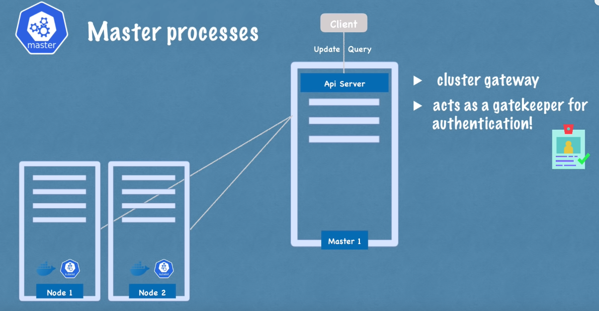

# Kubernetes


## Kubernetes Nedir?
- **Kubernetes**, açık kaynaklı bir konteyner yönetim aracıdır.
- Google tarafından geliştirilmiştir.
- Farklı dağıtım ortamlarında konteynerleştirilmiş uygulamaları yönetmenize yardımcı olur.
    - fiziksel ortamda
    - sanal ortamda
    - bulut ortamında

## Kubernetes'ın Avantajları:

- **Yüksek erişilebilirlik** veya kesintisiz çalışma
- **Ölçeklenebilirlik** veya yüksek performans
- **Afet kurtarma** - yedekleme ve geri yükleme

## Kubernetes Components
### Pod
* Pod Kubernete's en küçük birimidir.
* Konteyner üzerinde sanallaştırma yapar. (abstraction)


* Yalnızca Kubernetes katmanıyla etkileşime geçeriz.
* Bir pod içinde birden fazla konteyner çalıştırabilirsiniz, ancak genellikle bir pod başına bir uygulama bulunur.
* Her pod kendi IP adresine sahiptir. Her pod, birbirleriyle bu internal IP adresini kullanarak iletişim kurabilir.
* Ancak, Kubernetes'teki pod bileşenleri de geçicidir: yani çok kolay bir şekilde ölebilirler. Örneğin, bir veritabanı konteyneri kaybedersem, konteyner içindeki uygulama çöktüğü veya sunucu kaynakları tükendiği için pod ölür ve yerine yeni bir tane oluşturulur ve bu durumda yeni bir IP adresi atanır. Bu, veritabanıyla IP adresini kullanarak iletişim kuruyorsak elbette sakıncalıdır, her pod yeniden başladığında her seferinde yeniden ayarlamamız gerekir. Bu nedenle, pod'un yeniden başladığında IP adresini ayarlamanıza gerek kalmadan veritabanıyla iletişim kurmanızı sağlayan başka bir Kubernetes bileşeni olan `Service` kullanılır.
### Service and Ingress,

* Service, her bir pod'a bağlanabilen sabit bir IP adresidir. Uygulamamızın kendi `service`'i olacak ve veritabanı pod'u kendi `service`'ine sahip olacak. Buradaki güzel şey, servis ve Pod'un yaşam döngüleri birbirine bağlı değil, bu yüzden Pod ölse bile `Service` ve IP adresi kalır. Artık endpoint'i değiştirmemize gerek yoktur.


* Tabii ki, uygulamamızın bir tarayıcı aracılığıyla erişilebilir olmasını isteriz değil mi? Bunun için bir `external service` oluşturmamız gerekir. `External Service`, dış kaynaklardan iletişimi açan bir servistir. Ancak, veritabanımızı halka açık isteklere açmak istemeyiz. Bunun için `Internal Service` adını verdiğimiz bir şey oluştururuz.


* External Service URL'sinin çok pratik olmadığını fark ettiniz mi? Temelde, bir HTTP protokolüyle bir node IP adresi ve service port numarasına sahibiz. Bu hızlı bir şekilde bir şeyleri test etmek istiyorsak iyidir, ancak end-product için iyi değildir. Genellikle, uygulamamızla güvenli bir protokol ve bir alan adı kullanmak isteriz.


Bunun için Kubernetes'in başka bir bileşeni olan `Ingress` var. Bu şekilde, istek önce service'e değil, Ingress'e gider ve oradan Service'e yönlendirilir.


* Şimdi, Kubernetes'in çok temel bileşenlerini gördük ve gördüğünüz gibi, bu çok basit bir kurulum, sadece bir sunucu ve birkaç konteyner çalıştırıyoruz ve bazı component'ler var.
### ConfigMap and Secret

Yani, pod'lar birbirleriyle `service` aracılığıyla iletişim kurar. Uygulamamızın, veritabanı ile iletişim kurmak için kullandığı bir database endpoint `örneğin mongodb service`'i olacak. Ancak bu veritabanı URL'sini (ya da endpoint) genellikle nerede yapılandırırız?


Genellikle bunu application properties file veya bazı external environmental variable olarak yaparız, ancak genellikle yapılandırma,uygulamanın içerisindeki built image'tedir.

Örneğin, service endpoint (ya da service name) 'mongodb' olarak değişirse, uygulamadaki bu URL'yi ayarlamalıyız. Genellikle yeni bir sürümle uygulamayı rebuild etmemiz ve repoya pushlamamız gerekir. Ardından bu yeni image'i pod'umuzda pull'layıp tüm uygulamayı yeniden başlatmamız gerekebilir.


Yani, veritabanı URL'si gibi küçük bir değişiklik için bu gerçekten zahmetli. Bu sebeple, Kubernetes'in `configmap` adında bir bileşeni var. Yapısı, uygulamamıza `external configuration` sağlar. ConfigMap genellikle kullandığımız veritabanı URL'leri gibi yapılandırma verilerini içerir. Kubernetes'te bunu Pod'a bağlarız. Pod, ConfigMap'in içerdiği verileri alır. Ve şimdi, service adını değiştirirsek (service end point), sadece ConfigMap'i ayarlarız ve bu yeterli olacaktır. Yeni bir image oluşturmamıza ve tüm döngüyü geçirmemize gerek yoktur. Büyük avantaj!


Şimdi, external configuration bir parçası aynı zamanda database kullanıcı adı ve şifresi olabilir değil mi? Bu da uygulama dağıtım sürecinde değişebilir. Ancak, bir şifreyi veya diğer kimlik bilgilerini düz metin formatında bir configmap'e koymamız güvensiz olurdu.


Bu amaçla, Kubernetes'in `Secret` adında başka bir bileşeni vardır. Yani, Secret, ConfigMap gibi, ancak fark şu ki; şifre gibi gizli verileri saklamak için kullanılır. Ve tabii ki, düz metin formatında değil, base64 formatında kodlanmış olarak saklanır. Yani, Secret, kullanıcı adları gibi kimlik bilgilerini içerecek ve tabii ki, veritabanı kullanıcılarını içerecektir. ConfigMap'e de koyabiliriz, ancak önemli olan şifreler, sertifikalar, başkalarının erişimini istemediğimiz şeyler Secret'e girer. Aynı ConfigMap gibi, sadece Pod'umuza bağlarız, böylece Pod bu verileri görebilir ve Secret'ten okuyabilir. ConfigMap veya Secret'ten verileri, örneğin environment variables olarak veya hatta bir özellikler dosyası olarak uygulamamızın içinde kullanabiliriz.


Aslında en çok kullanılan Kubernetes temel bileşenlerinin neredeyse tamamını gördük. Pod'a göz attık. Hizmetlerin nasıl kullanıldığını, Ingress bileşeninin ne işe yaradığını gördük ve ayrıca ConfigMap ve Secrets'ı kullanan harici yapılandırmayı da gördük.


### Volumes
Şimdi genel olarak çok önemli bir kavramı inceleyelim, bu da ==veri depolama== ve Kubernetes içerisinde nasıl çalıştığıdır. Yani, uygulamamızın kullandığı bir database partımız var ve bir miktar verimiz var. Şu anda gördüğünüz bu kurulumla, eğer veritabanı container veya pod'u yeniden başlatılırsa, veri kaybolur. Ve bu açıkça sorunlu ve elverişsizdir, çünkü database'deki verilerinizin veya günlük verilerinizin uzun süreli güvenilir bir şekilde kalıcı olmasını istersiniz. Ve bunu Kubernetes'te yapmanın yolu, Kubernetes'in başka bir bileşeni olan `Volumes` kullanmaktır.


Ve şu şekilde çalışır: Temelde bir fiziksel depolama birimini, yani bir sabit diski, pod'unuza bağlar. Ve bu depolama ya yerel bir makinede olabilir, yani pod'un çalıştığı aynı sunucu node'unda olabilir, ya da Kubernetes kümesinin dışında anlamına gelen uzak bir depolama olabilir. Bulut depolama olabilir veya Kubernetes kümesinin bir parçası olmayan kendi yerleşke depolamanız olabilir, bu yüzden bununla ilgili external reference var.


Böylece, database pod'u veya caontainer yeniden başlatıldığında, tüm veri kalıcı bir şekilde saklanmış olacaktır.

Kubernetes kümesi ve tüm bileşenlerinin ve depolama arasındaki farkı anlamanız önemlidir, yerel veya uzak bir depolama olması fark etmeksizin, depolamayı Kubernetes kümesine takılmış harici bir sabit diske benzetebilirsiniz. Çünkü point is, Kubernetes kümesi açıkça hiçbir veri kalıcılığını yönetmez, bu da Kubernetes kullanıcısı veya yöneticisi olarak sizin veriyi yedeklemenizden, çoğaltmanızdan, yönetmenizden ve uygun donanımda saklamanızdan emin olmanız gerektiği anlamına gelir, çünkü Kubernetes bununla ilgilenmez.

### Deployment and Stateful Set

Şimdi, her şey mükemmel bir şekilde çalışıyor ve bir kullanıcı bir tarayıcı aracılığıyla uygulamaya erişebiliyor. Şimdi, bu kurulumla, application pod'u ölürse, crashlerse veya yeni bir container image oluşturduğum için pod'u restart etmem gerekiyorsa ne olurdu? Basically, bir kullanıcının uygulamama ulaşamadığı bir süre olan bir kesintim olurdu, bu da end product'ta gerçekleşirse çok kötü bir durumdur.


Ve bu, distributed systems ve containers avantajı tam olarak budur. Yani, yalnızca 1 application pod'u ve 1 database pod'u gibi bir şeye güvenmek yerine, her şeyi birden fazla sunucuda replikasını oluşturuyoruz. Yani, uygulamamızın bir klonu veya çoğaltması çalışacağı başka bir node olacak ve bu da service'e bağlı olacak. Hatırlarsanız önceki olarak service'in, bir pod öldüğünde end point'i sürekli ayarlamamıza gerek olmadığı için bir kalıcı statik IP adresi ve bir DNS adı gibi olduğunu söylemiştik.

* Btw service aynı zamanda bir `load balancer`dır. Yani, service isteği yakalayacak ve en az meşgul olan pod'a yönlendirecektir. Yani bu iki işlevi de vardır.


Ancak application pod'unun ikinci replikasını oluşturmak için ikinci bir pod oluşturmazsınız, bunun yerine uygulama pod'unun bir blueprint'ini tanımlar ve o pod'un kaç tane replikasını çalıştırmak istediğinizi belirtirsiniz. Ve bu component veya blueprint'e `deployment` denir, bu da Kubernetes'in başka bir componentidir. Pratikte, pod'larla çalışmazsınız veya pod'lar oluşturmazsınız; çünkü orada kaç tane replika belirtebilir ve ihtiyacınız olan pod'ların replika sayısını artırabilir veya azaltabilirsiniz. Yani pod, container'ların üzerinde bir layer of abstraction ve deployment, podların üzerinde başka bir layer of abstraction, bu da pod'larla etkileşimi, kopyalama ve diğer yapılandırmaları daha kullanışlı hale getirir.


Yani pratikte, çoğunlukla pod'larla değil, deployment'larla çalışırsınız. Yani şimdi, uygulama pod'unuzun replikalarından biri ölürse, service istekleri başkasına yönlendirilecektir, bu yüzden uygulamanız kullanıcılar için hala erişilebilir olacaktır.


Şimdi muhtemelen şunu merak ediyorsunuzdur, peki database pod'u ne olacak? Çünkü eğer database pod'u ölürse, uygulamanız da erişilemez olacaktır. Bu yüzden, bir database replikasına da ihtiyacımız var. Ancak, _==bir `deployment` kullanarak bir databese'i kopyalayamayız==_. Bunun nedeni, database'in bir state'i olmasıdır, yani veridir. Bu da demektir ki eğer database'in replikaları veya klonları olsaydı, hepsi aynı paylaşılan data storage volume'üne erişmek zorunda kalacaklardı. Ve burada, hangi pod'ların şu anda depolama birimine yazdığını veya hangi pod'ların depolama biriminden okuduğunu yöneten bir mekanizmaya ihtiyacınız olacaktı. Bu mekanizma, çoğaltma özelliklerinin yanı sıra sunan başka bir Kubernetes bileşeni olan `StatefulSet` ile sağlanır.


Bu bileşen özellikle database gibi uygulamalar için tasarlanmıştır. Yani, MySQL, MongoDB, Elasticsearch veya herhangi bir diğer stateful applications veya databases, deployments yerine Stateful Sets kullanılarak oluşturulmalıdır. Bu çok önemli bir ayrımdır. Ve StatefulSet, aynı deployment gibi, pod'ları replikalamayı ve bunları scaling'e alır ancak database reading ve writing işlemlerinin senkronize olduğundan emin olur, böylece database tutarsızlıkları olmaz.


Ancak, bir Kubernetes kümesinde StatefulSets kullanarak database uygulamalarını deploy etmek biraz zahmetli olabilir. Bu yüzden, database uygulamalarını Kubernetes kümesinin dışında barındırmak ve yalnızca dağıtımları veya durumsuz uygulamaları Kubernetes kümesinin içinde sorunsuz bir şekilde çoğaltmak ve ölçeklendirmek ve dış database ile iletişim kurmak yaygın bir uygulamadır.

Şimdi, uygulama pod'umun iki replikası ve database'in iki kopyası olduğunda ve hepsi load-balanced olduğunda, kurulumumuz daha güvenlidir. Bu, eğer Node 1(whole node1), yeniden başlatılsaydı veya çökseydi ve üzerinde hiçbir şey çalışamaz hale gelse bile, hala uygulama ve database pod'larının çalıştığı ikinci bir node'umuz olurdu. Uygulama, bu iki replikadan yeniden oluşturulana kadar kullanıcı tarafından erişilebilir olacaktır, bu yüzden kesintiyi önleyebilirsiniz.


Özetlemek gerekirse, en çok kullanılan Kubernetes bileşenlerini inceledik. Parçalar arasında iletişim kurmak için `pod`lar ve `service`lerle başladık, ve trafiği clusterlara yönlendirmek için kullanılan `Ingress` bileşenini inceledik. Ayrıca, `ConfigMaps` ve `Secret` kullanarak external configuration, ve `Volumes` kullanarak veri kalıcılığını inceledik. Ve son olarak, `Deployments` ve `StatefulSets` gibi replicating ve blueprintlere baktık, burada stateful applications özellikle databases gibi stateful applications için kullanılır. Ve evet, Kubernetes'in sunduğu çok daha fazla bileşen var, ama bunlar gerçekten çekirdek, temel olanlar. Bu temel bileşenleri kullanarak oldukça güçlü Kubernetes kümesi oluşturabilirsiniz.

## Kubernetes Mimarisi
Kubernetes'in temel mimarisinden bahsedeceğiz. Bu yüzden Kubernetes'in çalıştığı iki tür node'u inceleyeceğiz: biri `master` diğeri ise `slave`. Bunların arasındaki fark nedir ve her birinin cluster içindeki rolü nedir, onlara bakacağız.

Kubernetes'in ne yaptığını ve cluster'ın nasıl self-managed olduğunu, self-healing ve automated olduğunu gösteren temel kavramları ele alacağız. Ve sizin gibi bir Kubernetes cluster operatörü olarak, çok daha az manuel çaba harcamanız gerektiğini göreceğiz.
### Node Process

İki application parts çalıştığı tek bir node ile bu temel kurulumla başlayacağız. Kubernetes mimarisinin ana bileşenlerinden biri worker servers veya node'dur. Her node, o node'da çalışan birden fazla application pod'una sahip olacaktır.

Ve Kubernetes'in bunu yapma şekli, her node'da bulunması gereken ve bu pod'ları planlamak ve yönetmek için kullanılan ==three process== kullanmasıdır. Yani, node'lar, asıl işi yapan cluster serverlardır.. Bu yüzden bazen onlara worker nodes da denir.

#### 1) container runtime

Her node'da çalışması gereken ilk süreç, `container runtime`dır. Benim örneğimde Docker var, ancak başka bir teknoloji de olabilir. Yani, applitacion pod'larında içinde çalışan containers olduğu için, her node'da bir `container runtime`  kurulmalıdır.

#### 2) kubelet
Ancak pod'ları ve bu pod'ların altındaki container'ları schedule eden aslında `kubelet`tir, bu da Kubernetes'in bir parçasıdır. container runtime; hem konteyner çalışma zamanı hem de makine, yani node'un kendisiyle arayüzü olduğu gibi, sonuçta, kubelet bu config'i almak ve aslında bir pod'u çalıştırmak veya içinde bir container başlatmak ve ardından o node'dan container'e CPU, RAM ve depolama kaynakları gibi kaynaklar atamakla sorumludur.

Bu nedenle, genellikle bir Kubernetes cluster, kurulu olmalı ve `kubelet` hizmetlerine sahip birden fazla node'dan oluşur. Ve bu worker nodes, bu örnekteki application ve database pod'larının replikalarını çalıştıracak yüzlerce diğer node'u çalıştırır.

Ve aralarındaki iletişim şekli, `services` kullanılmasıdır, bu da isteği application parçasına veya örneğin bir database'e yönlendiren bir `load-balancer` gibi çalışır ve ardından ilgili parçaya yönlendirir.

#### 3) kube-proxy

Hizmetlerden pod'lara istekleri iletmekten sorumlu üçüncü süreç aslında `kube-proxy`dir ve her node'da kurulmalıdır. Kube-proxy, düşük bir işlem yükü ile performanslı bir şekilde iletişim kurulmasını sağlayan akıllı yönlendirme mantığına sahiptir.

Örneğin, bir uygulama, uygulama replikası, bir database'e bir istek yapıyorsa, hizmet sadece isteği rastgele bir replikaya yönlendirmek yerine, isteği başlatan pod'un çalıştığı aynı düğümde çalışan replikaya yönlendirecektir. Bu şekilde, isteği başka bir makineye göndermekle ilgili `ağ işlem yükünden` kaçınılmış olur.

==To summarize, two Kubernetes processes, `kubelet` and `kube-proxy`, must be installed on every Kubernetes worker node==, along with an independent container runtime, in order for the Kubernetes cluster to function properly.

Özetlemek gerekirse; bir kubernetes cluster'ının düzgün çalışabilmesi için `kubelet` ve `kube-proxy` her worker node  içerisine `container runtime` ile birlikte kurulmalıdır.


Ancak şimdi soru şu: Bu cluster ile nasıl interact? Yeni bir application pod'u veya database pod'u nerede schedule edilmeli? Bir replika pod'u ölürse, hangi process monitors ve reschedules veya restarts?
### Master Node

Yani, Master servers veya master nodes içerisinde tamamen farklı processler çalıştırır. Ve bunlar, cluster state ve worker nodes'ları kontrol eden ==her yönetici düğümünde çalışan dört süreçtir==.

#### 1) API Server

İlk hizmet API server. Bİr Kubernetes cluster'ında yeni bir application deploy etmek istediğinizde, bir kullanıcı olarak API server ile interact edersiniz. Bir Kubernetes Dashboard gibi bir kullanıcı arayüzü olabilir, `kubectl` gibi bir command-line tool veya bir Kubernetes API'si olabilir. Yani, API sunucusu, cluster içine herhangi bir güncelleme talebinin veya hatta kümeden gelen sorguların ilk isteğini alır. Ve yalnızca kimlik doğrulaması(auth) yaparak, yalnızca kimlik doğrulanmış ve yetkilendirilmiş isteklerin kümelere iletilmesini sağlar.



Bu, yeni pod'lar planlamak, yeni applications deploy etmek, yeni create new services veya herhangi bir components oluşturmak istediğinizde, isteğinizi master node API sunucusuna iletmek zorunda olduğunuz anlamına gelir. API server daha sonra requestinizi doğrular. Ve her şey yolundaysa, isteğinizi diğer süreçlere ileterek istediğiniz pod'u veya bileşeni schedule için bir node'a yönlendirir.


Ayrıca, dağıtımınızın durumu veya cluster health etc., gibi sorgu isteklerini yapmak isterseniz, API sunucusuna bir istek gönderir ve o da size yanıt verir, bu da güvenlik açısından iyidir çünkü clusterlara yalnızca `one entry point` vardır.

#### 2) Scheduler

Başka bir Master process ise Scheduler'dır. Yani, API serverına yeni bir pod schedule isteği gönderdiğinizde, API server, isteğinizi doğruladıktan sonra, gerçekte bu pod'un bir worker nodes'da başlatılması için `Scheduler`'a teslim eder.

Ve tabii ki, herhangi bir node'u rastgele atamak yerine, Scheduler, bir sonraki pod'un hangi belirli worker node'un scheduled olacağı konusunda zekice bir şekilde karar vermesi gerekmektedir. İlk olarak, isteğinizi kontrol eder ve planlamak istediğiniz uygulamanın ne kadar kaynağa ihtiyacı olduğunu kontrol eder. howmuch CPU, ne kadar RAM gibi..

Ve sonra, worker nodes'daki kullanılabilir kaynakları kontrol eder. Eğer bir node'un en çok kaynağa sahip olduğunu söylüyorsa, yeni pod'u o node'a planlar.


Önemli bir nokta şu ki, scheduler sadece yeni bir pod'un hangi düğüme planlanacağına karar verir. Asıl planlamayı yapan ve pod'u konteyner ile başlatan işlem ise `kubelet`'tir. Yani kubelet, scheduler'dan gelen isteği alır ve bu isteği ilgili node üzerinde yürütür.
#### 3) Controller Manager

Bir sonraki önemli bileşen ise `controller manager`'dır. Bu bileşen, herhangi bir düğümde pod'lar öldüğünde ne olacağı sorusu açısından kritik öneme sahiptir. Ölü node'ları tespit etmek ve daha sonra bu pod'ları en kısa sürede reschedule etmek gerekir.


Dolayısıyla controller manager, state changes'ları, örneğin pod'ların çökmesini tespit eder. Pod'lar öldüğünde controller manager bunu algılar ve cluster state'ini mümkün olan en kısa sürede kurtarmaya çalışır.

Bu amaçla, ölen pod'ları yeniden schedule için scheduler'a bir istek gönderir. Bu döngü içinde, scheduler kaynak hesaplamasına göre hangi worker node'ların bu pod'ları tekrar başlatması gerektiğine karar verir ve bu worker node'Lar üzerindeki ilgili `kubelet`lere aslında pod'ları yeniden başlatmaları için istek gönderir.


#### 4) Etcd
Son olarak, ana işlemlerden biri olan etcd, bir cluster state'inin key-value deposudur. Bunu aslında bir cluster beyni olarak düşünebilirsiniz. Yani cluster'daki her değişiklik, örneğin yeni bir pod schedule edildiğinde veya bir pod öldüğünde, tüm bu değişiklikler etcd'nin bu key-value deposunda kaydedilir veya güncellenir.


Etcd deposunun bir küme beyni olarak adlandırılmasının sebebi, scheduler, controller manager gibi tüm bu mekanizmaların, etcd'nin sahip olduğu veriler sayesinde çalışmasıdır.


Örneğin, scheduler her bir worker node'unda hangi kaynakların mevcut olduğunu nasıl bilir? Veya controller manager, cluster durumunda bir değişiklik olduğunu nasıl tespit eder?

Örnek olarak, pod'ların ölmesi, kubelet'in scheduler'ın isteği üzerine yeni pod'ları başlatması, API sunucusuna cluster health hakkında bir sorgu göndermeniz veya uygulama dağıtım durumunuz gibi durumlar. API sunucusu tüm bu durum bilgilerini nereden alır?

Tüm bu bilgiler etcd kümesinde saklanır. Etcd'nin key-value deposunda saklanmayan şey ise gerçek uygulama verileridir. Örneğin, bir cluster içinde çalışan bir database uygulamanız varsa, veriler etcd'de değil, başka bir yerde saklanır. Bu, yalnızca master işlemlerinin worker işlemleriyle ve tersiyle iletişim kurması için kullanılan bir cluster state bilgisidir.

Artık muhtemelen ana işlemlerin, özellikle de verileri güvenilir bir şekilde saklanması veya çoğaltılması gereken etcd deposunun, cluster operasyonu için kritik öneme sahip olduğunu anlamışsınızdır. Bu nedenle, uygulamada bir Kubernetes kümesi genellikle birden fazla master'dan oluşur. Her bir master düğümü kendi ana işlemlerini çalıştırır; elbette API sunucusu load-balanced'dır ve etcd deposu tüm master düğümleri arasında distributed bir depolama oluşturur.


## Örnek Cluster Yapısı


Şimdi worker ve master node'larında çalışan işlemleri gördükten sonra, gerçek hayattaki bir cluster kurulumuna bakalım. Çok küçük bir cluster'da muhtemelen iki master node ve üç worker node olur.


Burada dikkat edilmesi gereken bir diğer nokta ise master node sunucularının donanım kaynaklarının aslında farklı olmasıdır. Master işlemleri daha önemlidir, ancak aslında daha az iş yüküne sahiptirler. Dolayısıyla CPU, RAM ve depolama gibi daha az kaynağa ihtiyaç duyarlar. Worker node'ları ise, containerları çalıştıran pod'ları barındırma gibi asıl işi yaparlar.

Bu nedenle, worker node'larının daha fazla kaynağa ihtiyacı vardır. Uygulamanızın karmaşıklığı ve kaynak gereksinimi arttıkça, aslında cluster'ınıza daha fazla master ve worker node'u ekleyerek daha güçlü ve sağlam bir küme oluşturabilirsiniz. Böylece uygulama kaynak gereksinimlerinizi karşılayabilirsiniz.


Var olan bir Kubernetes cluster'ında yeni master veya worker serverları eklemek aslında oldukça kolaydır. Bir master sunucusu eklemek istiyorsanız, yeni bir bare metal sunucu edinin, üzerine tüm master işlemlerini kurun ve onu Kubernetes kümesine ekleyin.

Aynı şekilde, iki worker node'unda ihtiyacınız varsa, bare metal sunucular edinin, container runtime, kubelet ve kube-proxy gibi tüm worker düğümü işlemlerini üzerlerine kurun ve onları Kubernetes kümesine ekleyin. İşte bu kadar.

Bu şekilde, uygulama karmaşıklığı ve kaynak gereksinimi arttıkça, Kubernetes kümenizinin gücünü ve kaynaklarını sonsuza kadar artırabilirsiniz.


## Minikube ve Kubectl Lokal Kurulumu

### **Minikube Nedir?**

#### 1) Minikube


Genellikle Kubernetes dünyasında bir production cluster kurduğunuzda, aşağıdaki gibi görünecektir.


En az iki olmak üzere birden fazla Master'a sahip olacaksınız ve birden fazla worker node olacak. Worker düğümlerinin kendi ayrı sorumlulukları vardır. Diyagramda gördüğünüz gibi, her biri bir düğümü temsil eden gerçek ayrı sanal veya fiziksel makineleriniz olur.

Şimdi, yerel ortamınızda bir şey test etmek istiyorsanız veya yeni bir uygulama veya yeni bileşenler dağıtarak çok hızlı bir şekilde bir şey denemek istiyorsanız ve bunları yerel makinenizde test etmek istiyorsanız, açıkçası böyle bir cluster kurmak oldukça zor olacaktır. veya bellek ve CPU gibi yeterli kaynak yoksa imkansız bile olabilir. İşte tam olarak bu kullanım durumu için `Minikube` adı verilen bu açık kaynaklı araç var.

Minikube'un ne olduğuna gelince, temelde hem master processleri hem de worker processleri tek bir node'da çalıştıran tek node bir clusterdır. Bu node'da önceden yüklenmiş bir Docker container runtime olacak şekilde konteynerleri veya konteynerli pod'ları çalıştırabileceksiniz.


Dizüstü bilgisayarınızda VirtualBox veya başka bir hipervizör aracılığıyla çalışacak. Yani temel olarak, Minikube dizüstü bilgisayarınızda bir VirtualBox oluşturacak ve burada gördüğünüz düğümler bu VirtualBox'ta çalışacak.

Özetlemek gerekirse, Minikube, yerel kurulumunuzda Kubernetes'i test etmek için kullanabileceğiniz dizüstü bilgisayarınızda bir VirtualBox'ta çalışan tek node bir Kubernetes clusterdır.


Dizüstü bilgisayarınızda veya PC'nizde yerel makinenizde bir küme veya mini küme kurduktan sonra, kümeyle etkileşim kurmak için bir yola ihtiyacınız vardır. Bileşenler oluşturmak, yapılandırmak vb. isteyeceksiniz ve işte `kubectl` devreye giriyor.

#### 2) Kubectl

local makinenizde Minikube'u temsil eden bu virtual node'a sahip olduktan sonra, bu cluster ile etkileşim kurmak için bir yola ihtiyacınız vardır. Dolayısıyla düğümde pod'lar ve diğer Kubernetes bileşenleri oluşturmanın bir yoluna ihtiyacınız vardır ve bunu Kubernetes clusterları için bir command line toolu olan `kubectl` kullanarak yapabilirsiniz.

Peki nasıl çalıştığını görelim. Minikube'un hem master hem de worker processleri çalıştırdığını söylemiştik, bu nedenle API server adı verilen master processlerden biri aslında Kubernetes clusterın entry point noktasıdır.


Kubernetes'te bir şey yapmak istiyorsanız, herhangi bir şeyi yapılandırmak istiyorsanız, önce API sunucusuyla konuşmanız gerekir. API sunucusuyla konuşmanın yolu ise farklı istemciler aracılığıyla olur. Bir pano gibi bir UI arayüzünüz olabilir, Kubernetes API'sini kullanarak konuşabilir veya `kubectl` komut satırı aracını kullanabilirsiniz.


`kubectl` aslında üç istemcinin de en güçlüsüdür çünkü `kubectl` ile Kubernetes'te istediğiniz her şeyi yapabilirsiniz.

Bu video eğitimleri boyunca çoğunlukla `kubectl` kullanacağız. `kubectl` API sunucusuna component oluşturmak, component silmek vb. için komutlar gönderdikten sonra, Minikube node'undaki worker processler bunları gerçekleştirecektir. Aslında pod'ları oluşturmak, pod'ları yok etmek, services oluşturmak vb. için komutları yürüteceklerdir.

Bu, Minikube çalışma şeklidir. `kubectl` cluster ile nasıl kullanılır? Burada önemli bir nokta, `kubectl`'nin yalnızca Minikube cluster için olmadığıdır. Bir cloud cluster'ınız veya hibrit bir cluster'ınız varsa, ne olursa olsun, `kubectl` herhangi bir Kubernetes kümesi kurulumuyla etkileşim kurmak için kullanılan araçtır. Bu nedenle burada unutulmaması önemlidir.


Artık Minikube ve `kubectl`'nin ne olduğunu bildiğimize göre, onları pratikte görmek için gerçekten kuralım.

#### 3) Kurulum
Minikube bir sanallaştırmaya ihtiyaç duyar, çünkü daha önce bahsettiğimiz gibi bir VirtualBox kurulumunda veya bazı hipervizörlerde çalışacaktır. Bu nedenle bir tür hipervizör yüklemeniz gerekecektir. VirtualBox olabilir. Hyperkit yükleyeceğim ama bu adım adım talimatlarda da yer alacak. Size Linux'a nasıl kurulacağını göstereceğim.

```shell
curl -LO https://storage.googleapis.com/minikube/releases/latest/minikube-linux-amd64
sudo install minikube-linux-amd64 /usr/local/bin/minikube && rm minikube-linux-amd64
```

Şimdi her şeyin kurulduğundan emin olalım ve komutları kontrol edelim. Yani, `minikube` komutu çalışmalı:

```
c3ng0@ubn:~$ minikube start

😄  minikube v1.33.1 on Ubuntu 22.04
✨  Automatically selected the docker driver. Other choices: kvm2, qemu2, none, ssh
📌  Using Docker driver with root privileges
👍  Starting "minikube" primary control-plane node in "minikube" cluster
🚜  Pulling base image v0.0.44 ...
💾  Downloading Kubernetes v1.30.0 preload ...
    > preloaded-images-k8s-v18-v1...:  112.62 MiB / 342.90 MiB  32.84% 5.18 MiB
    > gcr.io/k8s-minikube/kicbase...:  70.41 MiB / 481.58 MiB  14.62% 2.65 MiB
    > index.docker.io/kicbase/sta...:  481.58 MiB / 481.58 MiB  100.00% 11.15 M
❗  minikube was unable to download gcr.io/k8s-minikube/kicbase:v0.0.44, but successfully downloaded docker.io/kicbase/stable:v0.0.44 as a fallback image
🔥  Creating docker container (CPUs=2, Memory=2200MB) ...
    > kubectl.sha256:  64 B / 64 B [-------------------------] 100.00% ? p/s 0s
    > kubeadm.sha256:  64 B / 64 B [-------------------------] 100.00% ? p/s 0s
    > kubelet.sha256:  64 B / 64 B [-------------------------] 100.00% ? p/s 0s
    > kubectl:  49.07 MiB / 49.07 MiB [------------] 100.00% 14.58 MiB p/s 3.6s
    > kubeadm:  47.92 MiB / 47.92 MiB [--------------] 100.00% 3.97 MiB p/s 12s
    > kubelet:  95.46 MiB / 95.46 MiB [--------------] 100.00% 6.52 MiB p/s 15s

    ▪ Generating certificates and keys ...
    ▪ Booting up control plane ...
    ▪ Configuring RBAC rules ...
🔗  Configuring bridge CNI (Container Networking Interface) ...
🔎  Verifying Kubernetes components...
    ▪ Using image gcr.io/k8s-minikube/storage-provisioner:v5
🌟  Enabled addons: storage-provisioner, default-storageclass
💡  kubectl not found. If you need it, try: 'minikube kubectl -- get pods -A'
🏄  Done! kubectl is now configured to use "minikube" cluster and "default" namespace by default
```

Ve `kubectl` indirmemiz gerekiyor:

```bash
curl -LO "https://dl.k8s.io/release/$(curl -L -s https://dl.k8s.io/release/stable.txt)/bin/linux/amd64/kubectl"
```

Binary'i doğrula(opsiyonel)

kubectl checksumfile indir:

```bash
curl -LO "https://dl.k8s.io/release/$(curl -L -s https://dl.k8s.io/release/stable.txt)/bin/linux/amd64/kubectl.sha256"   
```

Validate the kubectl binary against the checksum file:

```bash
echo "$(cat kubectl.sha256)  kubectl" | sha256sum --check
```

   If valid, the output is:

```console
kubectl: OK
```

- Install kubectl

```bash
sudo install -o root -g root -m 0755 kubectl /usr/local/bin/kubectl
```

- Test to ensure the version you installed is up-to-date:
```bash
kubectl version --client
```


daha fazlası için [kubernetes.io](https://kubernetes.io/docs/tasks/tools/install-kubectl-linux/)

Ve gördüğünüz gibi, Minikube oldukça basit bir komut satırı aracı ile birlikte gelir. Bu tek bir komutla tüm Kubernetes kümesini bu tek düğüm kurulumunda hızlıca başlatabilir ve onunla işler yapabilirsiniz ve durdurabilir veya silebilirsiniz. Oldukça kolay.


## İlk Cluster


Şimdi her ikisini de kurduğumuza ve komutların hazır olduğuna göre, aslında bir Minikube Kubernetes kümesi oluşturalım. Ve gördüğünüz gibi bir başlatma komutu var:

```bash
minikube start
```

işte Minikube ile bir Kubernetes kümesini nasıl başlatacağımız:

```bash
minikube start --vm-driver=kvm
```

Burada, kurulu hipervizörün devreye girdiğini görebilirsiniz çünkü Minikube'un bir Sanal ortamda çalışması gerektiğinden, Minikube'a hangi hipervizörü kullanması gerektiğini söyleyeceğiz. Bunun için, `--vm-driver` olarak adlandırılan bir seçenek belirleyeceğiz ve burada bende kurulu olan `kvm`'i ayarladım.

Bunu yürüttüğümde bir şeyler indirecek, yani ilk kez yapıyorsanız biraz daha uzun sürebilir.


Ve bahsettiğim gibi, Minikube'un Docker çalışma zamanı veya Docker Daemon önceden yüklü, bu yüzden makinenizde Docker yoksa bile çalışacak. Yani, Docker zaten yüklü olduğundan, içinde konteynerler oluşturabilirsiniz ki bu, Docker'ın zaten yüklü olmadığı bir durumda oldukça iyi bir özelliktir.

---

Tamamlandı. Artık `kubectl`, Minikube'u kullanacak şekilde yapılandırılmış durumda, bu da Minikube cluster'ının kurulduğu anlamına gelir.


Kubernetes Kümesi ile etkileşimde bulunmak için tasarlanmış olan `kubectl` komutu da o Minikube kümesi ile bağlantılıdır, bu da eğer şunu yaparsam:

```bash
kubectl get nodes
```

Bu, Kubernetes kümesinin düğümlerinin durumunu bana bildirir, bana bir Minikube node'unun hazır olduğunu söyleyecek ve gördüğünüz gibi açıkça master processleri çalıştırmalı çünkü sadece bir node var.


Ve ayrıca Minikube'ın durumunu alabilirim:

```bash
minikube status
```


Yani, ana makinede kubelet adlı bir hizmetin çalıştığını görüyorum, bu da aslında konteyner çalışma zamanını kullanarak pod'ları çalıştıran bir hizmettir, yani temelde her şey çalışıyor.

Buradan itibaren mini Kub kümesi ile `kubectl` komut satırı aracılığıyla etkileşime geçeceğiz. Minicube sadece cluster başlatma ve silme için kullanılır, ancak configuring ve diğer her şeyi `kubectl` aracılığıyla yapacağız.

---

- **The label applied to control-plane nodes "node-role.kubernetes.io/master" is now deprecated and will be removed in a future release after a GA deprecation period.**
- **Introduce a new label "node-role.kubernetes.io/control-plane" that will be applied in parallel to "node-role.kubernetes.io/master" until the removal of the "node-role.kubernetes.io/master" label.**


## Ana Kubectl Komutları

Bu yazımda size bazı temel Kubectl komutlarını göstereceğim ve minikube'da nasıl create ve debug Parts yapacağınızı göstereceğim.

Cubectl'i clusterda herhangi bir şey yapmak için kullanacaksınız, components oluşturmak, status almak, vb.

* İlk olarak, node'ların durumunu alacağız.

```bash
kubectl get nodes
```

Bu komutu kullanarak node'ların durumunu alıyoruz.

```bash
c3ng0@ubn:~$ kubectl get nodes
NAME       STATUS   ROLES           AGE    VERSION
minikube   Ready    control-plane   145m   v1.30.0
```

Görüyoruz ki bir node var ve her şey o node'da çalışıyor çünkü bu bir `minikube`.

* Pod'ları kontrol edebilirim ve herhangi birimim olmadığı için sonuç yok.

```bash
kubectl get pod
```

* Services kontrol edebilirim, varsayılan bir hizmetim var.

```bash
kubectl get services
```

```bash
c3ng0@ubn:~$ kubectl get services
NAME         TYPE        CLUSTER-IP   EXTERNAL-IP   PORT(S)   AGE
kubernetes   ClusterIP   10.96.0.1    <none>        443/TCP   148m
```

---

Şimdi, herhangi bir Pod'umuz olmadığı için bir tane oluşturacağız ve Kubernetes bileşenleri oluşturmanın bir Kubectl create komutu olduğunu hatırlayalım. Kubectl create komutunu kullanarak tüm bu bileşenleri oluşturabilirim.

* Ancak listede `Pod` yok çünkü Kubernetes dünyasında, Pod, Kubernetes clusterının en küçük birimidir ve genellikle, Pod'ları doğrudan oluşturulmaz. Veya Pod'larla doğrudan çalışılmaz. Pod'ların üzerinde bir soyutlama katmanı`(abstraction over Pods)` vardır, buna ·`deployment`· denir. İşte bu yaratmak üzere olduğumuz şey ve bu, altındaki parçaları oluşturacak.

```bash
Usage:
   kubectl create deployment NAME --image=image -- [COMMAND] [args...] [options]
```

* **NAME**: deployment'a isim vermeliyiz
* **--image=**: oluşturacağımız container image'i

Şimdi bir nginx dağıtımı oluşturalım.

```bash
c3ng0@ubn:~$ kubectl create deployment nginx-depl --image=nginx
deployment.apps/nginx-depl created
```

 * Nginx görüntüsünü, Docker Hub'dan indirecektir. Bu komutu yürütürsem, gördüğünüz gibi nginx deployment oluşturuldu.

```bash
c3ng0@ubn:~$ kubevtl get deployment
NAME         READY   UP-TO-DATE   AVAILABLE   AGE
nginx-depl   0/1     1            0           15s
```

 * Oluşturulmuş bir deployment olduğunu görüyorum ve burada "hazır değil" durumunda olduğunu görüyorum.

```bash
c3ng0@ubn:~$ kubectl get pod
NAME                          READY   STATUS    RESTARTS   AGE
nginx-depl-85c9d7c5f4-g4lwt   0/1     Creating  0          31s
```

 * Artık bir Pod'um var. Name değeri, prefix ve rastgele bir hash'e sahiptir. Burada "konteyner oluşturuluyor" yazıyor, yani henüz hazır değil. Bir süre bekleyince çalışıyor.

 * Bir deployment oluşturduğumda, deployment, Pod oluşturmak için gereken tüm bilgilere veya blueprintlere sahiptir.


 * Bu en temel yapılandırmadır, sadece adı ve görüntüsü bu kadar, geri kalanı default.

 * Deployment ve Pod arasında bir başka katman vardır ve bu, otomatik olarak kubernetes tarafından yönetilen ==replicaset=='tir.
 * kubectl get replica set yaparsam, bir nginx replica set hash'im olduğunu görüyorum. Ve burada, Pod adının bir deployment prefix, replica set'in ID'si ve son olarak kendi ID'si olduğunu görebilirsiniz. Pod adı bu şekilde oluşmaktadır. Replica set, Pod'un tüm replikalarını yönetir. Biz hiçbir zaman replica set oluşturmayacak, silmeyecek veya güncellemeyeceğiz. Doğrudan deploymentlar ile çalışacağız. Bu daha uygun çünkü deploymentlarda Pod blueprintini tamamen yapılandırabilirsiniz. Pod'un kaç replikasına ihtiyacınız olduğunu belirtebilir ve geri kalan configuration'u orada yapabilirsiniz.

### Layerların çalışma şekli:

 * İlk olarak Deployment, ReplicaSet'i yönetir.
 * ReplicaSet, o Pod'un tüm replikalarını yönetir.
 * Pod, bir konteynerin soyutlamasıdır.
 Deployment'tan aşağıdaki her şey otomatik olarak kubernetes tarafından yönetilmelidir.

Örneğin, kullanıldığı image gibi bir şeyi doğrudan bir deployment içerisinde düzenlemem gerekecek, Pod içinde değil. Öyleyse hemen yapalım.

```python
c3ng0@ubn:~$ kubectl edit deployment nginx-depl
# Please edit the object below. Lines beginning with a '#' will be ignored,
# and an empty file will abort the edit. If an error occurs while saving this file will be
# reopened with the relevant failures.
#
apiVersion: apps/v1
kind: Deployment
metadata:
  annotations:
    deployment.kubernetes.io/revision: "1"
  creationTimestamp: "2024-05-14T11:31:36Z"
  generation: 1
  labels:
    app: nginx-depl
  name: nginx-depl
  namespace: default
  resourceVersion: "9431"
  uid: 66d185d6-b628-4d10-b3bc-4aea093dfc59
spec:
  progressDeadlineSeconds: 600
  replicas: 1
...
...
...
```


Deployment oluştururken verdiğimiz iki seçenek dışında her şeyin otomatik olarak oluşturulmuş bir deployment, otomatik olarak oluşturulmuş bir yapılandırma dosyasını alıyoruz.
Şimdilik sadece resmi açıp istediğim versiyonu 1.16'ya sabitlemek istediğimi varsayalım ve bu değişikliği kaydedelim.

```
    spec:
      containers:
-       - image: nginx
---
    spec:
      containers:
+       - image: nginx:1.16

```

Ve gördüğünüz gibi dağıtım düzenlendi.


Şimdi `kubectl get pod` yaparsam , eski pod'umu görürüm.


* Eski Pod sona erdi ve yeni pod başladı.

Eğer ReplicaSet'i görüntülersem, eski olanın içinde pod olmadığını ve yeni bir tane oluşturulduğunu görüyorum.


Yani sonuç olarak deployment yapılandırmasını düzenledik ve altındaki her şey otomatik olarak güncellendi. Bu yaptığımız, Kubernetes'in sihrine ve nasıl çalıştığına bir örnektir.

---

### Debugging Pods

Bir diğer çok pratik komut ise `kubectl logs`, bu aslında Pod içinde çalışan uygulamanın neyi kaydettiğini gösterir.

```bash
kubectl logs [POD_NAME]
```

Logları görüntülemeden önce Nginx hiçbir şey kaydetmediği için başka bir dağıtım oluşturalım. Mongodb'den oluşturalım ve adına `mongo-depl` verelim.


Şimdi mongodb deployment oluşturuluyor.


Şu anda loglara bakabiliriz:


* `kubectl describe pod [POD_NAME]` events sekmesinde bize state değişikliklerini verir.


Loglamak, uygulamanın gerçekte neyi yazdığını görmede ve hata ayıklamada yardımcı olmaktadır.

Başka bir çok kullanışlı komut, `kubectl exec`tir. Debugging yaparken, bir şey çalışmıyorsa veya sadece Pod'un içeriğini kontrol etmek için kullanılır.
Basitçe açıklayacak olursak, çalışan Pod'dan shell alır. bu yüzden:
```
kubectl exec -it [POD_NAME] -- bin/bash
```
* -it = **interactive terminal**


Bu komutla mongodb uygulama konteynerinin terminalini alıyoruz ve şu anda root kullanıcısı olarak mongodb konteynerinin içindeyiz.
Exec, hata ayıklama veya bir şeyleri test etmek veya denemek istediğinizde kullanışlıdır. Konteynıra girebilir veya terminali alabilir ve orada bazı komutlar çalıştırabilirsiniz.

---

### Delete deployment - Apply configuration file

Tabii ki Cube CTL ile potları silebilirim,
Önce deployment'ları ve podları görüntüleyelim.


```
kubectl delete deployment [deployment_name]
```


kontrol ederseniz Pod'un sonlandığını ve eğer replica set alırsanız, mongodb replicasetinin de gittiğini görebilirsiniz.

Tüm crud işlemleri (create,update,delete vb.) deployment seviyesinde gerçekleşir ve altındaki her şey otomatik olarak takip eder. Aynı şekilde Services gibi diğer Kubernetes kaynakları oluşturabiliriz.

Ancak fark ettiğiniz gibi, Kubectl ile deployment gibi kubernetes bileşenlerini oluştururken, tüm bu seçenekleri komut satırında belirtmeniz gerekir.

* Adı belirtmeniz gerekir.
* Image'i belirtmeniz gerekir
* option1
* option2..  vb. olabilir.

Elbette bir deployment'ta veya bir Pod'ta yapılandırmak istediğiniz birçok şey olabilir ve açıkçası bunların hepsini komut satırında yazmak pratik olmayacaktır.Pratikte bunun için genellikle Kubernetes yapılandırma dosyalarıyla çalışırsınız, yani oluşturduğunuz bileşenin türü, bileşenin adı, hangi görüntüye dayandığı ve diğer tüm seçenekler bir yapılandırma dosyasında toplanır ve sadece cubectl'e bu yapılandırma dosyasını yürütmesini söylersiniz ve bunu yapmanın yolu cubectl apply komutunu kullanmaktır.

### kubectl apply

Apply, temelde dosyayı, yapılandırma dosyasını bir parametre olarak alır ve orada ne yazdıysanız yapar.

```bash
kubectl apply -f [file_name]
```

Apply, "-f" için bir seçenek alır ve bu dosyanın adını belirtir ve genellikle bu dosyalar için kullanılan biçim YAML'dir ve bu, dosyadaki her şeyi yürüten komuttur. Bu yüzden aslında bunu yapılandırma dosyası olarak adlandıracağız.

Örnek olarak çok basit, temel bir  `nginx-deployment.yaml` deployment dosyası oluşturalım.

Deployment için temel yapılandırma:

```yaml
apiVersion: apps/v1
kind: Deployment
metadata:
  name: nginx-deployment
  labels:
    app: nginx
spec:
  replicas: 1
  selector:
    matchLabels:
      app: nginx
  template:
    metadata:
      labels:
        app: nginx
    spec:
      containers:
      - name: nginx
        image: nginx:1.16
        ports:
        - containerPort: 80
```

* Şu an için gerekli olan satırları, aşağıda inceleyelim.
```yml
kind: Deployment
## Ne oluşturmak istediğimizi belirtiyoruz, Deployment oluşturmak istiyoruz.
```

```yml
name: nginx-deployment
## Oluşturacağımız Deployment ismi.
```

```yml
spec:            ## specification for deployment
  replicas: 1    ## Pod'lardan oluşturulacak replika sayısı
```

```yml
  template:
    metadata:
      labels:
        app: nginx
    spec:    ## specification for pods
      containers:
      - name: nginx
        image: nginx:1.16   ## Konteyner image'imiz için nginx versiyonu
        ports:
        - containerPort: 80 ## Binding Port
## Bu alan olutşturacağımız deployment'a ait blueprint
```

Bu, bizim config  dosyamız ve buna bir kere sahip olduktan sonra, bu yapılandırmayı istediğimiz zaman uygulayabiliriz.


Deployment oluşturuldu, şimdi podu görüntülersem, nginx dağıtımı podu oluşturuldu ve çalışıyor olduğunu görürüz.


Ayrıca dağıtımın 3 dakika 57 saniye önce oluşturulduğunu görüyorum. Eğer bu deployment'ta bir şeyleri değiştirmek istersem, sadece yerel yapılandırmamı değiştirmem yeterlidir. Örneğin, bir yerine iki replika istersek bunu tekrar uygulayabilirim ve deployment nginx dağıtımı olarak tekrar yapılandırılacaktır.


Fark ettiyseniz çıktıda bize "configured" dendi. Fark şu ki, Kubernetes, nginx deployment'ının var olmadığını algılarsa, yeni bir tane oluşturacak, ancak eğer deployment zaten varsa, yapılandırma dosyasını uyguladığımızd, onu güncellemesi gerektiğini bilecek ve yeni bir deployment oluşturmak yerine eski deployment'ı cofigure edecek.


Eski deployment hala ayakta (9m45s) fakat yeni bir replika oluşturuldu(3m22s) çünkü replika sayısını arttırdık. yani `kubectl apply` ile bir component oluşturabilir ve güncelleyebilirsiniz. Elbette Services, Volumes gibi diğer kubernetes bileşenlerine de ayar çekebilirsiniz.

---

Özetlemek gerekirse, bu yazıda birkaç cubectl komutuna baktık, bir component oluşturmayı, nasıl configure edeceğimizi ve sileceğimizi gördük. Pod'ların, deployment'ların, replikaset'lerinin vb. state'lerini nasıl alacağımızı gördük. Ayrıca Pod'un içindeki uygulamanın konsola yazdığı her şeyi nasıl kaydedeceğimizi gördük ve `cubectl exec`'i kullanarak çalışan bir konteynerdan nasıl shell alacağımızı gördük. Son olarak, kubernetes yapılandırma dosyasını ve `cubectl apply` komutunu kullanarak componentleri nasıl oluşturup güncelleyeceğimizi gördük.
Son olarak azıcık da `kubectl describe` komutunu gördük, bu da bir konteynerin bir Pod'da sorun giderme için ek bilgi almak istediğinizde kullandığınız bir komuttu.

#### Crud Commands:
* Create deployment      ->              `kubectl create deployment [name]`
* Edit deployment           ->              `kubectl edit deployment [name]`
* Delete deployment      ->               `kubectl delete deployment [name]`

#### Status of different K8s components
* `kubectl get nodes | pod | services | replicaset | deployment`

#### Debugging pods
* Log to console                     ->              `kubectl logs [pod_name]
* Get interactive Terminal      ->              `kubectl exec -it [pod_name] -- /bin/bash`
* Get info about pod              ->              `kubectl describe pod [pod_name]`  

#### Use configuration file for CRUD
* Apply a configuration file          ->        `kubectl apply -f [file_name]`
* Delete with configuration file    ->        `kubectl delete -f [file_name]`


---
