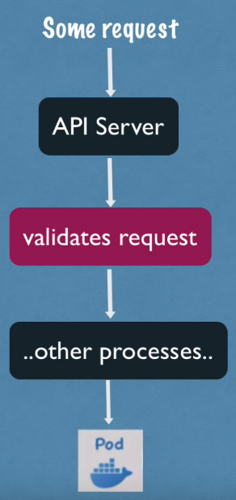
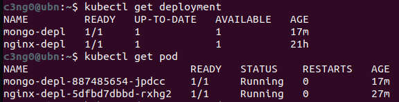

# Kubernetes


* Buradaki notlar, TechWorld Nina kanalına ait olan 3.5 saatlik "Kubernetes Tutorial for Beginners [FULL COURSE in 4 Hours]" videosunun Türkçe çevirisidir.
* Video linki aşağıda yer almaktadır.

[](https://www.youtube.com/watch?v=X48VuDVv0do&t=2949s)


## İçindekiler


- [Kubernetes Nedir?](#kubernetes-nedir)
- [Kubernetes Avantajları?](#kubernetes-avantajları)
- [Kubernetes Componentleri?](#kubernetes-componentleri)
  - [Pod](#pod)
  - [Service ve Ingress](#service-ve-ingress)
  - [ConfigMap ve Secret](#configmap-ve-secret)
  - [Volumes](#volumes)
  - [Deployment ve StatefulSet](#deployment-ve-statefulset)
- [Kubernetes Mimarisi](#kubernetes-mimarisi)
  - [Node Process](#node-process)
    - [1) Container Runtime](#1-container-runtime)
    - [2) Kubelet](#2-kubelet)
    - [3) Kube Proxy](#3-kube-proxy)
  - [Master Node](#master-node)
    - [1) API Server](#1-api-server)
    - [2) Scheduler](#2-scheduler)
    - [3) Controller Manager](#3-controller-manager)
    - [4) Etcd](#4-etcd)
- [Cluster Yapısı](#cluster-yapısı)
- [Minikube ve Kubectl Kurulumu](#minikube-ve-kubectl-kurulumu)
  - [Minikube](#minikube)
  - [Kubectl](#kubectl)
  - [Kurulum](#kurulum)
- [İlk Cluster](#ilk-cluster)
- [Main Kubectl Komutları](#main-kubectl-komutları)
  - [Layerların Çalışma Şekli](#layerların-çalışma-şekli)
  - [Debugging Pods](#debugging-pods)
  - [Deployment Silme ve Apply Configuration File](#deployment-silme-ve-apply-configuration-file)
  - [Kubectl Apply](#kubectl-apply)
    - [Crud Commands](#crud-commands)
    - [Status of Different K8s Components](#status-of-different-k8s-components)
    - [Debugging Pods](#debugging-pods)
    - [Use Configuration File for CRUD](#use-configuration-file-for-crud)


## Kubernetes Nedir?
- **Kubernetes**, açık kaynaklı bir konteyner yönetim aracıdır.
- Google tarafından geliştirilmiştir.
- Farklı dağıtım ortamlarında konteynerleştirilmiş uygulamaları yönetmenize yardımcı olur.
    - fiziksel ortamda
    - sanal ortamda
    - bulut ortamında

## Kubernetes Avantajları:

- **Yüksek erişilebilirlik** veya kesintisiz çalışma
- **Ölçeklenebilirlik** veya yüksek performans
- **Afet kurtarma** - yedekleme ve geri yükleme

## Kubernetes Componentleri
### Pod
* Pod Kubernetes'in en küçük birimidir.
* Konteyner üzerinde sanallaştırma yapar. (abstraction)


* Bizler yalnızca Kubernetes katmanıyla etkileşime geçeriz.
* Bir pod içinde birden fazla konteyner çalıştırabiliriz, ancak genellikle bir pod başına bir uygulama bulunur.
* Her pod kendi IP adresine sahiptir. Her pod, birbirleriyle bu internal IP adresini kullanarak iletişim kurabilir.

Ancak, Kubernetes'teki pod bileşenleri de geçicidir: yani çok kolay bir şekilde ölebilirler.
Örneğin, bir veritabanı konteynerını kaybettiğimizi düşünelim (konteyner içindeki uygulama çöktüğü veya sunucu kaynakları tükendiği için pod ölür ve yerine yeni bir tane oluşturulur). Bu durumda da yeni bir IP adresi atanır. Veritabanıyla IP adresini kullanarak iletişim kuruyorsak elbette sakıncalıdır. Her pod yeniden başladığında, iletişimi her seferinde yeniden ayarlamamız gerekir. Bu nedenle, pod'un yeniden başladığında IP adresini ayarlamamıza gerek kalmadan, veritabanıyla iletişim kurmanızı sağlayan başka bir Kubernetes bileşeni olan `Service` kullanılır.

### Service ve Ingress

* Service, her pod'a bağlanabilen sabit bir IP adresidir. Uygulamamızın kendi service'i olacak ve veritabanı pod'u kendi service'ine sahip olacak. Buradaki güzel şey, service ve Pod'un yaşam döngüleri birbirine bağlı değil. Bu yüzden Pod ölse bile Service ve bu service'e ait IP adresi kalır. Bu şekilde endpoint'i değiştirmemize gerek yoktur.


* Tabii ki, uygulamamızın bir tarayıcı aracılığıyla erişilebilir olmasını isteriz değil mi? Bunun için bir external service oluşturmamız gerekiyor. `External Service`, dış kaynaklardan iletişimi açan bir servistir. Ancak, veritabanımızı halka açık isteklere açmak istemeyiz. Bunun için `Internal Service` adını verdiğimiz bir şey oluştururuz.


* External Service URL'sinin çok pratik olmadığını fark ettiniz mi? Temelde, bir HTTP protokolüyle bir node IP adresi ve service port numarasına sahibiz. Bu hızlı bir şekilde bir şeyleri test etmek istiyorsak iyidir, ancak end-product için iyi değildir. Genellikle, uygulamamızla güvenli bir protokol ve bir alan adı kullanmak isteriz.


Bunun için Kubernetes'in başka bir bileşeni olan `Ingress` var. Bu şekilde, istek önce service'e değil, Ingress'e gider ve oradan Service'e yönlendirilir.


### ConfigMap ve Secret

Pod'lar birbirleriyle `service` aracılığıyla iletişim kurar. Uygulamamızın, veritabanı ile iletişim kurmak için kullandığı bir database endpoint `örneğin mongodb service`'i olacak. Ancak bu veritabanı URL'sini (ya da endpoint) genellikle nerede yapılandırırız?


Genellikle bunu application properties file veya bazı external environmental variable olarak yaparız, ancak genellikle yapılandırma, uygulamanın içerisindeki built image'tedir.

Örneğin, service endpoint (ya da service name) 'mongodb' olarak değişirse, uygulamadaki bu URL'i ayarlamalıyız. Genellikle yeni bir sürümle uygulamayı rebuild etmemiz ve repoya pushlamamız gerekir. Ardından bu yeni image'i pod'umuzda pull'layıp tüm uygulamayı yeniden başlatmamız gerekebilir.


Veritabanı URL'i gibi küçük bir değişiklik için bu gerçekten zahmetli. Bu sebeple, Kubernetes'in `configmap` adında bir bileşeni var. Yapısı, uygulamamıza `external configuration` sağlar. ConfigMap genellikle kullandığımız veritabanı URL'leri gibi yapılandırma verilerini içerir. Kubernetes'te bunu Pod'a bağlarız. Pod, ConfigMap'in içerdiği verileri alır. Ve şimdi, service adını değiştirirsek (service end point), sadece ConfigMap'i ayarlamamız yeterlidir. Yeni bir image oluşturmamıza ve tüm döngüyü geçirmemize gerek yoktur. Büyük avantaj!


Şimdi, external configuration'ın bir parçası aynı zamanda database kullanıcı adı ve şifresi olabilir değil mi? Bu veriler de uygulama dağıtım sürecinde değişebilir. Ancak, bir şifreyi veya diğer kimlik bilgilerini düz metin formatında bir configmap'e koymamız güvensiz olur.


Bu amaçla, Kubernetes'in `Secret` adında bir başka bileşeni daha var. Yani, Secret, ConfigMap gibi, ancak fark şu ki; şifre gibi gizli verileri saklamak için kullanılır. Ve tabii ki, düz metin formatında değil, base64 formatında kodlanmış olarak saklanır. Yani, Secret, kullanıcı adları gibi kimlik bilgilerini içerecek ve veritabanı kullanıcılarını içerecektir. ConfigMap'e de koyabiliriz, ancak önemli olan şifreler, sertifikalar, başkalarının erişimini istemediğimiz şeyler Secret'e koyulmalıdır. Aynı ConfigMap gibi, sadece Pod'umuza bağlarız, böylece Pod bu verileri görebilir ve Secret'ten okuyabilir. ConfigMap veya Secret'ten verileri, örneğin environment variables olarak veya hatta bir özellikler dosyası olarak uygulamamızın içinde kullanabiliriz.


Aslında en çok kullanılan Kubernetes temel bileşenlerinin neredeyse tamamını gördük. Pod'a göz attık. Hizmetlerin nasıl kullanıldığını, Ingress bileşeninin ne işe yaradığını gördük ve ayrıca ConfigMap ve Secrets'ı kullanan harici yapılandırmayı da gördük.


### Volumes

Sıra geldi çok önemli bir kavrama. `Veri depolama` nedir ve Kubernetes içerisinde nasıl çalışır? Uygulamamızın kullandığı bir database pod'umuz ve de bir miktar verimiz var. Şu anda gördüğünüz bu kurulumla, eğer veritabanı container veya pod'u yeniden başlatılırsa veri kaybolur. Bu açıkça sorunlu ve elverişsizdir çünkü database'deki verilerinizin veya günlük verilerinizin uzun süreli güvenilir ve kalıcı olmasını istersiniz. Bunu Kubernetes'te yapmanın yolu, Kubernetes'in başka bir bileşeni olan `Volumes` kullanmaktır.


Çalışma şekli şöyledir: Temelde bir fiziksel depolama birimini -yani bir sabit diski- pod'umuza bağlarız.
* Bu depolama yerel bir makinede olabilir.
* Pod'un çalıştığı aynı sunucu node'unda da olabilir.
* Kubernetes kümesinin dışında(Bulut depolama, Kubernetes kümesinin bir parçası olmayan kendi yerleşke depolamanız) olabilir.
Bu yüzden bununla ilgili external reference var.


Böylece, database pod'u veya container yeniden başlatıldığında, tüm veri kalıcı bir şekilde saklanmış olacaktır.

Kubernetes kümesi ve tüm bileşenlerinin ve depolama arasındaki farkı anlamamız önemlidir. Yerel veya uzak bir depolama olması fark etmeksizin, depolamayı Kubernetes kümesine takılmış harici bir sabit diske benzetebilirsiniz. Çünkü buradaki önemli nokta; Kubernetes kümesi açıkça hiçbir veri kalıcılığını yönetmez. Kubernetes kullanıcısı veya yöneticisi olarak sizin veriyi yedeklemenizden, çoğaltmanızdan, yönetmenizden ve uygun donanımda saklamanızdan emin olmanız gerektiği anlamına gelir.

### Deployment ve StatefulSet

Şimdi, her şey mükemmel bir şekilde çalışıyor ve bir kullanıcı bir tarayıcı aracılığıyla uygulamaya erişebiliyor. Bu kurulumla, application pod'u ölürse, crashlerse veya yeni bir container image oluşturduğumuz  için pod'u restart etmemiz gerekiyorsa ne olurdu? Basitçe cevap verecek olursak, bir kullanıcının uygulamamıza ulaşamadığı bir süre olan bir kesintimiz olurdu. Böyle bir durum end product'ta gerçekleşmesi çok kötü bir durumdur.


Distributed systems ve konteynerların avantajı tam olarak budur. Yalnızca 1 application pod'u ve 1 database pod'u gibi bir şeye güvenmek yerine, her şeyi birden fazla sunucuda replikasını oluşturuyoruz. Yani uygulamamızın bir klonu veya çoğaltması çalışacağı başka bir node olacak ve bu da service'e bağlı olacak. Hatırlarsanız service'in, bir pod öldüğünde end point'i sürekli ayarlamamıza gerek olmadığı, kalıcı statik IP adresi ve bir DNS adına sahip olduğunu söylemiştik.

* Service aynı zamanda bir `load balancer`dır. Yani, service isteği yakalayacak ve en az meşgul olan pod'a yönlendirecektir.


Ancak application pod'unun ikinci replikasını oluşturmak için ikinci bir pod oluşturmayız. Bunun yerine uygulama pod'umuzun bir blueprint'ini tanımlarız ve o pod'un kaç tane replikasının olmasını istediğimizi belirtiriz. Ve bu component veya blueprint'e `deployment` denir. Deployment, Kubernetes'in başka bir componentidir. Pratikte, pod'larla çalışmayız veya pod'lar oluşturmayız. Çünkü zaten kaç tane replika olacağını belirtebilir ve ihtiyacımız olan pod'ların replika sayısını artırabilir veya azaltabiliriz. Yani pod, container'ların üzerinde bir soyutlama katmanıdır(layer of abstraction). Deployment ise, podların üzerinde başka bir soyutlama katmanıdır(layer of abstraction). Bu durum; pod'larla etkileşimi, kopyalama ve diğer yapılandırmaları daha kullanışlı hale getirir.


Yani sonuç olarak çoğunlukla pod'larla değil, deployment'larla çalışırız. Uygulama pod'umuzun replikalarından biri ölürse, `service` istekleri başka bir replikaya yönlendirilecektir, bu şekilde uygulamamız kullanıcılar için hala erişilebilir olacaktır.


Şimdi muhtemelen şunu merak ediyorsunuzdur, peki database pod'u ne olacak? Çünkü eğer database pod'u ölürse, uygulamanız da erişilemez olacaktır. Bu yüzden, bir database replikasına da ihtiyacımız var. Ancak, `deployment kullanarak bir databese'i kopyalayamayız`. Bunun nedeni, database'in bir state'i olmasıdır, yani veridir. Bu da demektir ki eğer database'in replikaları veya klonları olsaydı, hepsi aynı paylaşılan data storage volume'üne erişmek zorunda kalacaktı. Bu durumda da, hangi pod'ların anlık olarak depolama birimine yazdığını veya hangi pod'ların depolama biriminden okuduğunu yöneten bir mekanizmaya ihtiyacımız olacaktı.

Bu mekanizma, çoğaltma özelliklerinin yanı sıra başka bir Kubernetes componenti olan `StatefulSet` ile sağlanır.


Bu component özellikle database gibi uygulamalar için tasarlanmıştır. Yani, MySQL, MongoDB, Elasticsearch veya herhangi bir diğer stateful applications veya databaseleri; deployments yerine `StatefulSets` kullanılarak oluşturulmalıdır.
Bu çok önemli bir ayrımdır. StatefulSet, aynı deployment gibi, pod'ları replikalamayı yapar ve bunları scaling'e alır. Database reading ve writing işlemlerinin senkronize olduğundan emin olur, böylece database tutarsızlıkları olmaz.


Ancak, bir Kubernetes kümesinde StatefulSets kullanarak database uygulamalarını deploy etmek biraz zahmetli olabilir. Bu yüzden, database uygulamalarını Kubernetes kümesinin dışında barındırmak ve yalnızca dağıtımları veya durumsuz uygulamaları Kubernetes kümesinin içinde sorunsuz bir şekilde çoğaltmak ve ölçeklendirmek ve dış database ile iletişim kurmak yaygın bir uygulamadır.

Şimdi, uygulama pod'umuzun iki replikası ve database'in iki kopyası olduğunda ve hepsi load-balanced olduğunda, kurulumumuz daha güvenlidir. Bu senaryoda eğer Node 1 yeniden başlatılsaydı veya çökseydi, hala uygulama ve database pod'larının çalıştığı ikinci bir node'umuz olurdu. Uygulama, bu iki replikadan yeniden oluşturulana kadar kullanıcı tarafından erişilebilir olacaktır, bu yüzden kesintiyi önlemiş oluruz.


Özetlemek gerekirse, en çok kullanılan Kubernetes bileşenlerini inceledik. Parçalar arasında iletişim kurmak için `pod`lar ve `service`lerle başladık, ve trafiği clusterlara yönlendirmek için kullanılan `Ingress` bileşenini inceledik. Ayrıca, `ConfigMaps` ve `Secret` kullanarak external configuration, ve `Volumes` kullanarak veri kalıcılığını inceledik. Ve son olarak, `Deployments` ve `StatefulSets` gibi replicating ve blueprintlere baktık.

Burada `stateful applications` özellikle databaseler gibi stateful applications için kullanılır. Ve evet, Kubernetes'in sunduğu çok daha fazla bileşen var, ama bunlar çekirdek, temel olanları. Bu temel bileşenleri kullanarak oldukça güçlü Kubernetes kümesi oluşturabiliriz.

## Kubernetes Mimarisi

Kubernetes'in temel mimarisinden bahsedeceğiz. Bu yüzden Kubernetes'in çalıştığı iki tür node'u inceleyeceğiz: biri `master` diğeri ise `slave`. Bunların arasındaki fark nedir ve her birinin cluster içindeki rolü nedir, onlara bakacağız.

Kubernetes'in ne yaptığını ve cluster'ın nasıl self-managed, self-healing ve automated olduğunu gösteren temel kavramları ele alacağız.  Bir Kubernetes cluster operatörü olarak, çok daha az manuel çaba harcamamız gerektiğini göreceğiz.

### Node Process

İki application pod'unun çalıştığı tek bir node ile bu temel kurulumla başlayacağız. Kubernetes mimarisinin ana bileşenlerinden biri worker servers veya node'dur. Her node, o node'da çalışan birden fazla application pod'una sahip olacaktır.

Ve Kubernetes'in bunu yapma şekli, her node'da bulunması gereken ve bu pod'ları planlamak ve yönetmek için kullanılan `three process` kullanmasıdır. Yani node'lar, asıl işi yapan cluster serverlardır. Bu yüzden bazen onlara worker nodes da denir.

#### 1) Container Runtime

Her node'da çalışması gereken ilk süreç, `container runtime`dır. Biz Docker ile işlem yapacağız, ancak başka bir teknoloji de olabilir. Applitacion pod'larında içinde çalışan containerlar olduğu için, her node'da bir `container runtime`  kurulmalıdır.

#### 2) Kubelet

Kubernetes'in bir parçası olan kubelet, Pod'ları ve bu Pod'ların altındaki container'ları schedule eder. Container Runtime, node'un kendisiyle arayüz oluştururken, kubelet bu yapılandırmayı alır, bir pod'u çalıştırır (veya içinde bir container başlatır) ve ardından o node'dan container'a CPU, RAM gibi depolama kaynakları atar.

Bu nedenle, genellikle bir Kubernetes cluster kurulu olmalıdır. Kubelet hizmetlerine sahip birden fazla node'dan oluşur. Bu worker node'ları, Örneğimizdeki application ve database pod'larının replikalarını çalıştıracak yüzlerce diğer node'u çalıştırır.

Aralarındaki iletişim şekli, `services` ile olur, bu da isteği application parçasına veya örneğin bir database'e yönlendiren bir `load-balancer` gibi çalışır ve ardından ilgili parçaya yönlendirir.

#### 3) Kube Proxy

Hizmetlerden pod'lara istekleri iletmekten sorumlu üçüncü süreç `kube-proxy`dir ve her node'da kurulmalıdır. Kube-proxy, düşük bir işlem yükü ile performanslı bir şekilde iletişim kurulmasını sağlayan akıllı yönlendirme mantığına sahiptir.

Bir uygulama veya bu uygulamanın replikası, bir database'e istek yapıyorsa, hizmet sadece isteği rastgele bir replikaya yönlendirmek yerine; isteği başlatan pod'un çalıştığı aynı node'da çalışan replikaya yönlendirecektir. Bu şekilde, isteği başka bir makineye göndermekle ilgili `ağ işlem yükünden` kaçınılmış olur.

Özetlemek gerekirse; bir kubernetes cluster'ının düzgün çalışabilmesi için `kubelet` ve `kube-proxy` her worker node içerisine `container runtime` ile birlikte kurulmalıdır.


Ancak şimdi soru şu: Bu cluster ile nasıl etkileşime girilir? Yeni bir application pod'u veya database pod'u nerede schedule edilmeli? Bir replika pod'u ölürse, hangi process monitoring, reschedule veya restart işlemleri ile ilgilenir?

### Master Node

Master servers(master nodes), içerisinde tamamen farklı processler çalıştırır. Ve bunlar, cluster state ve worker nodes'ları kontrol eden =`her yönetici düğümünde çalışan dört süreçtir`.

#### 1) API Server

İlk hizmetimiz API server. Bir Kubernetes cluster'ında yeni bir application deploy etmek istediğinizde, bir kullanıcı olarak API server ile interact ederiz. Bir Kubernetes Dashboard gibi bir kullanıcı arayüzü de olabilir, `kubectl` gibi bir command-line tool veya bir Kubernetes API'si de olabilir.

API sunucusu, cluster içine herhangi bir güncelleme talebinin veya hatta clusterdan gelen sorguların ilk isteğini alır. Kimlik doğrulaması(auth) yaparak, yalnızca kimliği doğrulanmış ve yetkilendirilmiş isteklerin clusterlara iletilmesini sağlar.


Bu, yeni pod'lar planlamak, yeni applications deploy etmek, yeni services oluşturmak veya herhangi bir component oluşturmak istediğimizde, bu requestimizi master node API sunucusuna iletmek zorunda olduğunuz anlamına gelir. API server daha sonra requestimizi doğrular. Her şey yolundaysa, requestimizi diğer süreçlere ileterek istediğimiz pod'u veya bileşeni schedule için bir node'a yönlendirir.



Ayrıca, dağıtımımızın durumu veya cluster health etc., gibi sorgu isteklerini yapmak isteyebiliriz. Bu sorgular API sunucusuna bir istek gönderir ve o da bize yanıt verir. Bu durum güvenlik açısından gayet iyidir çünkü clusterlara yalnızca `bir entry point` vardır.

#### 2) Scheduler

Başka bir Master process ise Scheduler'dır. API serverına yeni bir pod schedule isteği gönderdiğimizi varsayalım. API server bu isteğimizi doğruladıktan sonra, bu pod'un bir worker node'da başlatılması için `Scheduler`'a teslim eder.

Ve tabii ki, herhangi bir node'a rastgele atamak yerine, Scheduler, bir sonraki pod'un hangi belirli worker node'un scheduled olacağı konusunda zekice bir şekilde karar vermektedir. İlk olarak, isteğimizi kontrol eder ve planlamak istediğimiz uygulamanın ne kadar kaynağa ihtiyacı olduğunu kontrol eder. Ne kadar CPU, ne kadar RAM vb.

Ardından, worker node'daki kullanılabilir kaynakları kontrol eder. Eğer bir node'un en çok kaynağa sahip olduğunu söylüyorsa, yeni pod'u o node'a schedule eder.


Önemli bir nokta şu ki, scheduler sadece yeni bir pod'un hangi node'a schedule edileceğine karar verir. Asıl planlamayı yapan ve pod'u konteynerla başlatan işlem ise `kubelet`'tir. Yani kubelet, scheduler'dan gelen isteği alır ve bu isteği ilgili node üzerinde yürütür.

#### 3) Controller Manager

Bir sonraki önemli bileşen ise `controller manager`'dır. Bu bileşen, herhangi bir düğümde pod'lar öldüğünde ne olacağı sorusu açısından kritik öneme sahiptir. Ölü node'ları tespit etmek ve daha sonra bu pod'ları en kısa sürede reschedule etmek gerekir.


Dolayısıyla controller manager, state changes'ları, örneğin pod'ların çökmesini tespit eder. Pod'lar öldüğünde controller manager bunu algılar ve cluster state'ini mümkün olan en kısa sürede kurtarmaya çalışır.

Ölen pod'ları yeniden schedule etme amacıyla scheduler'a bir istek gönderir. Bu döngü içinde, scheduler kaynak hesaplamasına göre hangi worker node'ların bu pod'ları tekrar başlatması gerektiğine karar verir ve bu worker node'lar üzerindeki ilgili `kubelet`lere, pod'ları yeniden başlatmaları için istek gönderir.


#### 4) Etcd

Son olarak, ana işlemlerden biri olan etcd, bir cluster state'inin key-value deposudur. Bunu aslında bir cluster beyni olarak düşünebiliriz. Yani cluster'daki her değişiklik -örneğin yeni bir pod schedule edildiğinde veya bir pod öldüğünde- etcd'nin bu key-value deposunda kaydedilir veya güncellenir.


Etcd deposunun bir küme beyni olarak adlandırılmasının sebebi, scheduler, controller manager gibi tüm bu mekanizmaların, etcd'nin sahip olduğu veriler sayesinde çalışmasıdır.


Örneğin, scheduler her bir worker node'unda hangi kaynakların mevcut olduğunu nasıl bilir? Veya controller manager, cluster durumunda bir değişiklik olduğunu nasıl tespit eder? Pod'ların ölmesi, kubelet'in scheduler'ın isteği üzerine yeni pod'ları başlatması, API sunucusuna cluster health hakkında bir sorgu göndermemiz veya uygulama dağıtım durumumuz gibi bu durum bilgilerini, API sunucusu nereden alır?

Cevap: Tüm bu bilgiler etcd kümesinde saklanır. Etcd'nin key-value deposunda saklanmayan şey ise gerçek uygulama verileridir. Örneğin, bir cluster içinde çalışan bir database uygulamamız varsa, veriler etcd'de değil, başka bir yerde saklanır. Bu, yalnızca master işlemlerinin worker işlemleriyle ve tersiyle iletişim kurması için kullanılan bir cluster state bilgisidir.

Artık muhtemelen ana işlemlerin, özellikle de verileri güvenilir bir şekilde saklanması veya çoğaltılması gereken etcd deposunun, cluster operasyonu için kritik öneme sahip olduğunu anlamışsınızdır. Bu nedenle, uygulamada bir Kubernetes kümesi genellikle birden fazla master'dan oluşur. Her bir master düğümü kendi ana işlemlerini çalıştırır; elbette API sunucusu load-balanced'dır ve etcd deposu tüm master düğümleri arasında distributed bir depolama oluşturur.


## Cluster Yapısı


Şimdi worker ve master node'larında çalışan işlemleri gördükten sonra, gerçek hayattaki bir cluster kurulumuna bakalım. Çok küçük bir cluster'da muhtemelen iki master node ve üç worker node olur.


Burada dikkat edilmesi gereken bir diğer nokta ise master node sunucularının donanım kaynaklarının aslında farklı olmasıdır. Master işlemleri daha önemlidir, ancak aslında daha az iş yüküne sahiptirler. Dolayısıyla CPU, RAM ve depolama gibi daha az kaynağa ihtiyaç duyarlar. Worker node'ları ise, containerları çalıştıran pod'ları barındırma gibi asıl işi yaparlar.

Bu nedenle, worker node'larının daha fazla kaynağa ihtiyacı vardır. Uygulamamızın karmaşıklığı ve kaynak gereksinimi arttıkça, aslında cluster'ımıza daha fazla master ve worker node'u ekleyerek daha güçlü ve sağlam bir küme oluşturabiliriz. Böylece uygulama kaynak gereksinimlerimizi karşılayabiliriz.


Var olan bir Kubernetes cluster'ında yeni master veya worker serverları eklemek aslında oldukça kolaydır. Bir master sunucusu eklemek istiyorsak, yeni bir bare metal sunucu ediniyoruz. Üzerine tüm master work'leri kurup  onu Kubernetes kümesine ekliyoruz. Bu kadar..

Yine aynı şekilde, iki worker node'una ihtiyacımız varsa, bare metal sunucular ediniyoruz. Container runtime, kubelet ve kube-proxy gibi tüm worker node işlemlerini üzerlerine kurup onları Kubernetes clusterına ekleyin.

İşte bu kadar.
Bu şekilde, uygulama karmaşıklığı ve kaynak gereksinimi arttıkça, Kubernetes kümemizin gücünü ve kaynaklarını sonsuza kadar artırabiliriz.


## Minikube ve Kubectl Kurulumu

### Minikube


Genellikle Kubernetes dünyasında bir production cluster kurduğumuzda, aşağıdaki gibi görünecektir.


En az iki olmak üzere birden fazla Master'a sahip olacağız ve birden fazla worker node olacak. Worker düğümlerinin kendi ayrı sorumlulukları vardır. Diyagramda gördüğümüz gibi, her biri bir node'u temsil eden gerçek ayrı sanal veya fiziksel makinelerimiz olur.

Şimdi, yerel ortamımızda bir şey test etmek istiyorsak veya yeni bir uygulama, yeni bileşenler dağıtarak çok hızlı bir şekilde bir şey denemek istiyorsak ve bunları yerel makinemizde test etmek istiyorsak; açıkçası böyle bir cluster kurmak oldukça zor olacaktır. Bellek ve CPU gibi yeterli kaynağımız yoksa imkansız bile olabilir. İşte tam olarak bu kullanım durumu için `Minikube` adı verilen açık kaynaklı araç var.

Minikube'un ne olduğuna gelirsek, temelde hem master processleri hem de worker processleri tek bir node'da çalıştıran tek node bir clusterdır. Bu node'da önceden yüklenmiş bir Docker container runtime olacak şekilde konteynerleri veya konteynerli pod'ları çalıştırabileceğiz.


Dizüstü bilgisayarımızda VirtualBox, KVM veya başka bir hipervizör aracılığıyla çalışacak. Yani temel olarak, Minikube dizüstü bilgisayarlarımızda bir sanal makine oluşturacak ve burada gördüğümüz node'lar bu sanal makinede çalışacak.

Özetleyecek olursak, Minikube, yerel kurulumumuzda Kubernetes'i test etmek için kullanabileceğimiz dizüstü bilgisayarınızda bir sanallaştırma aracıyla çalışan tek node bir Kubernetes clusterdır.


Yerel makinemizde bir cluster veya mini cluster kurduktan sonra, bu cluster ile etkileşim kurmak için bir yola ihtiyacımız olacaktır. Componentler oluşturmak, yapılandırmak vb. isteyeceğiz. Tam burada `kubectl` devreye giriyor.

### Kubectl

local makinemizde Minikube'u temsil eden bu virtual node'a sahip olduktan sonra, bu cluster ile etkileşim kurmak için bir yola ihtiyacımız vardır. Bunu Kubernetes clusterları için bir command line toolu olan `kubectl` kullanarak yapabiliriz.

Nasıl çalıştığını görelim. Minikube'un hem master hem de worker processleri çalıştırdığını söylemiştik, bu nedenle API server adı verilen master processlerden biri aslında Kubernetes clusterın entry point noktasıdır.


Kubernetes'te bir şey yapmak istiyorsak veya herhangi bir şeyi yapılandırmak istiyorsak, önce API server ile konuşmamız gerekir. API server ile konuşmanın yolu ise farklı istemciler aracılığıyla olur. Bir dashboard gibi bir UI arayüzünüz olabilir, Kubernetes API'sini kullanarak konuşabilir veya `kubectl` command line tool kullanabilirsiniz.


`kubectl` aslında üç istemcinin de en güçlüsüdür çünkü `kubectl` ile Kubernetes'te istediğimiz her şeyi yapabiliriz.

Bu yazının neredeyse sonuna kadar `kubectl` kullanılmaktadır. `kubectl` API sunucusuna component oluşturmak, component silmek vb. için komutlar gönderdikten sonra, Minikube node'undaki worker processler bunları gerçekleştirecektir. Pod'lar oluşturmak, pod'ları yok etmek, services oluşturmak vb. için komutları yürüteceklerdir.

Bu, Minikube çalışma şeklidir. `kubectl` cluster ile nasıl kullanılır? Burada önemli bir nokta, `kubectl`'in yalnızca Minikube cluster için olmadığıdır. Bir cloud cluster'ımız veya hibrit bir cluster'ımız varsa, `kubectl` herhangi bir Kubernetes cluster kurulumuyla etkileşim kurmak için kullanılan araçtır. Bu nedenle burada unutulmaması önemlidir.


Artık Minikube ve `kubectl`'nin ne olduğunu bildiğimize göre, onları pratikte görmek için kuruluma başlayalım.

### Kurulum
Daha önce de belirttiğimiz gibi Minikube bir sanallaştırmaya ihtiyaç duyar, çünkü bazı hipervizörlerde çalışacaktır. Bu nedenle bir tür hipervizör yüklemelisiniz.


Şimdi linux üzerinde minikube ve kubectl kurulumuna geçelim.

```shell
curl -LO https://storage.googleapis.com/minikube/releases/latest/minikube-linux-amd64
sudo install minikube-linux-amd64 /usr/local/bin/minikube && rm minikube-linux-amd64
```

Şimdi her şeyin kurulduğundan emin olalım ve komutları kontrol edelim. Yani, `minikube` komutu çalışmalı:

```
c3ng0@ubn:~$ minikube start

😄  minikube v1.33.1 on Ubuntu 22.04
✨  Automatically selected the docker driver. Other choices: kvm2, qemu2, none, ssh
📌  Using Docker driver with root privileges
👍  Starting "minikube" primary control-plane node in "minikube" cluster
🚜  Pulling base image v0.0.44 ...
💾  Downloading Kubernetes v1.30.0 preload ...
    > preloaded-images-k8s-v18-v1...:  112.62 MiB / 342.90 MiB  32.84% 5.18 MiB
    > gcr.io/k8s-minikube/kicbase...:  70.41 MiB / 481.58 MiB  14.62% 2.65 MiB
    > index.docker.io/kicbase/sta...:  481.58 MiB / 481.58 MiB  100.00% 11.15 M
❗  minikube was unable to download gcr.io/k8s-minikube/kicbase:v0.0.44, but successfully downloaded docker.io/kicbase/stable:v0.0.44 as a fallback image
🔥  Creating docker container (CPUs=2, Memory=2200MB) ...
    > kubectl.sha256:  64 B / 64 B [-------------------------] 100.00% ? p/s 0s
    > kubeadm.sha256:  64 B / 64 B [-------------------------] 100.00% ? p/s 0s
    > kubelet.sha256:  64 B / 64 B [-------------------------] 100.00% ? p/s 0s
    > kubectl:  49.07 MiB / 49.07 MiB [------------] 100.00% 14.58 MiB p/s 3.6s
    > kubeadm:  47.92 MiB / 47.92 MiB [--------------] 100.00% 3.97 MiB p/s 12s
    > kubelet:  95.46 MiB / 95.46 MiB [--------------] 100.00% 6.52 MiB p/s 15s

    ▪ Generating certificates and keys ...
    ▪ Booting up control plane ...
    ▪ Configuring RBAC rules ...
🔗  Configuring bridge CNI (Container Networking Interface) ...
🔎  Verifying Kubernetes components...
    ▪ Using image gcr.io/k8s-minikube/storage-provisioner:v5
🌟  Enabled addons: storage-provisioner, default-storageclass
💡  kubectl not found. If you need it, try: 'minikube kubectl -- get pods -A'
🏄  Done! kubectl is now configured to use "minikube" cluster and "default" namespace by default
```

Ve `kubectl` indirmemiz gerekiyor:

```bash
curl -LO "https://dl.k8s.io/release/$(curl -L -s https://dl.k8s.io/release/stable.txt)/bin/linux/amd64/kubectl"
```

Binary'i doğrula(opsiyonel)

kubectl checksumfile indir:

```bash
curl -LO "https://dl.k8s.io/release/$(curl -L -s https://dl.k8s.io/release/stable.txt)/bin/linux/amd64/kubectl.sha256"   
```

İndirilen checksum file ile binary doğrulama:

```bash
echo "$(cat kubectl.sha256)  kubectl" | sha256sum --check
```

   Doğru ise çıktı aşağıdaki gibi olmalı:

`kubectl: OK`

- Kubectl Kurulumu

```bash
sudo install -o root -g root -m 0755 kubectl /usr/local/bin/kubectl
```

- Son sürümü kurduğumuzu kontrol etme:
```bash
kubectl version --client
```


daha fazlası için [kubernetes.io](https://kubernetes.io/docs/tasks/tools/install-kubectl-linux/)

Minikube oldukça basit bir komut satırı aracı ile birlikte gelir. Tek bir komutla tüm Kubernetes kümesini bu tek düğüm kurulumunda hızlıca başlatabilir, durdurabilir veya silebiliriz.


## İlk Cluster

Şimdi her ikisini de kurduğumuza göre, bir Minikube Kubernetes cluster oluşturalım.

```bash
minikube start
```

işte Minikube ile bir Kubernetes cluster nasıl başlatacağımız:

```bash
minikube start --vm-driver=kvm
```

Burada, kurulu hipervizörün devreye girdiğini görebilirsiniz çünkü Minikube'un bir Sanal ortamda çalışması gerektiğinden, Minikube'a hangi hipervizörü kullanması gerektiğini söyleyeceğiz. Bunun için, `--vm-driver` olarak adlandırılan bir seçenek belirleyeceğiz ve burada bende kurulu olan `kvm`'i ayarladım.

Bunu yürüttüğümde bir şeyler indirecek, yani ilk kez yapıyorsak biraz daha uzun sürebilir.


Ve bahsettiğim gibi, makinenizde Docker yoksa bile çalışacak.

Tamamlandı. Artık `kubectl`, Minikube'u kullanacak şekilde yapılandırılmış durumda, bu da Minikube cluster'ının kurulduğu anlamına gelir.


Kubernetes Kümesi ile etkileşimde bulunmak için tasarlanmış olan `kubectl` komutu da o Minikube kümesi ile bağlantılıdır, eğer şunu yaparsak:

```bash
kubectl get nodes
```

Bu, Kubernetes cluster node'larının durumunu bize bildirir. Bize bir Minikube node'unun hazır olduğunu söyleyecek ve gördüğümüz gibi açıkça master processleri çalıştırmalı çünkü sadece bir node var.


Ve ayrıca Minikube'ın durumunu alabiliriz:

```bash
minikube status
```


Yani, ana makinede kubelet adlı bir hizmetin çalıştığını görüyoruz, bu da aslında konteyner runtime kullanarak pod'ları çalıştıran bir hizmettir, yani her şey çalışıyor.

Buradan itibaren mini Kub kümesi ile `kubectl` komut satırı aracılığıyla etkileşime geçeceğiz. Minicube sadece cluster başlatma ve silme için kullanılır, ancak configuring ve diğer her şeyi `kubectl` aracılığıyla yapacağız.

---

- **The label applied to control-plane nodes "node-role.kubernetes.io/master" is now deprecated and will be removed in a future release after a GA deprecation period.**
- **Introduce a new label "node-role.kubernetes.io/control-plane" that will be applied in parallel to "node-role.kubernetes.io/master" until the removal of the "node-role.kubernetes.io/master" label.**


## Main Kubectl Komutları

Bu bölümde bazı temel Kubectl komutlarını göreceğiz ve minikube'da nasıl create ve debug pods yapıldığını göreceğiz.

Cubectl'i clusterda herhangi bir şey yapmak için kullanacağız. -components oluşturmak, status almak, vb.-

* İlk olarak, node'ların durumunu alacağız.

```bash
kubectl get nodes
```

Bu komutu kullanarak node'ların durumunu öğrenebiliyoruz.

```bash
c3ng0@ubn:~$ kubectl get nodes
NAME       STATUS   ROLES           AGE    VERSION
minikube   Ready    control-plane   145m   v1.30.0
```

Görüyoruz ki bir node var ve her şey o node'da çalışıyor çünkü bu bir `minikube`.

* Pod'ları kontrol edebiliriz ve herhangi bir pod'umuz olmadığı için sonuç yok.

```bash
kubectl get pod
```

* Services kontrol edebiliriz, varsayılan bir service'imiz var.

```bash
kubectl get services
```

```bash
c3ng0@ubn:~$ kubectl get services
NAME         TYPE        CLUSTER-IP   EXTERNAL-IP   PORT(S)   AGE
kubernetes   ClusterIP   10.96.0.1    <none>        443/TCP   148m
```

Şimdi, herhangi bir Pod'umuz olmadığı için bir tane oluşturacağız ve Kubernetes bileşenleri oluşturmanın bir Kubectl create komutu olduğunu hatırlayalım. Kubectl create komutunu kullanarak tüm bu bileşenleri oluşturabiliriz.

* Ancak listede `Pod` yok çünkü Kubernetes dünyasında, Pod, Kubernetes clusterının en küçük birimidir ve genellikle, Pod'ları doğrudan oluşturulmaz. Veya Pod'larla doğrudan çalışılmaz. Pod'ların üzerinde bir soyutlama katmanı`(abstraction over Pods)` vardır, buna ·`deployment`· denir. İşte bu oluşturmak üzere olduğumuz şey. Bu da, altındaki parçaları oluşturacak.

```bash
Usage:
   kubectl create deployment NAME --image=image -- [COMMAND] [args...] [options]
```

* **NAME**: deployment'a isim vermeliyiz
* **--image=**: oluşturacağımız container image'i

Şimdi bir nginx dağıtımı oluşturalım.

```bash
c3ng0@ubn:~$ kubectl create deployment nginx-depl --image=nginx
deployment.apps/nginx-depl created
```

 * Nginx görüntüsünü, Docker Hub'dan indirecektir. Bu komutu yürütürsem, gördüğünüz gibi nginx deployment oluşturuldu.

```bash
c3ng0@ubn:~$ kubevtl get deployment
NAME         READY   UP-TO-DATE   AVAILABLE   AGE
nginx-depl   0/1     1            0           15s
```

 * Oluşturulmuş bir deployment olduğunu görüyoruz ve burada "hazır değil" durumunda olduğunu da görebiliyoruz.

```bash
c3ng0@ubn:~$ kubectl get pod
NAME                          READY   STATUS    RESTARTS   AGE
nginx-depl-85c9d7c5f4-g4lwt   0/1     Creating  0          31s
```

 * Artık bir Pod'umuz var. Name değeri, prefix ve rastgele bir hash'e sahipt. Burada "konteyner oluşturuluyor" yazıyor, yani henüz hazır değil. Bir süre beklersek `Running`.

 * Bir deployment oluşturduğumuzda, deployment, Pod oluşturmak için gereken tüm bilgilere veya blueprintlere sahip olur.


 * Bu en temel yapılandırmadır, sadece adı ve görüntüsü. Bu kadar.. geri kalanı default.

 * Deployment ve Pod arasında bir başka katman vardır ve bu, otomatik olarak kubernetes tarafından yönetilen `replicaset`'tir.
 * `kubectl get replicaset` yaparsak, bir nginx replica set hash'imiz olduğunu görüyoruz. Ve burada, Pod adının bir deployment prefix, replicaset'in ID'si ve son olarak kendi ID'si olduğunu görebiliriz. Pod adı bu şekilde oluşmaktadır. Replicaset, Pod'un tüm replikalarını yönetir. Biz hiçbir zaman replica set oluşturmayacak, silmeyecek veya güncellemeyeceğiz. Doğrudan deploymentlar ile çalışacağız. Bu daha uygun çünkü deploymentlarda Pod blueprintini tamamen yapılandırabiliriz. Pod'un kaç replikasına ihtiyacımız olduğunu belirtebilir ve geri kalan configuration'u orada yapabiliriz.

### Layerların çalışma şekli:

 * İlk olarak Deployment, ReplicaSet'i yönetir.
 * ReplicaSet, o Pod'un tüm replikalarını yönetir.
 * Pod, bir konteynerin soyutlamasıdır.
 Deployment'tan aşağıdaki her şey otomatik olarak kubernetes tarafından yönetilmelidir.

Örneğin, kullanıldığı image gibi bir şeyi doğrudan bir deployment içerisinde düzenlemem gerekecek, Pod içinde değil. Öyleyse hemen yapalım.

```python
c3ng0@ubn:~$ kubectl edit deployment nginx-depl
# Please edit the object below. Lines beginning with a '#' will be ignored,
# and an empty file will abort the edit. If an error occurs while saving this file will be
# reopened with the relevant failures.
#
apiVersion: apps/v1
kind: Deployment
metadata:
  annotations:
    deployment.kubernetes.io/revision: "1"
  creationTimestamp: "2024-05-14T11:31:36Z"
  generation: 1
  labels:
    app: nginx-depl
  name: nginx-depl
  namespace: default
  resourceVersion: "9431"
  uid: 66d185d6-b628-4d10-b3bc-4aea093dfc59
spec:
  progressDeadlineSeconds: 600
  replicas: 1
...
...
...
```


Deployment oluştururken verdiğimiz iki seçenek dışında her şeyin otomatik olarak oluşturulmuş bir deployment, otomatik olarak oluşturulmuş bir yapılandırma dosyasını alıyoruz.
Şimdilik sadece resmi açıp istediğim versiyonu 1.16'ya sabitlemek istediğimi varsayalım ve bu değişikliği kaydedelim.

```
    spec:
      containers:
-       - image: nginx
---
    spec:
      containers:
+       - image: nginx:1.16

```

Ve gördüğünüz gibi dağıtım düzenlendi.


Şimdi `kubectl get pod` yaparsak, eski pod'umuzu görürüz.


* Eski Pod sona erdi ve yeni pod başladı.

Eğer ReplicaSet'i görüntülersek, eski olanın içinde pod olmadığını ve yeni bir tane oluşturulduğunu görüyoruz.


Yani sonuç olarak deployment yapılandırmasını düzenledik ve altındaki her şey otomatik olarak güncellendi. Bu yaptığımız, Kubernetes'in sihrine ve nasıl çalıştığına bir örnektir.

---

### Debugging Pods

Bir diğer çok pratik komut ise `kubectl logs`, bu aslında Pod içinde çalışan uygulamanın neyi kaydettiğini gösterir.

```bash
kubectl logs [POD_NAME]
```

Logları görüntülemeden önce Nginx hiçbir şey kaydetmediği için başka bir dağıtım oluşturalım. Mongodb'den oluşturalım ve adına `mongo-depl` verelim.


Şimdi mongodb deployment oluşturuluyor.


Şu anda loglara bakabiliriz:


* `kubectl describe pod [POD_NAME]` events sekmesinde bize state değişikliklerini verir.


Loglamak, uygulamanın gerçekte neyi yazdığını görmede ve hata ayıklamada yardımcı olmaktadır.

Başka bir çok kullanışlı komut, `kubectl exec`tir. Debugging yaparken, bir şey çalışmıyorsa veya sadece Pod'un içeriğini kontrol etmek için kullanılır.
Basitçe açıklayacak olursak, çalışan Pod'dan shell alır. bu yüzden:
```
kubectl exec -it [POD_NAME] -- bin/bash
```
* -it = **interactive terminal**


Bu komutla mongodb uygulama konteynerinin terminalini alıyoruz ve şu anda root kullanıcısı olarak mongodb konteynerinin içindeyiz.
Exec, hata ayıklama veya bir şeyleri test etmek veya denemek istediğinizde kullanışlıdır. Konteynera girebilir veya terminali alabilir ve orada bazı komutlar çalıştırabilirsiniz.

---

### Deployment Silme ve Apply Configuration File

Tabii ki kubectl ile podları silebiliriz, önce deployment'ları ve podları görüntüleyelim.



```
kubectl delete deployment [deployment_name]
```


kontrol ederseniz Pod'un sonlandığını ve eğer replica set alırsanız, mongodb replicasetinin de gittiğini görebilirsiniz.

Tüm crud işlemleri (create,update,delete vb.) deployment seviyesinde gerçekleşir ve altındaki her şey otomatik olarak takip eder. Aynı şekilde Services gibi diğer Kubernetes kaynakları oluşturabiliriz.

Ancak fark ettiğiniz gibi, Kubectl ile deployment gibi kubernetes bileşenlerini oluştururken, tüm bu seçenekleri komut satırında belirtmemiz gerekir.

* Adı belirtmemiz gerekir.
* Image'i belirtmemiz gerekir
* option1
* option2..  vb. olabilir.

Elbette bir deployment'ta veya bir Pod'ta yapılandırmak istediğimiz birçok şey olabilir ve açıkçası bunların hepsini komut satırında yazmak pratik olmayacaktır. Bunun için genellikle Kubernetes yapılandırma dosyalarıyla çalışılmaktadır. Yani oluşturduğumuz bileşenin türü, adı, image'i ve diğer tüm seçenekleri bir yapılandırma dosyasında toplanır. Sadece cubectl'e bu yapılandırma dosyasını yürütmesini söyleriz.

Bunu yapmanın yolu `kubectl apply` komutunu kullanmaktır.

### kubectl apply

Apply, temelde dosyayı, yapılandırma dosyasını bir parametre olarak alır ve orada ne yazdıysak yapar.

```bash
kubectl apply -f [file_name]
```

Apply, "-f" için bir seçenek alır ve bu dosyanın adını belirtir ve genellikle bu dosyalar için kullanılan biçim YAML'dir ve bu, dosyadaki her şeyi yürüten komuttur. Bu yüzden aslında bunu yapılandırma dosyası olarak adlandıracağız.

Örnek olarak çok basit, temel bir  `nginx-deployment.yaml` deployment dosyası oluşturalım.

Deployment için temel yapılandırma:

```yaml
apiVersion: apps/v1
kind: Deployment
metadata:
  name: nginx-deployment
  labels:
    app: nginx
spec:
  replicas: 1
  selector:
    matchLabels:
      app: nginx
  template:
    metadata:
      labels:
        app: nginx
    spec:
      containers:
      - name: nginx
        image: nginx:1.16
        ports:
        - containerPort: 80
```

* Şu an için gerekli olan satırları, aşağıda inceleyelim.
```yml
kind: Deployment
## Ne oluşturmak istediğimizi belirtiyoruz, Deployment oluşturmak istiyoruz.
```

```yml
name: nginx-deployment
## Oluşturacağımız Deployment ismi.
```

```yml
spec:            ## specification for deployment
  replicas: 1    ## Pod'lardan oluşturulacak replika sayısı
```

```yml
  template:
    metadata:
      labels:
        app: nginx
    spec:    ## specification for pods
      containers:
      - name: nginx
        image: nginx:1.16   ## Konteyner image'imiz için nginx versiyonu
        ports:
        - containerPort: 80 ## Binding Port
## Bu alan olutşturacağımız deployment'a ait blueprint
```

Bu, bizim config  dosyamız ve buna bir kere sahip olduktan sonra, bu yapılandırmayı istediğimiz zaman uygulayabiliriz.


Deployment oluşturuldu, şimdi podu görüntülersek, nginx dağıtımı podu oluşturuldu ve çalışıyor olduğunu görürüz.


Ayrıca dağıtımın 3 dakika 57 saniye önce oluşturulduğunu görüyoruz. Eğer bu deployment'ta bir şeyleri değiştirmek istersek, sadece yerel yapılandırmamızı değiştirmemiz yeterlidir. Örneğin, bir yerine iki replika istersek, sadece dosyayı düzenleyip tekrar apply ederiz. Ve deployment, nginx dağıtımı olarak tekrar yapılandırılacaktır.


Fark ettiyseniz çıktıda bize "configured" dendi. Fark şu ki, Kubernetes, nginx deployment'ının var olmadığını algılarsa, yeni bir tane oluşturacak, ancak eğer deployment zaten varsa, yapılandırma dosyasını apply ettiğimizde, onu güncellemesi gerektiğini bilecek ve yeni bir deployment oluşturmak yerine eski deployment'ı cofigure edecek.


Eski deployment hala ayakta (9m45s) fakat yeni bir replika oluşturuldu(3m22s) çünkü replika sayısını arttırdık. yani `kubectl apply` ile bir component oluşturabilir ve güncelleyebiliriz. Elbette Services, Volumes gibi diğer kubernetes bileşenlerine de ayar çekebiliriz.

---

Özetlemek gerekirse, bu yazıda birkaç kubectl komutuna baktık, bir component oluşturmayı, nasıl configure edeceğimizi ve sileceğimizi gördük. Pod'ların, deployment'ların, replikaset'lerinin vb. state'lerini nasıl alacağımızı gördük. Ayrıca Pod'un içindeki uygulamanın konsola yazdığı her şeyi nasıl kaydedeceğimizi gördük ve `kubectl exec`'i kullanarak çalışan bir konteynerdan nasıl shell alacağımızı gördük. Son olarak, kubernetes yapılandırma dosyasını ve `kubectl apply` komutunu kullanarak componentleri nasıl oluşturup güncelleyeceğimizi gördük.
Son olarak azıcık da `kubectl describe` komutunu gördük, bu da bir konteynerin bir Pod'da sorun giderme için ek bilgi almak istediğinizde kullandığınız bir komuttu.

#### Crud Commands:
* Create deployment                  ->        `kubectl create deployment [name]`
* Edit deployment                    ->        `kubectl edit deployment [name]`
* Delete deployment                  ->        `kubectl delete deployment [name]`

#### Status of different K8s components
* `kubectl get nodes | pod | services | replicaset | deployment`

#### Debugging pods
* Log to console                     ->        `kubectl logs [pod_name]`
* Get interactive Terminal           ->        `kubectl exec -it [pod_name] -- /bin/bash`
* Get info about pod                 ->        `kubectl describe pod [pod_name]`  

#### Use configuration file for CRUD
* Apply a configuration file         ->        `kubectl apply -f [file_name]`
* Delete with configuration file     ->        `kubectl delete -f [file_name]`


---
